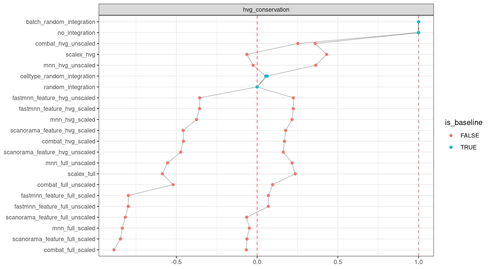

missing 'task_description'

<figure>

<figcaption aria-hidden="true">Overview of the results per method. This figures shows the means of the scaled scores per method across all results (group Mean), per dataset (group Dataset) and per metric (group Metric).</figcaption>
</figure>

Overview per parameter set

<figure>

<figcaption aria-hidden="true">Overview of the results per method and parameter set. This figures shows the means of the scaled scores per method parameter set across all results (group Mean), per dataset (group Dataset) and per metric (group Metric).</figcaption>
</figure>

## Methods

-   **Random Integration by Batch** (Open Problems for Single Cell Analysis Consortium 2022): missing 'method_summary'

<!-- -->

-   **Random Integration by Celltype** (Open Problems for Single Cell Analysis Consortium 2022): missing 'method_summary'

<!-- -->

-   **Combat (full/scaled)** (Johnson, Li, and Rabinovic 2006): missing 'method_summary'

<!-- -->

-   **Combat (full/unscaled)** (Johnson, Li, and Rabinovic 2006): missing 'method_summary'

<!-- -->

-   **Combat (hvg/scaled)** (Johnson, Li, and Rabinovic 2006): missing 'method_summary'

<!-- -->

-   **Combat (hvg/unscaled)** (Johnson, Li, and Rabinovic 2006): missing 'method_summary'

<!-- -->

-   **FastMNN feature (full/scaled)** (Lun 2019): missing 'method_summary'

<!-- -->

-   **FastMNN feature (full/unscaled)** (Lun 2019): missing 'method_summary'

<!-- -->

-   **FastMNN feature (hvg/scaled)** (Lun 2019): missing 'method_summary'

<!-- -->

-   **FastMNN feature (hvg/unscaled)** (Lun 2019): missing 'method_summary'

<!-- -->

-   **MNN (full/scaled)** (Haghverdi et al. 2018): missing 'method_summary'

<!-- -->

-   **MNN (full/unscaled)** (Haghverdi et al. 2018): missing 'method_summary'

<!-- -->

-   **MNN (hvg/scaled)** (Haghverdi et al. 2018): missing 'method_summary'

<!-- -->

-   **MNN (hvg/unscaled)** (Haghverdi et al. 2018): missing 'method_summary'

<!-- -->

-   **No Integration** (Open Problems for Single Cell Analysis Consortium 2022): missing 'method_summary'

<!-- -->

-   **Random Integration** (Open Problems for Single Cell Analysis Consortium 2022): missing 'method_summary'

<!-- -->

-   **SCALEX (full)** (Xiong et al. 2022): missing 'method_summary'

<!-- -->

-   **SCALEX (hvg)** (Xiong et al. 2022): missing 'method_summary'

<!-- -->

-   **Scanorama gene output (full/scaled)** (Hie, Bryson, and Berger 2019): missing 'method_summary'

<!-- -->

-   **Scanorama gene output (full/unscaled)** (Hie, Bryson, and Berger 2019): missing 'method_summary'

<!-- -->

-   **Scanorama gene output (hvg/scaled)** (Hie, Bryson, and Berger 2019): missing 'method_summary'

<!-- -->

-   **Scanorama gene output (hvg/unscaled)** (Hie, Bryson, and Berger 2019): missing 'method_summary'

## Datasets

-   **Immune (by batch)** (Luecken et al. 2021): Human immune cells from peripheral blood and bone marrow taken from 5 datasets comprising 10 batches across technologies (10X, Smart-seq2).
-   **Pancreas (by batch)** (Luecken et al. 2021): Human pancreatic islet scRNA-seq data from 6 datasets across technologies (CEL-seq, CEL-seq2, Smart-seq2, inDrop, Fluidigm C1, and SMARTER-seq).

## Metrics

-   **HVG conservation** (Luecken et al. 2021): missing 'metric_summary'

## Details

Quality control checks

✓ All checks succeeded!

Visualization of raw results

## References

Haghverdi, Laleh, Aaron T L Lun, Michael D Morgan, and John C Marioni. 2018. "Batch Effects in Single-Cell RNA-Sequencing Data Are Corrected by Matching Mutual Nearest Neighbors." *Nature Biotechnology* 36 (5): 421--27. <https://doi.org/10.1038/nbt.4091>.

Hie, Brian, Bryan Bryson, and Bonnie Berger. 2019. "Efficient Integration of Heterogeneous Single-Cell Transcriptomes Using Scanorama." *Nature Biotechnology* 37 (6): 685--91. <https://doi.org/10.1038/s41587-019-0113-3>.

Johnson, W. Evan, Cheng Li, and Ariel Rabinovic. 2006. "Adjusting Batch Effects in Microarray Expression Data Using Empirical Bayes Methods." *Biostatistics* 8 (1): 118--27. <https://doi.org/10.1093/biostatistics/kxj037>.

Luecken, Malte D., M. Büttner, K. Chaichoompu, A. Danese, M. Interlandi, M. F. Mueller, D. C. Strobl, et al. 2021. "Benchmarking Atlas-Level Data Integration in Single-Cell Genomics." *Nature Methods* 19 (1): 41--50. <https://doi.org/10.1038/s41592-021-01336-8>.

Lun, Aaron. 2019. "A Description of the Theory Behind the fastMNN Algorithm." <https://marionilab.github.io/FurtherMNN2018/theory/description.html>.

Open Problems for Single Cell Analysis Consortium. 2022. "Open Problems." <https://openproblems.bio>.

Xiong, Lei, Kang Tian, Yuzhe Li, Weixi Ning, Xin Gao, and Qiangfeng Cliff Zhang. 2022. "Online Single-Cell Data Integration Through Projecting Heterogeneous Datasets into a Common Cell-Embedding Space." *Nature Communications* 13 (1). <https://doi.org/10.1038/s41467-022-33758-z>.
