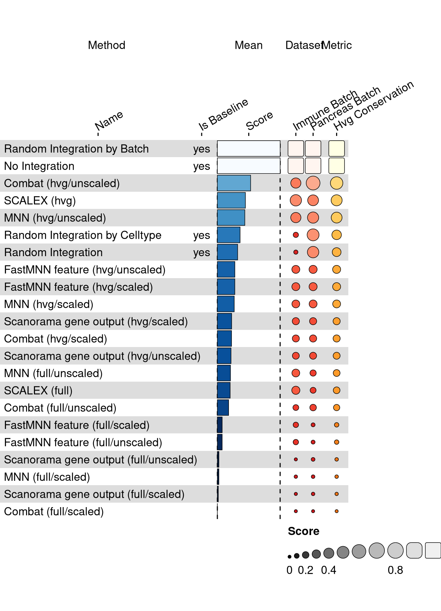

<link href="index_files/libs/lightable-0.0.1/lightable.css" rel="stylesheet" />

Missing 'task_description'

## Results

<figure>

<figcaption aria-hidden="true">Overview of the results per method. This figures shows the means of the scaled scores per method across all results (group Mean), per dataset (group Dataset) and per metric (group Metric).</figcaption>
</figure>

## Methods

-   **[Combat](https://scanpy.readthedocs.io/en/stable/api/scanpy.pp.combat.html)** (Johnson, Li, and Rabinovic 2006): Missing 'method_description'.

<!-- -->

-   **[FastMNN feature](https://doi.org/doi:10.18129/B9.bioc.batchelor)** (Lun 2019): Missing 'method_description'.

<!-- -->

-   **[MNN](https://github.com/chriscainx/mnnpy)** (Haghverdi et al. 2018): Missing 'method_description'.

<!-- -->

-   **[SCALEX](https://github.com/jsxlei/SCALEX)** (Xiong et al. 2022): Missing 'method_description'.

<!-- -->

-   **[Scanorama gene output](https://github.com/brianhie/scanorama)** (Hie, Bryson, and Berger 2019): Missing 'method_description'.

## Metrics

-   **HVG conservation** (Luecken et al. 2021): Missing 'metric_description'.

## Datasets

-   **Immune (by batch)** (Luecken et al. 2021): Missing 'dataset_description'.

<!-- -->

-   **Pancreas (by batch)** (Luecken et al. 2021): Missing 'dataset_description'.

## Baselines

-   **Random Integration by Batch**: Missing 'method_description'.

<!-- -->

-   **Random Integration by Celltype**: Missing 'method_description'.

<!-- -->

-   **No Integration**: Missing 'method_description'.

<!-- -->

-   **Random Integration**: Missing 'method_description'.

## Downloads

<a href="data/task_info.json" class="btn btn-secondary">Task info</a>
<a href="data/method_info.json" class="btn btn-secondary">Method info</a>
<a href="data/metric_info.json" class="btn btn-secondary">Metric info</a>
<a href="data/dataset_info.json" class="btn btn-secondary">Dataset info</a>
<a href="data/results.json" class="btn btn-secondary">Results</a>
<a href="data/quality_control.json" class="btn btn-secondary">Quality control</a>

## Details

Overview per parameter set

<figure>

<figcaption aria-hidden="true">Overview of the results per method and parameter set. This figures shows the means of the scaled scores per method parameter set across all results (group Mean), per dataset (group Dataset) and per metric (group Metric).</figcaption>
</figure>

Quality control

<table class="table lightable-paper" style='margin-left: auto; margin-right: auto; font-family: "Arial Narrow", arial, helvetica, sans-serif; margin-left: auto; margin-right: auto;'>
 <thead>
  <tr>
   <th style="text-align:left;"> Category </th>
   <th style="text-align:left;"> Name </th>
   <th style="text-align:right;"> Value </th>
   <th style="text-align:left;"> Condition </th>
   <th style="text-align:left;"> Severity </th>
  </tr>
 </thead>
<tbody>
  <tr>
   <td style="text-align:left;" data-toggle="tooltip" data-container="body" data-placement="right" title="Dataset metadata field 'dataset_description' should be defined
  Task id: batch_integration_feature
  Field: dataset_description
"> Dataset info </td>
   <td style="text-align:left;" data-toggle="tooltip" data-container="body" data-placement="right" title="Dataset metadata field 'dataset_description' should be defined
  Task id: batch_integration_feature
  Field: dataset_description
"> Pct 'dataset_description' missing </td>
   <td style="text-align:right;" data-toggle="tooltip" data-container="body" data-placement="right" title="Dataset metadata field 'dataset_description' should be defined
  Task id: batch_integration_feature
  Field: dataset_description
"> 1 </td>
   <td style="text-align:left;" data-toggle="tooltip" data-container="body" data-placement="right" title="Dataset metadata field 'dataset_description' should be defined
  Task id: batch_integration_feature
  Field: dataset_description
"> percent_missing(dataset_info, field) </td>
   <td style="text-align:left;color: red !important;" data-toggle="tooltip" data-container="body" data-placement="right" title="Dataset metadata field 'dataset_description' should be defined
  Task id: batch_integration_feature
  Field: dataset_description
"> ✗✗ </td>
  </tr>
  <tr>
   <td style="text-align:left;" data-toggle="tooltip" data-container="body" data-placement="right" title="Method metadata field 'method_description' should be defined
  Task id: batch_integration_feature
  Field: method_description
"> Method info </td>
   <td style="text-align:left;" data-toggle="tooltip" data-container="body" data-placement="right" title="Method metadata field 'method_description' should be defined
  Task id: batch_integration_feature
  Field: method_description
"> Pct 'method_description' missing </td>
   <td style="text-align:right;" data-toggle="tooltip" data-container="body" data-placement="right" title="Method metadata field 'method_description' should be defined
  Task id: batch_integration_feature
  Field: method_description
"> 1 </td>
   <td style="text-align:left;" data-toggle="tooltip" data-container="body" data-placement="right" title="Method metadata field 'method_description' should be defined
  Task id: batch_integration_feature
  Field: method_description
"> percent_missing(method_info, field) </td>
   <td style="text-align:left;color: red !important;" data-toggle="tooltip" data-container="body" data-placement="right" title="Method metadata field 'method_description' should be defined
  Task id: batch_integration_feature
  Field: method_description
"> ✗✗ </td>
  </tr>
  <tr>
   <td style="text-align:left;" data-toggle="tooltip" data-container="body" data-placement="right" title="Metric metadata field 'metric_description' should be defined
  Task id: batch_integration_feature
  Field: metric_description
"> Metric info </td>
   <td style="text-align:left;" data-toggle="tooltip" data-container="body" data-placement="right" title="Metric metadata field 'metric_description' should be defined
  Task id: batch_integration_feature
  Field: metric_description
"> Pct 'metric_description' missing </td>
   <td style="text-align:right;" data-toggle="tooltip" data-container="body" data-placement="right" title="Metric metadata field 'metric_description' should be defined
  Task id: batch_integration_feature
  Field: metric_description
"> 1 </td>
   <td style="text-align:left;" data-toggle="tooltip" data-container="body" data-placement="right" title="Metric metadata field 'metric_description' should be defined
  Task id: batch_integration_feature
  Field: metric_description
"> percent_missing(metric_info, field) </td>
   <td style="text-align:left;color: red !important;" data-toggle="tooltip" data-container="body" data-placement="right" title="Metric metadata field 'metric_description' should be defined
  Task id: batch_integration_feature
  Field: metric_description
"> ✗✗ </td>
  </tr>
  <tr>
   <td style="text-align:left;" data-toggle="tooltip" data-container="body" data-placement="right" title="Task metadata field 'task_description' should be defined
  Task id: batch_integration_feature
  Field: task_description
"> Task info </td>
   <td style="text-align:left;" data-toggle="tooltip" data-container="body" data-placement="right" title="Task metadata field 'task_description' should be defined
  Task id: batch_integration_feature
  Field: task_description
"> Pct 'task_description' missing </td>
   <td style="text-align:right;" data-toggle="tooltip" data-container="body" data-placement="right" title="Task metadata field 'task_description' should be defined
  Task id: batch_integration_feature
  Field: task_description
"> 1 </td>
   <td style="text-align:left;" data-toggle="tooltip" data-container="body" data-placement="right" title="Task metadata field 'task_description' should be defined
  Task id: batch_integration_feature
  Field: task_description
"> percent_missing([task_info], field) </td>
   <td style="text-align:left;color: red !important;" data-toggle="tooltip" data-container="body" data-placement="right" title="Task metadata field 'task_description' should be defined
  Task id: batch_integration_feature
  Field: task_description
"> ✗✗ </td>
  </tr>
</tbody>
</table>

Visualization of raw results

## References

Haghverdi, Laleh, Aaron T L Lun, Michael D Morgan, and John C Marioni. 2018. "Batch Effects in Single-Cell RNA-Sequencing Data Are Corrected by Matching Mutual Nearest Neighbors." *Nature Biotechnology* 36 (5): 421--27. <https://doi.org/10.1038/nbt.4091>.

Hie, Brian, Bryan Bryson, and Bonnie Berger. 2019. "Efficient Integration of Heterogeneous Single-Cell Transcriptomes Using Scanorama." *Nature Biotechnology* 37 (6): 685--91. <https://doi.org/10.1038/s41587-019-0113-3>.

Johnson, W. Evan, Cheng Li, and Ariel Rabinovic. 2006. "Adjusting Batch Effects in Microarray Expression Data Using Empirical Bayes Methods." *Biostatistics* 8 (1): 118--27. <https://doi.org/10.1093/biostatistics/kxj037>.

Luecken, Malte D., M. Büttner, K. Chaichoompu, A. Danese, M. Interlandi, M. F. Mueller, D. C. Strobl, et al. 2021. "Benchmarking Atlas-Level Data Integration in Single-Cell Genomics." *Nature Methods* 19 (1): 41--50. <https://doi.org/10.1038/s41592-021-01336-8>.

Lun, Aaron. 2019. "A Description of the Theory Behind the fastMNN Algorithm." <https://marionilab.github.io/FurtherMNN2018/theory/description.html>.

Xiong, Lei, Kang Tian, Yuzhe Li, Weixi Ning, Xin Gao, and Qiangfeng Cliff Zhang. 2022. "Online Single-Cell Data Integration Through Projecting Heterogeneous Datasets into a Common Cell-Embedding Space." *Nature Communications* 13 (1). <https://doi.org/10.1038/s41467-022-33758-z>.
