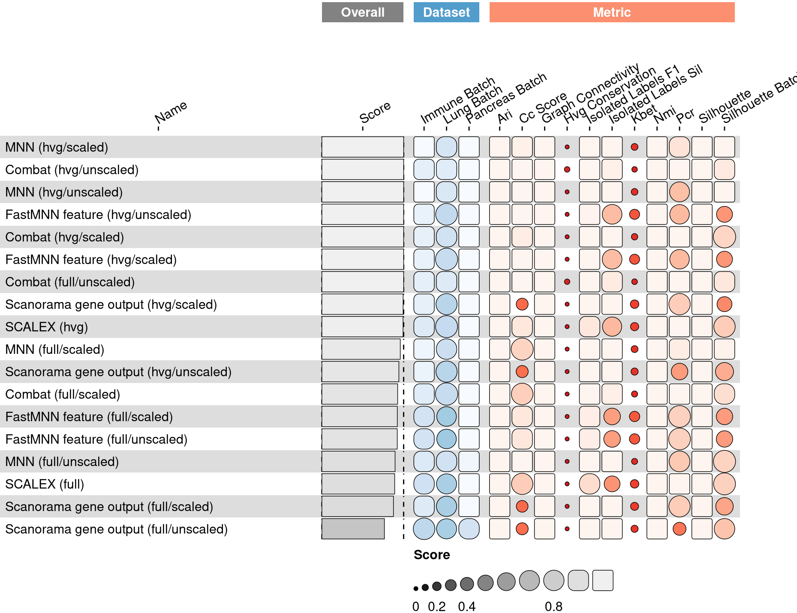

<link href="index_files/libs/lightable-0.0.1/lightable.css" rel="stylesheet" />

## Description

Missing 'task_description'

## Summary

<figure>

<figcaption aria-hidden="true"><strong>Overview of the results per method</strong>. This figures shows the mean of the scaled scores (group Overall), the mean scores per dataset (group Dataset) and the mean scores per metric (group Metric).</figcaption>
</figure>

## Downloads

<a href="data/task_info.json" class="btn btn-secondary">Task info</a>
<a href="data/method_info.json" class="btn btn-secondary">Method info</a>
<a href="data/metric_info.json" class="btn btn-secondary">Metric info</a>
<a href="data/dataset_info.json" class="btn btn-secondary">Dataset info</a>
<a href="data/results.json" class="btn btn-secondary">Results</a>
<a href="data/quality_control.json" class="btn btn-secondary">Quality control</a>

## Details

Method descriptions

-   **[Random Integration by Batch](https://github.com/openproblems-bio/openproblems)**: Missing 'method_description'. [\[openproblems\]](/bibliography#openproblems)

<!-- -->

-   **[Random Integration by Celltype](https://github.com/openproblems-bio/openproblems)**: Missing 'method_description'. [\[openproblems\]](/bibliography#openproblems)

<!-- -->

-   **[Combat (full/scaled)](https://scanpy.readthedocs.io/en/stable/api/scanpy.pp.combat.html)**: Missing 'method_description'. [\[hansen2012removing\]](/bibliography#hansen2012removing)

<!-- -->

-   **[Combat (full/unscaled)](https://scanpy.readthedocs.io/en/stable/api/scanpy.pp.combat.html)**: Missing 'method_description'. [\[hansen2012removing\]](/bibliography#hansen2012removing)

<!-- -->

-   **[Combat (hvg/scaled)](https://scanpy.readthedocs.io/en/stable/api/scanpy.pp.combat.html)**: Missing 'method_description'. [\[hansen2012removing\]](/bibliography#hansen2012removing)

<!-- -->

-   **[Combat (hvg/unscaled)](https://scanpy.readthedocs.io/en/stable/api/scanpy.pp.combat.html)**: Missing 'method_description'. [\[hansen2012removing\]](/bibliography#hansen2012removing)

<!-- -->

-   **[FastMNN feature (full/scaled)](https://doi.org/doi:10.18129/B9.bioc.batchelor)**: Missing 'method_description'. [\[lun2019fastmnn\]](/bibliography#lun2019fastmnn)

<!-- -->

-   **[FastMNN feature (full/unscaled)](https://doi.org/doi:10.18129/B9.bioc.batchelor)**: Missing 'method_description'. [\[lun2019fastmnn\]](/bibliography#lun2019fastmnn)

<!-- -->

-   **[FastMNN feature (hvg/scaled)](https://doi.org/doi:10.18129/B9.bioc.batchelor)**: Missing 'method_description'. [\[lun2019fastmnn\]](/bibliography#lun2019fastmnn)

<!-- -->

-   **[FastMNN feature (hvg/unscaled)](https://doi.org/doi:10.18129/B9.bioc.batchelor)**: Missing 'method_description'. [\[lun2019fastmnn\]](/bibliography#lun2019fastmnn)

<!-- -->

-   **[MNN (full/scaled)](https://github.com/chriscainx/mnnpy)**: Missing 'method_description'. [\[haghverdi2018batch\]](/bibliography#haghverdi2018batch)

<!-- -->

-   **[MNN (full/unscaled)](https://github.com/chriscainx/mnnpy)**: Missing 'method_description'. [\[haghverdi2018batch\]](/bibliography#haghverdi2018batch)

<!-- -->

-   **[MNN (hvg/scaled)](https://github.com/chriscainx/mnnpy)**: Missing 'method_description'. [\[haghverdi2018batch\]](/bibliography#haghverdi2018batch)

<!-- -->

-   **[MNN (hvg/unscaled)](https://github.com/chriscainx/mnnpy)**: Missing 'method_description'. [\[haghverdi2018batch\]](/bibliography#haghverdi2018batch)

<!-- -->

-   **[No Integration](https://github.com/openproblems-bio/openproblems)**: Missing 'method_description'. [\[openproblems\]](/bibliography#openproblems)

<!-- -->

-   **[Random Integration](https://github.com/openproblems-bio/openproblems)**: Missing 'method_description'. [\[openproblems\]](/bibliography#openproblems)

<!-- -->

-   **[SCALEX (full)](https://github.com/jsxlei/SCALEX)**: Missing 'method_description'. [\[xiong2021online\]](/bibliography#xiong2021online)

<!-- -->

-   **[SCALEX (hvg)](https://github.com/jsxlei/SCALEX)**: Missing 'method_description'. [\[xiong2021online\]](/bibliography#xiong2021online)

<!-- -->

-   **[Scanorama gene output (full/scaled)](https://github.com/brianhie/scanorama)**: Missing 'method_description'. [\[hie2019efficient\]](/bibliography#hie2019efficient)

<!-- -->

-   **[Scanorama gene output (full/unscaled)](https://github.com/brianhie/scanorama)**: Missing 'method_description'. [\[hie2019efficient\]](/bibliography#hie2019efficient)

<!-- -->

-   **[Scanorama gene output (hvg/scaled)](https://github.com/brianhie/scanorama)**: Missing 'method_description'. [\[hie2019efficient\]](/bibliography#hie2019efficient)

<!-- -->

-   **[Scanorama gene output (hvg/unscaled)](https://github.com/brianhie/scanorama)**: Missing 'method_description'. [\[hie2019efficient\]](/bibliography#hie2019efficient)

Metric descriptions

-   **HVG conservation**: Missing 'metric_description'. [\[luecken2022benchmarking\]](/bibliography#luecken2022benchmarking)

Dataset descriptions

-   **Immune (by batch)**: Missing 'dataset_description'. [\[luecken2022benchmarking\]](/bibliography#luecken2022benchmarking)

<!-- -->

-   **Pancreas (by batch)**: Missing 'dataset_description'. [\[luecken2022benchmarking\]](/bibliography#luecken2022benchmarking)

Baseline descriptions

-   **Random Integration by Batch**: Missing 'method_description'.

<!-- -->

-   **Random Integration by Celltype**: Missing 'method_description'.

<!-- -->

-   **No Integration**: Missing 'method_description'.

<!-- -->

-   **Random Integration**: Missing 'method_description'.

Quality control

<table class="table lightable-paper" style='margin-left: auto; margin-right: auto; font-family: "Arial Narrow", arial, helvetica, sans-serif; margin-left: auto; margin-right: auto;'>
 <thead>
  <tr>
   <th style="text-align:left;"> Category </th>
   <th style="text-align:left;"> Name </th>
   <th style="text-align:right;"> Value </th>
   <th style="text-align:left;"> Condition </th>
   <th style="text-align:left;"> Severity </th>
  </tr>
 </thead>
<tbody>
  <tr>
   <td style="text-align:left;" data-toggle="tooltip" data-container="body" data-placement="right" title="Dataset metadata field 'dataset_description' should be defined
  Task id: batch_integration_feature
  Field: dataset_description
"> Dataset info </td>
   <td style="text-align:left;" data-toggle="tooltip" data-container="body" data-placement="right" title="Dataset metadata field 'dataset_description' should be defined
  Task id: batch_integration_feature
  Field: dataset_description
"> Pct 'dataset_description' missing </td>
   <td style="text-align:right;" data-toggle="tooltip" data-container="body" data-placement="right" title="Dataset metadata field 'dataset_description' should be defined
  Task id: batch_integration_feature
  Field: dataset_description
"> 1 </td>
   <td style="text-align:left;" data-toggle="tooltip" data-container="body" data-placement="right" title="Dataset metadata field 'dataset_description' should be defined
  Task id: batch_integration_feature
  Field: dataset_description
"> percent_missing(dataset_info, field) </td>
   <td style="text-align:left;color: red !important;" data-toggle="tooltip" data-container="body" data-placement="right" title="Dataset metadata field 'dataset_description' should be defined
  Task id: batch_integration_feature
  Field: dataset_description
"> ✗✗ </td>
  </tr>
  <tr>
   <td style="text-align:left;" data-toggle="tooltip" data-container="body" data-placement="right" title="Method metadata field 'method_description' should be defined
  Task id: batch_integration_feature
  Field: method_description
"> Method info </td>
   <td style="text-align:left;" data-toggle="tooltip" data-container="body" data-placement="right" title="Method metadata field 'method_description' should be defined
  Task id: batch_integration_feature
  Field: method_description
"> Pct 'method_description' missing </td>
   <td style="text-align:right;" data-toggle="tooltip" data-container="body" data-placement="right" title="Method metadata field 'method_description' should be defined
  Task id: batch_integration_feature
  Field: method_description
"> 1 </td>
   <td style="text-align:left;" data-toggle="tooltip" data-container="body" data-placement="right" title="Method metadata field 'method_description' should be defined
  Task id: batch_integration_feature
  Field: method_description
"> percent_missing(method_info, field) </td>
   <td style="text-align:left;color: red !important;" data-toggle="tooltip" data-container="body" data-placement="right" title="Method metadata field 'method_description' should be defined
  Task id: batch_integration_feature
  Field: method_description
"> ✗✗ </td>
  </tr>
  <tr>
   <td style="text-align:left;" data-toggle="tooltip" data-container="body" data-placement="right" title="Metric metadata field 'metric_description' should be defined
  Task id: batch_integration_feature
  Field: metric_description
"> Metric info </td>
   <td style="text-align:left;" data-toggle="tooltip" data-container="body" data-placement="right" title="Metric metadata field 'metric_description' should be defined
  Task id: batch_integration_feature
  Field: metric_description
"> Pct 'metric_description' missing </td>
   <td style="text-align:right;" data-toggle="tooltip" data-container="body" data-placement="right" title="Metric metadata field 'metric_description' should be defined
  Task id: batch_integration_feature
  Field: metric_description
"> 1 </td>
   <td style="text-align:left;" data-toggle="tooltip" data-container="body" data-placement="right" title="Metric metadata field 'metric_description' should be defined
  Task id: batch_integration_feature
  Field: metric_description
"> percent_missing(metric_info, field) </td>
   <td style="text-align:left;color: red !important;" data-toggle="tooltip" data-container="body" data-placement="right" title="Metric metadata field 'metric_description' should be defined
  Task id: batch_integration_feature
  Field: metric_description
"> ✗✗ </td>
  </tr>
  <tr>
   <td style="text-align:left;" data-toggle="tooltip" data-container="body" data-placement="right" title="Task metadata field 'task_description' should be defined
  Task id: batch_integration_feature
  Field: task_description
"> Task info </td>
   <td style="text-align:left;" data-toggle="tooltip" data-container="body" data-placement="right" title="Task metadata field 'task_description' should be defined
  Task id: batch_integration_feature
  Field: task_description
"> Pct 'task_description' missing </td>
   <td style="text-align:right;" data-toggle="tooltip" data-container="body" data-placement="right" title="Task metadata field 'task_description' should be defined
  Task id: batch_integration_feature
  Field: task_description
"> 1 </td>
   <td style="text-align:left;" data-toggle="tooltip" data-container="body" data-placement="right" title="Task metadata field 'task_description' should be defined
  Task id: batch_integration_feature
  Field: task_description
"> percent_missing([task_info], field) </td>
   <td style="text-align:left;color: red !important;" data-toggle="tooltip" data-container="body" data-placement="right" title="Task metadata field 'task_description' should be defined
  Task id: batch_integration_feature
  Field: task_description
"> ✗✗ </td>
  </tr>
</tbody>
</table>

Visualization of raw results

