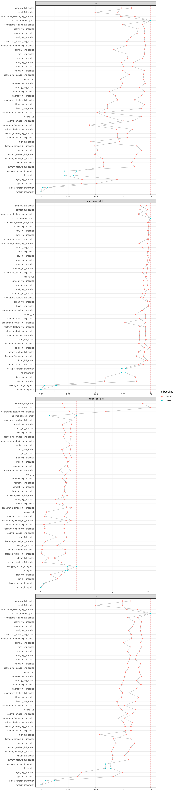

<link href="index_files/libs/lightable-0.0.1/lightable.css" rel="stylesheet" />

missing 'task_description'

<figure>

<figcaption aria-hidden="true">Overview of the results per method. This figures shows the means of the scaled scores per method across all results (group Mean), per dataset (group Dataset) and per metric (group Metric).</figcaption>
</figure>

Overview per parameter set

<figure>

<figcaption aria-hidden="true">Overview of the results per method and parameter set. This figures shows the means of the scaled scores per method parameter set across all results (group Mean), per dataset (group Dataset) and per metric (group Metric).</figcaption>
</figure>

## Methods

-   **Random Integration by Batch** (Open Problems for Single Cell Analysis Consortium 2022): missing 'method_summary'

<!-- -->

-   **BBKNN (full/scaled)** (Polański et al. 2019): missing 'method_summary'

<!-- -->

-   **BBKNN (full/unscaled)** (Polański et al. 2019): missing 'method_summary'

<!-- -->

-   **BBKNN (hvg/scaled)** (Polański et al. 2019): missing 'method_summary'

<!-- -->

-   **BBKNN (hvg/unscaled)** (Polański et al. 2019): missing 'method_summary'

<!-- -->

-   **Random Graph by Celltype** (Open Problems for Single Cell Analysis Consortium 2022): missing 'method_summary'

<!-- -->

-   **Random Integration by Celltype** (Open Problems for Single Cell Analysis Consortium 2022): missing 'method_summary'

<!-- -->

-   **Combat (full/scaled)** (Johnson, Li, and Rabinovic 2006): missing 'method_summary'

<!-- -->

-   **Combat (full/unscaled)** (Johnson, Li, and Rabinovic 2006): missing 'method_summary'

<!-- -->

-   **Combat (hvg/scaled)** (Johnson, Li, and Rabinovic 2006): missing 'method_summary'

<!-- -->

-   **Combat (hvg/unscaled)** (Johnson, Li, and Rabinovic 2006): missing 'method_summary'

<!-- -->

-   **FastMNN embed (full/scaled)** (Lun 2019): missing 'method_summary'

<!-- -->

-   **FastMNN embed (full/unscaled)** (Lun 2019): missing 'method_summary'

<!-- -->

-   **FastMNN embed (hvg/scaled)** (Lun 2019): missing 'method_summary'

<!-- -->

-   **FastMNN embed (hvg/unscaled)** (Lun 2019): missing 'method_summary'

<!-- -->

-   **FastMNN feature (full/scaled)** (Lun 2019): missing 'method_summary'

<!-- -->

-   **FastMNN feature (full/unscaled)** (Lun 2019): missing 'method_summary'

<!-- -->

-   **FastMNN feature (hvg/scaled)** (Lun 2019): missing 'method_summary'

<!-- -->

-   **FastMNN feature (hvg/unscaled)** (Lun 2019): missing 'method_summary'

<!-- -->

-   **Harmony (full/scaled)** (Korsunsky et al. 2019): missing 'method_summary'

<!-- -->

-   **Harmony (full/unscaled)** (Korsunsky et al. 2019): missing 'method_summary'

<!-- -->

-   **Harmony (hvg/scaled)** (Korsunsky et al. 2019): missing 'method_summary'

<!-- -->

-   **Harmony (hvg/unscaled)** (Korsunsky et al. 2019): missing 'method_summary'

<!-- -->

-   **Liger (full/unscaled)** (Welch et al. 2019): missing 'method_summary'

<!-- -->

-   **Liger (hvg/unscaled)** (Welch et al. 2019): missing 'method_summary'

<!-- -->

-   **MNN (full/scaled)** (Haghverdi et al. 2018): missing 'method_summary'

<!-- -->

-   **MNN (full/unscaled)** (Haghverdi et al. 2018): missing 'method_summary'

<!-- -->

-   **MNN (hvg/scaled)** (Haghverdi et al. 2018): missing 'method_summary'

<!-- -->

-   **MNN (hvg/unscaled)** (Haghverdi et al. 2018): missing 'method_summary'

<!-- -->

-   **No Integration** (Open Problems for Single Cell Analysis Consortium 2022): missing 'method_summary'

<!-- -->

-   **Random Integration** (Open Problems for Single Cell Analysis Consortium 2022): missing 'method_summary'

<!-- -->

-   **SCALEX (full)** (Xiong et al. 2022): missing 'method_summary'

<!-- -->

-   **SCALEX (hvg)** (Xiong et al. 2022): missing 'method_summary'

<!-- -->

-   **Scanorama (full/scaled)** (Hie, Bryson, and Berger 2019): missing 'method_summary'

<!-- -->

-   **Scanorama (full/unscaled)** (Hie, Bryson, and Berger 2019): missing 'method_summary'

<!-- -->

-   **Scanorama (hvg/scaled)** (Hie, Bryson, and Berger 2019): missing 'method_summary'

<!-- -->

-   **Scanorama (hvg/unscaled)** (Hie, Bryson, and Berger 2019): missing 'method_summary'

<!-- -->

-   **Scanorama gene output (full/scaled)** (Hie, Bryson, and Berger 2019): missing 'method_summary'

<!-- -->

-   **Scanorama gene output (full/unscaled)** (Hie, Bryson, and Berger 2019): missing 'method_summary'

<!-- -->

-   **Scanorama gene output (hvg/scaled)** (Hie, Bryson, and Berger 2019): missing 'method_summary'

<!-- -->

-   **Scanorama gene output (hvg/unscaled)** (Hie, Bryson, and Berger 2019): missing 'method_summary'

<!-- -->

-   **scANVI (full/unscaled)** (Xu et al. 2021): missing 'method_summary'

<!-- -->

-   **scANVI (hvg/unscaled)** (Xu et al. 2021): missing 'method_summary'

<!-- -->

-   **scVI (full/unscaled)** (Lopez et al. 2018): missing 'method_summary'

<!-- -->

-   **scVI (hvg/unscaled)** (Lopez et al. 2018): missing 'method_summary'

## Datasets

-   **Immune (by batch)** (Luecken et al. 2021): Human immune cells from peripheral blood and bone marrow taken from 5 datasets comprising 10 batches across technologies (10X, Smart-seq2).
-   **Pancreas (by batch)** (Luecken et al. 2021): Human pancreatic islet scRNA-seq data from 6 datasets across technologies (CEL-seq, CEL-seq2, Smart-seq2, inDrop, Fluidigm C1, and SMARTER-seq).

## Metrics

-   **ARI** (Luecken et al. 2021): missing 'metric_summary'
-   **Graph connectivity** (Luecken et al. 2021): missing 'metric_summary'
-   **Isolated label F1** (Luecken et al. 2021): missing 'metric_summary'
-   **NMI** (Luecken et al. 2021): missing 'metric_summary'

## Details

Quality control checks

<table class="table lightable-paper" style='margin-left: auto; margin-right: auto; font-family: "Arial Narrow", arial, helvetica, sans-serif; margin-left: auto; margin-right: auto;'>
 <thead>
  <tr>
   <th style="text-align:left;"> Category </th>
   <th style="text-align:left;"> Name </th>
   <th style="text-align:right;"> Value </th>
   <th style="text-align:left;"> Condition </th>
   <th style="text-align:left;"> Severity </th>
  </tr>
 </thead>
<tbody>
  <tr>
   <td style="text-align:left;" data-toggle="tooltip" data-container="body" data-placement="right" title="Method combat_full_scaled performs a lot better than baselines.
  Task id: batch_integration_graph
  Method id: combat_full_scaled
  Metric id: isolated_labels_f1
  Best score: 3.0647051566740684%
"> Scaling </td>
   <td style="text-align:left;" data-toggle="tooltip" data-container="body" data-placement="right" title="Method combat_full_scaled performs a lot better than baselines.
  Task id: batch_integration_graph
  Method id: combat_full_scaled
  Metric id: isolated_labels_f1
  Best score: 3.0647051566740684%
"> Best score combat_full_scaled isolated_labels_f1 </td>
   <td style="text-align:right;" data-toggle="tooltip" data-container="body" data-placement="right" title="Method combat_full_scaled performs a lot better than baselines.
  Task id: batch_integration_graph
  Method id: combat_full_scaled
  Metric id: isolated_labels_f1
  Best score: 3.0647051566740684%
"> 3.064705 </td>
   <td style="text-align:left;" data-toggle="tooltip" data-container="body" data-placement="right" title="Method combat_full_scaled performs a lot better than baselines.
  Task id: batch_integration_graph
  Method id: combat_full_scaled
  Metric id: isolated_labels_f1
  Best score: 3.0647051566740684%
"> best_score &lt;= 2 </td>
   <td style="text-align:left;color: red !important;" data-toggle="tooltip" data-container="body" data-placement="right" title="Method combat_full_scaled performs a lot better than baselines.
  Task id: batch_integration_graph
  Method id: combat_full_scaled
  Metric id: isolated_labels_f1
  Best score: 3.0647051566740684%
"> ✗ </td>
  </tr>
  <tr>
   <td style="text-align:left;" data-toggle="tooltip" data-container="body" data-placement="right" title="Method harmony_full_scaled performs a lot better than baselines.
  Task id: batch_integration_graph
  Method id: harmony_full_scaled
  Metric id: isolated_labels_f1
  Best score: 2.8549222797927465%
"> Scaling </td>
   <td style="text-align:left;" data-toggle="tooltip" data-container="body" data-placement="right" title="Method harmony_full_scaled performs a lot better than baselines.
  Task id: batch_integration_graph
  Method id: harmony_full_scaled
  Metric id: isolated_labels_f1
  Best score: 2.8549222797927465%
"> Best score harmony_full_scaled isolated_labels_f1 </td>
   <td style="text-align:right;" data-toggle="tooltip" data-container="body" data-placement="right" title="Method harmony_full_scaled performs a lot better than baselines.
  Task id: batch_integration_graph
  Method id: harmony_full_scaled
  Metric id: isolated_labels_f1
  Best score: 2.8549222797927465%
"> 2.854922 </td>
   <td style="text-align:left;" data-toggle="tooltip" data-container="body" data-placement="right" title="Method harmony_full_scaled performs a lot better than baselines.
  Task id: batch_integration_graph
  Method id: harmony_full_scaled
  Metric id: isolated_labels_f1
  Best score: 2.8549222797927465%
"> best_score &lt;= 2 </td>
   <td style="text-align:left;color: red !important;" data-toggle="tooltip" data-container="body" data-placement="right" title="Method harmony_full_scaled performs a lot better than baselines.
  Task id: batch_integration_graph
  Method id: harmony_full_scaled
  Metric id: isolated_labels_f1
  Best score: 2.8549222797927465%
"> ✗ </td>
  </tr>
</tbody>
</table>

Visualization of raw results

## References

Haghverdi, Laleh, Aaron T L Lun, Michael D Morgan, and John C Marioni. 2018. "Batch Effects in Single-Cell RNA-Sequencing Data Are Corrected by Matching Mutual Nearest Neighbors." *Nature Biotechnology* 36 (5): 421--27. <https://doi.org/10.1038/nbt.4091>.

Hie, Brian, Bryan Bryson, and Bonnie Berger. 2019. "Efficient Integration of Heterogeneous Single-Cell Transcriptomes Using Scanorama." *Nature Biotechnology* 37 (6): 685--91. <https://doi.org/10.1038/s41587-019-0113-3>.

Johnson, W. Evan, Cheng Li, and Ariel Rabinovic. 2006. "Adjusting Batch Effects in Microarray Expression Data Using Empirical Bayes Methods." *Biostatistics* 8 (1): 118--27. <https://doi.org/10.1093/biostatistics/kxj037>.

Korsunsky, Ilya, Nghia Millard, Jean Fan, Kamil Slowikowski, Fan Zhang, Kevin Wei, Yuriy Baglaenko, Michael Brenner, Po-ru Loh, and Soumya Raychaudhuri. 2019. "Fast, Sensitive and Accurate Integration of Single-Cell Data with Harmony." *Nature Methods* 16 (12): 1289--96. <https://doi.org/10.1038/s41592-019-0619-0>.

Lopez, Romain, Jeffrey Regier, Michael B. Cole, Michael I. Jordan, and Nir Yosef. 2018. "Deep Generative Modeling for Single-Cell Transcriptomics." *Nature Methods* 15 (12): 1053--58. <https://doi.org/10.1038/s41592-018-0229-2>.

Luecken, Malte D., M. Büttner, K. Chaichoompu, A. Danese, M. Interlandi, M. F. Mueller, D. C. Strobl, et al. 2021. "Benchmarking Atlas-Level Data Integration in Single-Cell Genomics." *Nature Methods* 19 (1): 41--50. <https://doi.org/10.1038/s41592-021-01336-8>.

Lun, Aaron. 2019. "A Description of the Theory Behind the fastMNN Algorithm." <https://marionilab.github.io/FurtherMNN2018/theory/description.html>.

Open Problems for Single Cell Analysis Consortium. 2022. "Open Problems." <https://openproblems.bio>.

Polański, Krzysztof, Matthew D Young, Zhichao Miao, Kerstin B Meyer, Sarah A Teichmann, and Jong-Eun Park. 2019. "BBKNN: Fast Batch Alignment of Single Cell Transcriptomes." Edited by Bonnie Berger. *Bioinformatics*. <https://doi.org/10.1093/bioinformatics/btz625>.

Welch, Joshua D., Velina Kozareva, Ashley Ferreira, Charles Vanderburg, Carly Martin, and Evan Z. Macosko. 2019. "Single-Cell Multi-Omic Integration Compares and Contrasts Features of Brain Cell Identity." *Cell* 177 (7): 1873--1887.e17. <https://doi.org/10.1016/j.cell.2019.05.006>.

Xiong, Lei, Kang Tian, Yuzhe Li, Weixi Ning, Xin Gao, and Qiangfeng Cliff Zhang. 2022. "Online Single-Cell Data Integration Through Projecting Heterogeneous Datasets into a Common Cell-Embedding Space." *Nature Communications* 13 (1). <https://doi.org/10.1038/s41467-022-33758-z>.

Xu, Chenling, Romain Lopez, Edouard Mehlman, Jeffrey Regier, Michael I Jordan, and Nir Yosef. 2021. "Probabilistic Harmonization and Annotation of Single-Cell Transcriptomics Data with Deep Generative Models." *Molecular Systems Biology* 17 (1). <https://doi.org/10.15252/msb.20209620>.
