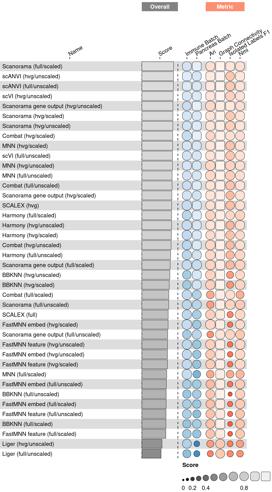
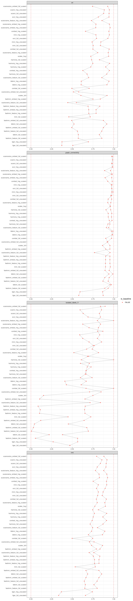

<link href="index_files/libs/datatables-css-0.0.0/datatables-crosstalk.css" rel="stylesheet" />

<link href="index_files/libs/dt-core-1.11.3/css/jquery.dataTables.min.css" rel="stylesheet" />
<link href="index_files/libs/dt-core-1.11.3/css/jquery.dataTables.extra.css" rel="stylesheet" />

<link href="index_files/libs/dt-ext-select-1.11.3/css/select.dataTables.min.css" rel="stylesheet" />

<link href="index_files/libs/dt-ext-searchpanes-1.11.3/css/searchPanes.dataTables.min.css" rel="stylesheet" />

<link href="index_files/libs/dt-ext-buttons-1.11.3/css/buttons.dataTables.min.css" rel="stylesheet" />

<link href="index_files/libs/dt-ext-responsive-1.11.3/css/responsive.dataTables.min.css" rel="stylesheet" />

<link href="index_files/libs/crosstalk-1.2.0/css/crosstalk.min.css" rel="stylesheet" />

<link href="index_files/libs/lightable-0.0.1/lightable.css" rel="stylesheet" />

## Description

Missing 'task_description'

## Summary

<figure>

<figcaption aria-hidden="true">Overview of the results per method. This figures shows the mean of the scaled scores (group Overall), the mean scores per dataset (group Dataset) and the mean scores per metric (group Metric).</figcaption>
</figure>

## Metrics

-   **ARI**<a href="/bibliography#luecken2022benchmarking" target="_blank">1</a>: Missing 'metric_description'.

<!-- -->

-   **Graph connectivity**<a href="/bibliography#luecken2022benchmarking" target="_blank">1</a>: Missing 'metric_description'.

<!-- -->

-   **Isolated label F1**<a href="/bibliography#luecken2022benchmarking" target="_blank">1</a>: Missing 'metric_description'.

<!-- -->

-   **NMI**<a href="/bibliography#luecken2022benchmarking" target="_blank">1</a>: Missing 'metric_description'.

## Results

## Details

Methods

-   **Random Integration by Batch**<a href="/bibliography#openproblems" target="_blank">12</a>: Missing 'method_description'. Links: [Docs](https://github.com/openproblems-bio/openproblems).

<!-- -->

-   **BBKNN (full/scaled)**<a href="/bibliography#polanski2020bbknn" target="_blank">8</a>: Missing 'method_description'. Links: [Docs](https://github.com/Teichlab/bbknn).

<!-- -->

-   **BBKNN (full/unscaled)**<a href="/bibliography#polanski2020bbknn" target="_blank">8</a>: Missing 'method_description'. Links: [Docs](https://github.com/Teichlab/bbknn).

<!-- -->

-   **BBKNN (hvg/scaled)**<a href="/bibliography#polanski2020bbknn" target="_blank">8</a>: Missing 'method_description'. Links: [Docs](https://github.com/Teichlab/bbknn).

<!-- -->

-   **BBKNN (hvg/unscaled)**<a href="/bibliography#polanski2020bbknn" target="_blank">8</a>: Missing 'method_description'. Links: [Docs](https://github.com/Teichlab/bbknn).

<!-- -->

-   **Random Graph by Celltype**<a href="/bibliography#openproblems" target="_blank">12</a>: Missing 'method_description'. Links: [Docs](https://github.com/openproblems-bio/openproblems).

<!-- -->

-   **Random Integration by Celltype**<a href="/bibliography#openproblems" target="_blank">12</a>: Missing 'method_description'. Links: [Docs](https://github.com/openproblems-bio/openproblems).

<!-- -->

-   **Combat (full/scaled)**<a href="/bibliography#hansen2012removing" target="_blank">3</a>: Missing 'method_description'. Links: [Docs](https://scanpy.readthedocs.io/en/stable/api/scanpy.pp.combat.html).

<!-- -->

-   **Combat (full/unscaled)**<a href="/bibliography#hansen2012removing" target="_blank">3</a>: Missing 'method_description'. Links: [Docs](https://scanpy.readthedocs.io/en/stable/api/scanpy.pp.combat.html).

<!-- -->

-   **Combat (hvg/scaled)**<a href="/bibliography#hansen2012removing" target="_blank">3</a>: Missing 'method_description'. Links: [Docs](https://scanpy.readthedocs.io/en/stable/api/scanpy.pp.combat.html).

<!-- -->

-   **Combat (hvg/unscaled)**<a href="/bibliography#hansen2012removing" target="_blank">3</a>: Missing 'method_description'. Links: [Docs](https://scanpy.readthedocs.io/en/stable/api/scanpy.pp.combat.html).

<!-- -->

-   **FastMNN embed (full/scaled)**<a href="/bibliography#lun2019fastmnn" target="_blank">10</a>: Missing 'method_description'. Links: [Docs](https://doi.org/doi:10.18129/B9.bioc.batchelor).

<!-- -->

-   **FastMNN embed (full/unscaled)**<a href="/bibliography#lun2019fastmnn" target="_blank">10</a>: Missing 'method_description'. Links: [Docs](https://doi.org/doi:10.18129/B9.bioc.batchelor).

<!-- -->

-   **FastMNN embed (hvg/scaled)**<a href="/bibliography#lun2019fastmnn" target="_blank">10</a>: Missing 'method_description'. Links: [Docs](https://doi.org/doi:10.18129/B9.bioc.batchelor).

<!-- -->

-   **FastMNN embed (hvg/unscaled)**<a href="/bibliography#lun2019fastmnn" target="_blank">10</a>: Missing 'method_description'. Links: [Docs](https://doi.org/doi:10.18129/B9.bioc.batchelor).

<!-- -->

-   **FastMNN feature (full/scaled)**<a href="/bibliography#lun2019fastmnn" target="_blank">10</a>: Missing 'method_description'. Links: [Docs](https://doi.org/doi:10.18129/B9.bioc.batchelor).

<!-- -->

-   **FastMNN feature (full/unscaled)**<a href="/bibliography#lun2019fastmnn" target="_blank">10</a>: Missing 'method_description'. Links: [Docs](https://doi.org/doi:10.18129/B9.bioc.batchelor).

<!-- -->

-   **FastMNN feature (hvg/scaled)**<a href="/bibliography#lun2019fastmnn" target="_blank">10</a>: Missing 'method_description'. Links: [Docs](https://doi.org/doi:10.18129/B9.bioc.batchelor).

<!-- -->

-   **FastMNN feature (hvg/unscaled)**<a href="/bibliography#lun2019fastmnn" target="_blank">10</a>: Missing 'method_description'. Links: [Docs](https://doi.org/doi:10.18129/B9.bioc.batchelor).

<!-- -->

-   **Harmony (full/scaled)**<a href="/bibliography#korsunsky2019fast" target="_blank">2</a>: Missing 'method_description'. Links: [Docs](https://github.com/lilab-bcb/harmony-pytorch).

<!-- -->

-   **Harmony (full/unscaled)**<a href="/bibliography#korsunsky2019fast" target="_blank">2</a>: Missing 'method_description'. Links: [Docs](https://github.com/lilab-bcb/harmony-pytorch).

<!-- -->

-   **Harmony (hvg/scaled)**<a href="/bibliography#korsunsky2019fast" target="_blank">2</a>: Missing 'method_description'. Links: [Docs](https://github.com/lilab-bcb/harmony-pytorch).

<!-- -->

-   **Harmony (hvg/unscaled)**<a href="/bibliography#korsunsky2019fast" target="_blank">2</a>: Missing 'method_description'. Links: [Docs](https://github.com/lilab-bcb/harmony-pytorch).

<!-- -->

-   **Liger (full/unscaled)**<a href="/bibliography#welch2019single" target="_blank">11</a>: Missing 'method_description'. Links: [Docs](https://github.com/welch-lab/liger).

<!-- -->

-   **Liger (hvg/unscaled)**<a href="/bibliography#welch2019single" target="_blank">11</a>: Missing 'method_description'. Links: [Docs](https://github.com/welch-lab/liger).

<!-- -->

-   **MNN (full/scaled)**<a href="/bibliography#haghverdi2018batch" target="_blank">9</a>: Missing 'method_description'. Links: [Docs](https://github.com/chriscainx/mnnpy).

<!-- -->

-   **MNN (full/unscaled)**<a href="/bibliography#haghverdi2018batch" target="_blank">9</a>: Missing 'method_description'. Links: [Docs](https://github.com/chriscainx/mnnpy).

<!-- -->

-   **MNN (hvg/scaled)**<a href="/bibliography#haghverdi2018batch" target="_blank">9</a>: Missing 'method_description'. Links: [Docs](https://github.com/chriscainx/mnnpy).

<!-- -->

-   **MNN (hvg/unscaled)**<a href="/bibliography#haghverdi2018batch" target="_blank">9</a>: Missing 'method_description'. Links: [Docs](https://github.com/chriscainx/mnnpy).

<!-- -->

-   **No Integration**<a href="/bibliography#openproblems" target="_blank">12</a>: Missing 'method_description'. Links: [Docs](https://github.com/openproblems-bio/openproblems).

<!-- -->

-   **Random Integration**<a href="/bibliography#openproblems" target="_blank">12</a>: Missing 'method_description'. Links: [Docs](https://github.com/openproblems-bio/openproblems).

<!-- -->

-   **SCALEX (full)**<a href="/bibliography#xiong2021online" target="_blank">7</a>: Missing 'method_description'. Links: [Docs](https://github.com/jsxlei/SCALEX).

<!-- -->

-   **SCALEX (hvg)**<a href="/bibliography#xiong2021online" target="_blank">7</a>: Missing 'method_description'. Links: [Docs](https://github.com/jsxlei/SCALEX).

<!-- -->

-   **Scanorama (full/scaled)**<a href="/bibliography#hie2019efficient" target="_blank">4</a>: Missing 'method_description'. Links: [Docs](https://github.com/brianhie/scanorama).

<!-- -->

-   **Scanorama (full/unscaled)**<a href="/bibliography#hie2019efficient" target="_blank">4</a>: Missing 'method_description'. Links: [Docs](https://github.com/brianhie/scanorama).

<!-- -->

-   **Scanorama (hvg/scaled)**<a href="/bibliography#hie2019efficient" target="_blank">4</a>: Missing 'method_description'. Links: [Docs](https://github.com/brianhie/scanorama).

<!-- -->

-   **Scanorama (hvg/unscaled)**<a href="/bibliography#hie2019efficient" target="_blank">4</a>: Missing 'method_description'. Links: [Docs](https://github.com/brianhie/scanorama).

<!-- -->

-   **Scanorama gene output (full/scaled)**<a href="/bibliography#hie2019efficient" target="_blank">4</a>: Missing 'method_description'. Links: [Docs](https://github.com/brianhie/scanorama).

<!-- -->

-   **Scanorama gene output (full/unscaled)**<a href="/bibliography#hie2019efficient" target="_blank">4</a>: Missing 'method_description'. Links: [Docs](https://github.com/brianhie/scanorama).

<!-- -->

-   **Scanorama gene output (hvg/scaled)**<a href="/bibliography#hie2019efficient" target="_blank">4</a>: Missing 'method_description'. Links: [Docs](https://github.com/brianhie/scanorama).

<!-- -->

-   **Scanorama gene output (hvg/unscaled)**<a href="/bibliography#hie2019efficient" target="_blank">4</a>: Missing 'method_description'. Links: [Docs](https://github.com/brianhie/scanorama).

<!-- -->

-   **scANVI (full/unscaled)**<a href="/bibliography#xu2021probabilistic" target="_blank">5</a>: Missing 'method_description'. Links: [Docs](https://github.com/YosefLab/scvi-tools).

<!-- -->

-   **scANVI (hvg/unscaled)**<a href="/bibliography#xu2021probabilistic" target="_blank">5</a>: Missing 'method_description'. Links: [Docs](https://github.com/YosefLab/scvi-tools).

<!-- -->

-   **scVI (full/unscaled)**<a href="/bibliography#lopez2018deep" target="_blank">6</a>: Missing 'method_description'. Links: [Docs](https://github.com/YosefLab/scvi-tools).

<!-- -->

-   **scVI (hvg/unscaled)**<a href="/bibliography#lopez2018deep" target="_blank">6</a>: Missing 'method_description'. Links: [Docs](https://github.com/YosefLab/scvi-tools).

Baseline methods

-   **Random Integration by Batch**: Missing 'method_description'.

<!-- -->

-   **Random Graph by Celltype**: Missing 'method_description'.

<!-- -->

-   **Random Integration by Celltype**: Missing 'method_description'.

<!-- -->

-   **No Integration**: Missing 'method_description'.

<!-- -->

-   **Random Integration**: Missing 'method_description'.

Datasets

-   **Immune (by batch)**<a href="/bibliography#luecken2022benchmarking" target="_blank">1</a>: Missing 'dataset_description'.

<!-- -->

-   **Pancreas (by batch)**<a href="/bibliography#luecken2022benchmarking" target="_blank">1</a>: Missing 'dataset_description'.

Download raw data

<a href="data/task_info.json" class="btn btn-secondary">Task info</a>
<a href="data/method_info.json" class="btn btn-secondary">Method info</a>
<a href="data/metric_info.json" class="btn btn-secondary">Metric info</a>
<a href="data/dataset_info.json" class="btn btn-secondary">Dataset info</a>
<a href="data/results.json" class="btn btn-secondary">Results</a>
<a href="data/quality_control.json" class="btn btn-secondary">Quality control</a>

Quality control results

<table class="table lightable-paper" style='margin-left: auto; margin-right: auto; font-family: "Arial Narrow", arial, helvetica, sans-serif; margin-left: auto; margin-right: auto;'>
 <thead>
  <tr>
   <th style="text-align:left;"> Category </th>
   <th style="text-align:left;"> Name </th>
   <th style="text-align:right;"> Value </th>
   <th style="text-align:left;"> Condition </th>
   <th style="text-align:left;"> Severity </th>
  </tr>
 </thead>
<tbody>
  <tr>
   <td style="text-align:left;" data-toggle="tooltip" data-container="body" data-placement="right" title="Dataset metadata field 'dataset_description' should be defined
  Task id: batch_integration_graph
  Field: dataset_description
"> Dataset info </td>
   <td style="text-align:left;" data-toggle="tooltip" data-container="body" data-placement="right" title="Dataset metadata field 'dataset_description' should be defined
  Task id: batch_integration_graph
  Field: dataset_description
"> Pct 'dataset_description' missing </td>
   <td style="text-align:right;" data-toggle="tooltip" data-container="body" data-placement="right" title="Dataset metadata field 'dataset_description' should be defined
  Task id: batch_integration_graph
  Field: dataset_description
"> 1.000000 </td>
   <td style="text-align:left;" data-toggle="tooltip" data-container="body" data-placement="right" title="Dataset metadata field 'dataset_description' should be defined
  Task id: batch_integration_graph
  Field: dataset_description
"> percent_missing(dataset_info, field) </td>
   <td style="text-align:left;color: red !important;" data-toggle="tooltip" data-container="body" data-placement="right" title="Dataset metadata field 'dataset_description' should be defined
  Task id: batch_integration_graph
  Field: dataset_description
"> ✗✗ </td>
  </tr>
  <tr>
   <td style="text-align:left;" data-toggle="tooltip" data-container="body" data-placement="right" title="Method metadata field 'method_description' should be defined
  Task id: batch_integration_graph
  Field: method_description
"> Method info </td>
   <td style="text-align:left;" data-toggle="tooltip" data-container="body" data-placement="right" title="Method metadata field 'method_description' should be defined
  Task id: batch_integration_graph
  Field: method_description
"> Pct 'method_description' missing </td>
   <td style="text-align:right;" data-toggle="tooltip" data-container="body" data-placement="right" title="Method metadata field 'method_description' should be defined
  Task id: batch_integration_graph
  Field: method_description
"> 1.000000 </td>
   <td style="text-align:left;" data-toggle="tooltip" data-container="body" data-placement="right" title="Method metadata field 'method_description' should be defined
  Task id: batch_integration_graph
  Field: method_description
"> percent_missing(method_info, field) </td>
   <td style="text-align:left;color: red !important;" data-toggle="tooltip" data-container="body" data-placement="right" title="Method metadata field 'method_description' should be defined
  Task id: batch_integration_graph
  Field: method_description
"> ✗✗ </td>
  </tr>
  <tr>
   <td style="text-align:left;" data-toggle="tooltip" data-container="body" data-placement="right" title="Metric metadata field 'metric_description' should be defined
  Task id: batch_integration_graph
  Field: metric_description
"> Metric info </td>
   <td style="text-align:left;" data-toggle="tooltip" data-container="body" data-placement="right" title="Metric metadata field 'metric_description' should be defined
  Task id: batch_integration_graph
  Field: metric_description
"> Pct 'metric_description' missing </td>
   <td style="text-align:right;" data-toggle="tooltip" data-container="body" data-placement="right" title="Metric metadata field 'metric_description' should be defined
  Task id: batch_integration_graph
  Field: metric_description
"> 1.000000 </td>
   <td style="text-align:left;" data-toggle="tooltip" data-container="body" data-placement="right" title="Metric metadata field 'metric_description' should be defined
  Task id: batch_integration_graph
  Field: metric_description
"> percent_missing(metric_info, field) </td>
   <td style="text-align:left;color: red !important;" data-toggle="tooltip" data-container="body" data-placement="right" title="Metric metadata field 'metric_description' should be defined
  Task id: batch_integration_graph
  Field: metric_description
"> ✗✗ </td>
  </tr>
  <tr>
   <td style="text-align:left;" data-toggle="tooltip" data-container="body" data-placement="right" title="Task metadata field 'task_description' should be defined
  Task id: batch_integration_graph
  Field: task_description
"> Task info </td>
   <td style="text-align:left;" data-toggle="tooltip" data-container="body" data-placement="right" title="Task metadata field 'task_description' should be defined
  Task id: batch_integration_graph
  Field: task_description
"> Pct 'task_description' missing </td>
   <td style="text-align:right;" data-toggle="tooltip" data-container="body" data-placement="right" title="Task metadata field 'task_description' should be defined
  Task id: batch_integration_graph
  Field: task_description
"> 1.000000 </td>
   <td style="text-align:left;" data-toggle="tooltip" data-container="body" data-placement="right" title="Task metadata field 'task_description' should be defined
  Task id: batch_integration_graph
  Field: task_description
"> percent_missing([task_info], field) </td>
   <td style="text-align:left;color: red !important;" data-toggle="tooltip" data-container="body" data-placement="right" title="Task metadata field 'task_description' should be defined
  Task id: batch_integration_graph
  Field: task_description
"> ✗✗ </td>
  </tr>
  <tr>
   <td style="text-align:left;" data-toggle="tooltip" data-container="body" data-placement="right" title="Method combat_full_scaled performs a lot better than baselines.
  Task id: batch_integration_graph
  Method id: combat_full_scaled
  Metric id: isolated_labels_f1
  Best score: 3.0647051566740684%
"> Scaling </td>
   <td style="text-align:left;" data-toggle="tooltip" data-container="body" data-placement="right" title="Method combat_full_scaled performs a lot better than baselines.
  Task id: batch_integration_graph
  Method id: combat_full_scaled
  Metric id: isolated_labels_f1
  Best score: 3.0647051566740684%
"> Best score combat_full_scaled isolated_labels_f1 </td>
   <td style="text-align:right;" data-toggle="tooltip" data-container="body" data-placement="right" title="Method combat_full_scaled performs a lot better than baselines.
  Task id: batch_integration_graph
  Method id: combat_full_scaled
  Metric id: isolated_labels_f1
  Best score: 3.0647051566740684%
"> 3.064705 </td>
   <td style="text-align:left;" data-toggle="tooltip" data-container="body" data-placement="right" title="Method combat_full_scaled performs a lot better than baselines.
  Task id: batch_integration_graph
  Method id: combat_full_scaled
  Metric id: isolated_labels_f1
  Best score: 3.0647051566740684%
"> best_score &lt;= 2 </td>
   <td style="text-align:left;color: red !important;" data-toggle="tooltip" data-container="body" data-placement="right" title="Method combat_full_scaled performs a lot better than baselines.
  Task id: batch_integration_graph
  Method id: combat_full_scaled
  Metric id: isolated_labels_f1
  Best score: 3.0647051566740684%
"> ✗ </td>
  </tr>
  <tr>
   <td style="text-align:left;" data-toggle="tooltip" data-container="body" data-placement="right" title="Method harmony_full_scaled performs a lot better than baselines.
  Task id: batch_integration_graph
  Method id: harmony_full_scaled
  Metric id: isolated_labels_f1
  Best score: 2.8549222797927465%
"> Scaling </td>
   <td style="text-align:left;" data-toggle="tooltip" data-container="body" data-placement="right" title="Method harmony_full_scaled performs a lot better than baselines.
  Task id: batch_integration_graph
  Method id: harmony_full_scaled
  Metric id: isolated_labels_f1
  Best score: 2.8549222797927465%
"> Best score harmony_full_scaled isolated_labels_f1 </td>
   <td style="text-align:right;" data-toggle="tooltip" data-container="body" data-placement="right" title="Method harmony_full_scaled performs a lot better than baselines.
  Task id: batch_integration_graph
  Method id: harmony_full_scaled
  Metric id: isolated_labels_f1
  Best score: 2.8549222797927465%
"> 2.854922 </td>
   <td style="text-align:left;" data-toggle="tooltip" data-container="body" data-placement="right" title="Method harmony_full_scaled performs a lot better than baselines.
  Task id: batch_integration_graph
  Method id: harmony_full_scaled
  Metric id: isolated_labels_f1
  Best score: 2.8549222797927465%
"> best_score &lt;= 2 </td>
   <td style="text-align:left;color: red !important;" data-toggle="tooltip" data-container="body" data-placement="right" title="Method harmony_full_scaled performs a lot better than baselines.
  Task id: batch_integration_graph
  Method id: harmony_full_scaled
  Metric id: isolated_labels_f1
  Best score: 2.8549222797927465%
"> ✗ </td>
  </tr>
</tbody>
</table>

Visualization of raw results

