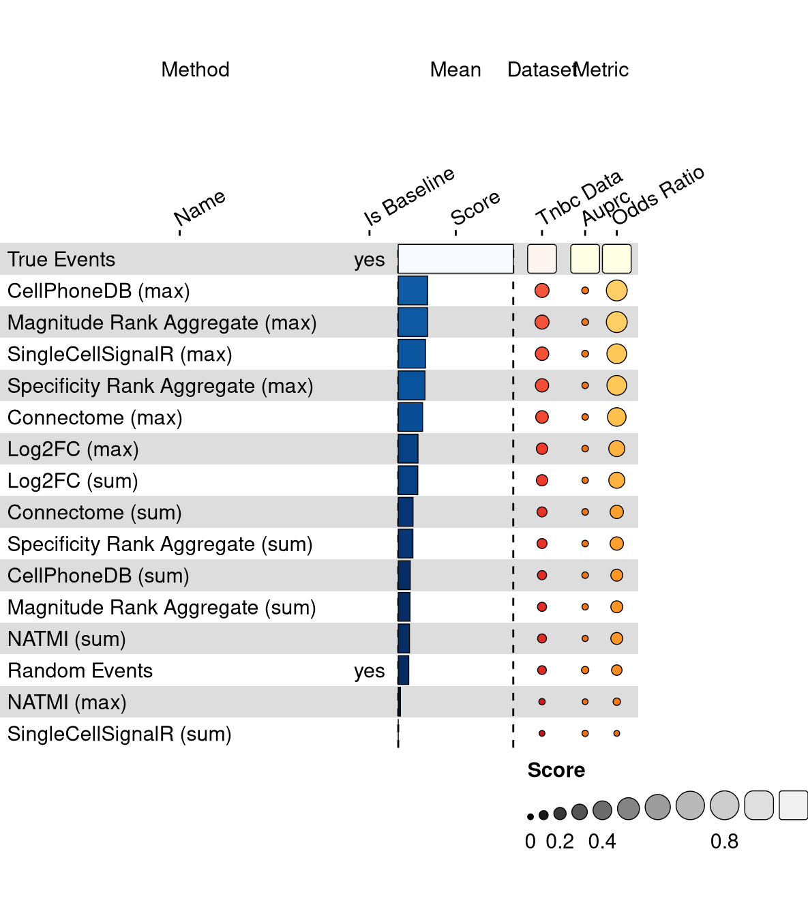
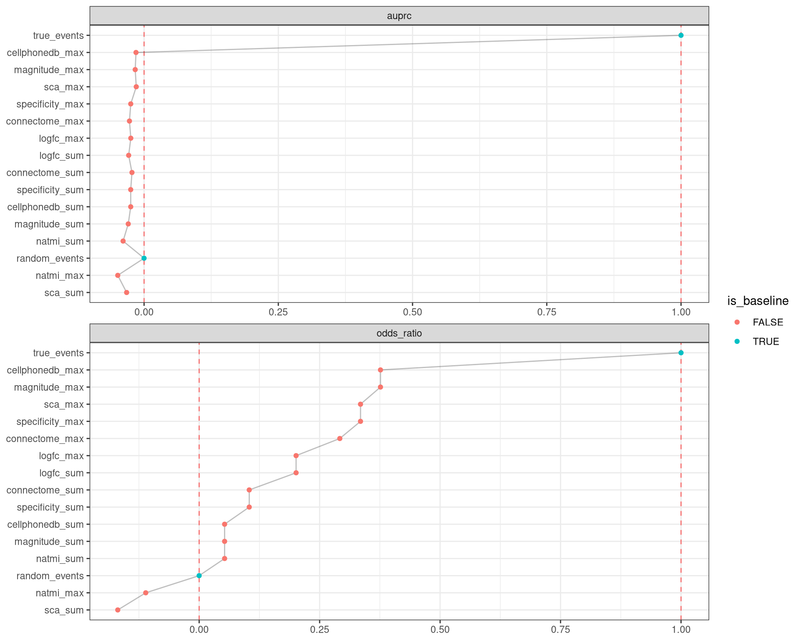

<missing description>

## Overview

This visualization shows the means of the scaled scores per method across all results (group Mean), per dataset (group Dataset) and per metric (group Metric).

<figure>

<figcaption aria-hidden="true">The average overall, per dataset and per metric scaled scores per method.</figcaption>
</figure>

Overview per parameter set

<figure>

<figcaption aria-hidden="true">The average overall, per dataset and per metric scaled scores per method and parameter set.</figcaption>
</figure>

## Metrics

-   **Precision-recall AUC**: <missing description>
-   **Odds Ratio**: <missing description>

## Details

Quality control checks

✓ All checks succeeded!

Visualization of raw results

