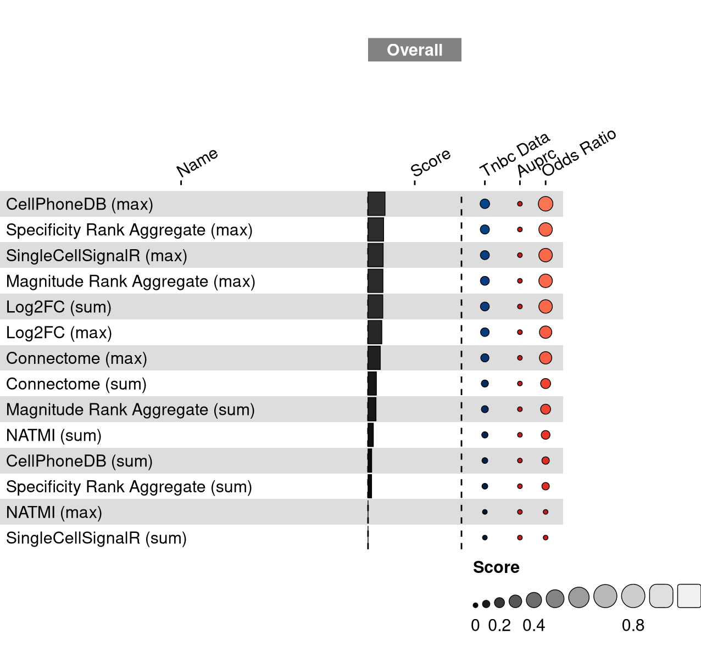

missing 'task_description'

<figure>

<figcaption aria-hidden="true">Overview of the results per method. This figures shows the means of the scaled scores per method across all results (group Mean), per dataset (group Dataset) and per metric (group Metric).</figcaption>
</figure>

Overview per parameter set

<figure>

<figcaption aria-hidden="true">Overview of the results per method and parameter set. This figures shows the means of the scaled scores per method parameter set across all results (group Mean), per dataset (group Dataset) and per metric (group Metric).</figcaption>
</figure>

## Methods

-   **CellPhoneDB (max)** (Efremova et al. 2020): missing 'method_summary'

<!-- -->

-   **CellPhoneDB (sum)** (Efremova et al. 2020): missing 'method_summary'

<!-- -->

-   **Connectome (max)** (Raredon et al. 2022): missing 'method_summary'

<!-- -->

-   **Connectome (sum)** (Raredon et al. 2022): missing 'method_summary'

<!-- -->

-   **Log2FC (max)** (Raredon et al. 2022): missing 'method_summary'

<!-- -->

-   **Log2FC (sum)** (Raredon et al. 2022): missing 'method_summary'

<!-- -->

-   **Magnitude Rank Aggregate (max)** (Dimitrov et al. 2022): missing 'method_summary'

<!-- -->

-   **Magnitude Rank Aggregate (sum)** (Dimitrov et al. 2022): missing 'method_summary'

<!-- -->

-   **NATMI (max)** (Hou et al. 2020): missing 'method_summary'

<!-- -->

-   **NATMI (sum)** (Hou et al. 2020): missing 'method_summary'

<!-- -->

-   **Random Events** (Open Problems for Single Cell Analysis Consortium 2022): missing 'method_summary'

<!-- -->

-   **SingleCellSignalR (max)** (Cabello-Aguilar et al. 2020): missing 'method_summary'

<!-- -->

-   **SingleCellSignalR (sum)** (Cabello-Aguilar et al. 2020): missing 'method_summary'

<!-- -->

-   **Specificity Rank Aggregate (max)** (Dimitrov et al. 2022): missing 'method_summary'

<!-- -->

-   **Specificity Rank Aggregate (sum)** (Dimitrov et al. 2022): missing 'method_summary'

<!-- -->

-   **True Events** (Open Problems for Single Cell Analysis Consortium 2022): missing 'method_summary'

## Datasets

-   **Triple negative breast cancer atlas** (Wu et al. 2021): Human breast cancer atlas (Wu et al., 2021), with cytokine activities, inferred using a multivariate linear model with cytokine-focused signatures, as assumed true cell-cell communication (Dimitrov et al., 2022). 42512 cells x 28078 features with 29 cell types from 10 patients

## Metrics

-   **Precision-recall AUC** (Davis and Goadrich 2006): missing 'metric_summary'
-   **Odds Ratio** (Bland 2000): missing 'metric_summary'

## Details

Quality control checks

✓ All checks succeeded!

Visualization of raw results

## References

Bland, J. M. 2000. "Statistics Notes: The Odds Ratio." *BMJ* 320 (7247): 1468--68. <https://doi.org/10.1136/bmj.320.7247.1468>.

Cabello-Aguilar, Simon, Mélissa Alame, Fabien Kon-Sun-Tack, Caroline Fau, Matthieu Lacroix, and Jacques Colinge. 2020. "SingleCellSignalR: Inference of Intercellular Networks from Single-Cell Transcriptomics." *Nucleic Acids Research* 48 (10): e55--55. <https://doi.org/10.1093/nar/gkaa183>.

Davis, Jesse, and Mark Goadrich. 2006. "The Relationship Between Precision-Recall and ROC Curves." In *Proceedings of the 23rd International Conference on Machine Learning - ICML 06*. ACM Press. <https://doi.org/10.1145/1143844.1143874>.

Dimitrov, Daniel, Dénes Türei, Martin Garrido-Rodriguez, Paul L. Burmedi, James S. Nagai, Charlotte Boys, Ricardo O. Ramirez Flores, et al. 2022. "Comparison of Methods and Resources for Cell-Cell Communication Inference from Single-Cell RNA-Seq Data." *Nature Communications* 13 (1). <https://doi.org/10.1038/s41467-022-30755-0>.

Efremova, Mirjana, Miquel Vento-Tormo, Sarah A. Teichmann, and Roser Vento-Tormo. 2020. "CellPhoneDB: Inferring Cellcell Communication from Combined Expression of Multi-Subunit Ligandreceptor Complexes." *Nature Protocols* 15 (4): 1484--1506. <https://doi.org/10.1038/s41596-020-0292-x>.

Hou, Rui, Elena Denisenko, Huan Ting Ong, Jordan A. Ramilowski, and Alistair R. R. Forrest. 2020. "Predicting Cell-to-Cell Communication Networks Using NATMI." *Nature Communications* 11 (1). <https://doi.org/10.1038/s41467-020-18873-z>.

Open Problems for Single Cell Analysis Consortium. 2022. "Open Problems." <https://openproblems.bio>.

Raredon, Micha Sam Brickman, Junchen Yang, James Garritano, Meng Wang, Dan Kushnir, Jonas Christian Schupp, Taylor S. Adams, et al. 2022. "Computation and Visualization of Cellcell Signaling Topologies in Single-Cell Systems Data Using Connectome." *Scientific Reports* 12 (1). <https://doi.org/10.1038/s41598-022-07959-x>.

Wu, Sunny Z., Ghamdan Al-Eryani, Daniel Lee Roden, Simon Junankar, Kate Harvey, Alma Andersson, Aatish Thennavan, et al. 2021. "A Single-Cell and Spatially Resolved Atlas of Human Breast Cancers." *Nature Genetics* 53 (9): 1334--47. <https://doi.org/10.1038/s41588-021-00911-1>.
