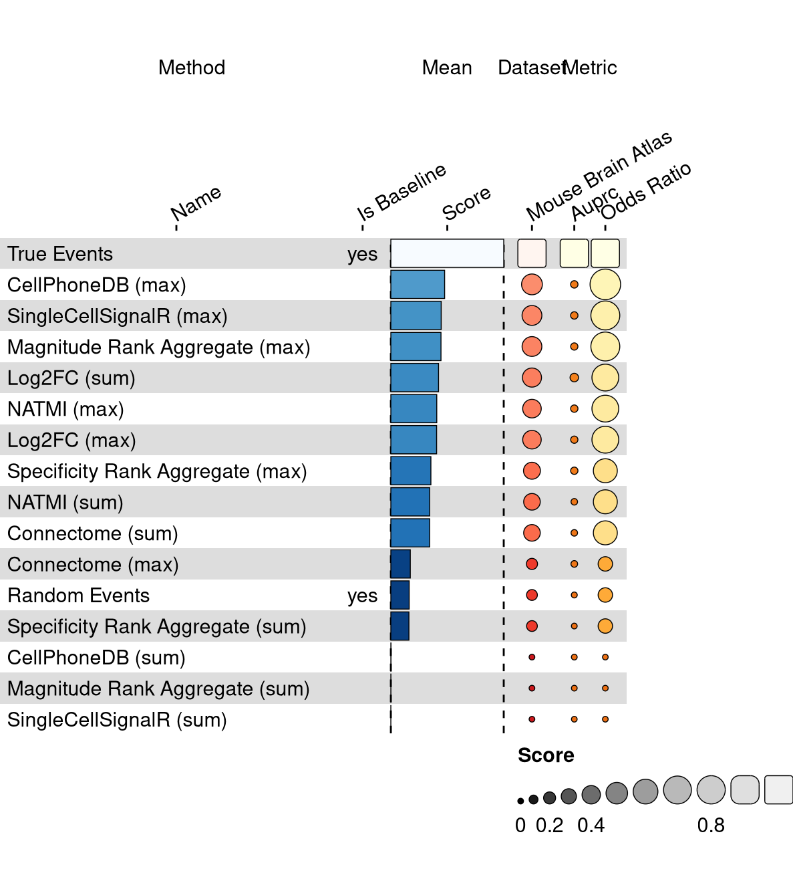
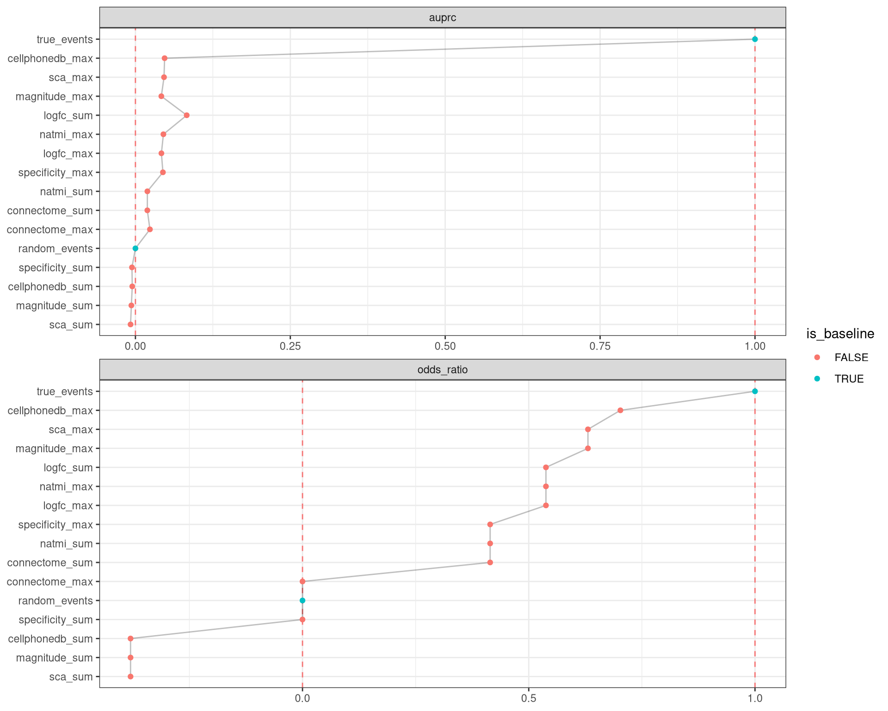

<link href="index_files/libs/lightable-0.0.1/lightable.css" rel="stylesheet" />

missing 'task_description'

<figure>

<figcaption aria-hidden="true">Overview of the results per method. This figures shows the means of the scaled scores per method across all results (group Mean), per dataset (group Dataset) and per metric (group Metric).</figcaption>
</figure>

Overview per parameter set

<figure>

<figcaption aria-hidden="true">Overview of the results per method and parameter set. This figures shows the means of the scaled scores per method parameter set across all results (group Mean), per dataset (group Dataset) and per metric (group Metric).</figcaption>
</figure>

## Methods

-   **CellPhoneDB (max)** (Efremova et al. 2020): missing 'method_summary'

<!-- -->

-   **CellPhoneDB (sum)** (Efremova et al. 2020): missing 'method_summary'

<!-- -->

-   **Connectome (max)** (Raredon et al. 2022): missing 'method_summary'

<!-- -->

-   **Connectome (sum)** (Raredon et al. 2022): missing 'method_summary'

<!-- -->

-   **Log2FC (max)** (Raredon et al. 2022): missing 'method_summary'

<!-- -->

-   **Log2FC (sum)** (Raredon et al. 2022): missing 'method_summary'

<!-- -->

-   **Magnitude Rank Aggregate (max)** (Dimitrov et al. 2022): missing 'method_summary'

<!-- -->

-   **Magnitude Rank Aggregate (sum)** (Dimitrov et al. 2022): missing 'method_summary'

<!-- -->

-   **NATMI (max)** (Hou et al. 2020): missing 'method_summary'

<!-- -->

-   **NATMI (sum)** (Hou et al. 2020): missing 'method_summary'

<!-- -->

-   **Random Events** (Open Problems for Single Cell Analysis Consortium 2022): missing 'method_summary'

<!-- -->

-   **SingleCellSignalR (max)** (Cabello-Aguilar et al. 2020): missing 'method_summary'

<!-- -->

-   **SingleCellSignalR (sum)** (Cabello-Aguilar et al. 2020): missing 'method_summary'

<!-- -->

-   **Specificity Rank Aggregate (max)** (Dimitrov et al. 2022): missing 'method_summary'

<!-- -->

-   **Specificity Rank Aggregate (sum)** (Dimitrov et al. 2022): missing 'method_summary'

<!-- -->

-   **True Events** (Open Problems for Single Cell Analysis Consortium 2022): missing 'method_summary'

## Datasets

-   **Mouse brain atlas** (Tasic et al. 2016): A murine brain atlas with adjacent cell types as assumed benchmark truth, inferred from deconvolution proportion correlations using matching 10x Visium slides (see Dimitrov et al., 2022). 14249 cells x 34617 features with 23 cell type labels.

## Metrics

-   **Precision-recall AUC** (Davis and Goadrich 2006): missing 'metric_summary'
-   **Odds Ratio** (Bland 2000): missing 'metric_summary'

## Details

Quality control checks

<table class="table lightable-paper" style='margin-left: auto; margin-right: auto; font-family: "Arial Narrow", arial, helvetica, sans-serif; margin-left: auto; margin-right: auto;'>
 <thead>
  <tr>
   <th style="text-align:left;"> Category </th>
   <th style="text-align:left;"> Name </th>
   <th style="text-align:right;"> Value </th>
   <th style="text-align:left;"> Condition </th>
   <th style="text-align:left;"> Severity </th>
  </tr>
 </thead>
<tbody>
  <tr>
   <td style="text-align:left;" data-toggle="tooltip" data-container="body" data-placement="right" title="Percentage of missing results should be less than 10%.
  Task id: cell_cell_communication_source_target
  method id: cellphonedb_sum
  Percentage missing: 50%
"> Raw results </td>
   <td style="text-align:left;" data-toggle="tooltip" data-container="body" data-placement="right" title="Percentage of missing results should be less than 10%.
  Task id: cell_cell_communication_source_target
  method id: cellphonedb_sum
  Percentage missing: 50%
"> Method cellphonedb_sum %missing </td>
   <td style="text-align:right;" data-toggle="tooltip" data-container="body" data-placement="right" title="Percentage of missing results should be less than 10%.
  Task id: cell_cell_communication_source_target
  method id: cellphonedb_sum
  Percentage missing: 50%
"> 0.5000 </td>
   <td style="text-align:left;" data-toggle="tooltip" data-container="body" data-placement="right" title="Percentage of missing results should be less than 10%.
  Task id: cell_cell_communication_source_target
  method id: cellphonedb_sum
  Percentage missing: 50%
"> pct_missing &lt;= .1 </td>
   <td style="text-align:left;color: red !important;" data-toggle="tooltip" data-container="body" data-placement="right" title="Percentage of missing results should be less than 10%.
  Task id: cell_cell_communication_source_target
  method id: cellphonedb_sum
  Percentage missing: 50%
"> ✗✗✗ </td>
  </tr>
  <tr>
   <td style="text-align:left;" data-toggle="tooltip" data-container="body" data-placement="right" title="Percentage of missing results should be less than 10%.
  Task id: cell_cell_communication_source_target
  method id: magnitude_sum
  Percentage missing: 50%
"> Raw results </td>
   <td style="text-align:left;" data-toggle="tooltip" data-container="body" data-placement="right" title="Percentage of missing results should be less than 10%.
  Task id: cell_cell_communication_source_target
  method id: magnitude_sum
  Percentage missing: 50%
"> Method magnitude_sum %missing </td>
   <td style="text-align:right;" data-toggle="tooltip" data-container="body" data-placement="right" title="Percentage of missing results should be less than 10%.
  Task id: cell_cell_communication_source_target
  method id: magnitude_sum
  Percentage missing: 50%
"> 0.5000 </td>
   <td style="text-align:left;" data-toggle="tooltip" data-container="body" data-placement="right" title="Percentage of missing results should be less than 10%.
  Task id: cell_cell_communication_source_target
  method id: magnitude_sum
  Percentage missing: 50%
"> pct_missing &lt;= .1 </td>
   <td style="text-align:left;color: red !important;" data-toggle="tooltip" data-container="body" data-placement="right" title="Percentage of missing results should be less than 10%.
  Task id: cell_cell_communication_source_target
  method id: magnitude_sum
  Percentage missing: 50%
"> ✗✗✗ </td>
  </tr>
  <tr>
   <td style="text-align:left;" data-toggle="tooltip" data-container="body" data-placement="right" title="Percentage of missing results should be less than 10%.
  Task id: cell_cell_communication_source_target
  method id: sca_sum
  Percentage missing: 50%
"> Raw results </td>
   <td style="text-align:left;" data-toggle="tooltip" data-container="body" data-placement="right" title="Percentage of missing results should be less than 10%.
  Task id: cell_cell_communication_source_target
  method id: sca_sum
  Percentage missing: 50%
"> Method sca_sum %missing </td>
   <td style="text-align:right;" data-toggle="tooltip" data-container="body" data-placement="right" title="Percentage of missing results should be less than 10%.
  Task id: cell_cell_communication_source_target
  method id: sca_sum
  Percentage missing: 50%
"> 0.5000 </td>
   <td style="text-align:left;" data-toggle="tooltip" data-container="body" data-placement="right" title="Percentage of missing results should be less than 10%.
  Task id: cell_cell_communication_source_target
  method id: sca_sum
  Percentage missing: 50%
"> pct_missing &lt;= .1 </td>
   <td style="text-align:left;color: red !important;" data-toggle="tooltip" data-container="body" data-placement="right" title="Percentage of missing results should be less than 10%.
  Task id: cell_cell_communication_source_target
  method id: sca_sum
  Percentage missing: 50%
"> ✗✗✗ </td>
  </tr>
  <tr>
   <td style="text-align:left;" data-toggle="tooltip" data-container="body" data-placement="right" title="Percentage of missing results should be less than 10%.
  Task id: cell_cell_communication_source_target
  Metric id: odds_ratio
  Percentage missing: 19%
"> Raw results </td>
   <td style="text-align:left;" data-toggle="tooltip" data-container="body" data-placement="right" title="Percentage of missing results should be less than 10%.
  Task id: cell_cell_communication_source_target
  Metric id: odds_ratio
  Percentage missing: 19%
"> Metric odds_ratio %missing </td>
   <td style="text-align:right;" data-toggle="tooltip" data-container="body" data-placement="right" title="Percentage of missing results should be less than 10%.
  Task id: cell_cell_communication_source_target
  Metric id: odds_ratio
  Percentage missing: 19%
"> 0.1875 </td>
   <td style="text-align:left;" data-toggle="tooltip" data-container="body" data-placement="right" title="Percentage of missing results should be less than 10%.
  Task id: cell_cell_communication_source_target
  Metric id: odds_ratio
  Percentage missing: 19%
"> pct_missing &lt;= .1 </td>
   <td style="text-align:left;color: red !important;" data-toggle="tooltip" data-container="body" data-placement="right" title="Percentage of missing results should be less than 10%.
  Task id: cell_cell_communication_source_target
  Metric id: odds_ratio
  Percentage missing: 19%
"> ✗ </td>
  </tr>
</tbody>
</table>

Visualization of raw results

## References

Bland, J. M. 2000. "Statistics Notes: The Odds Ratio." *BMJ* 320 (7247): 1468--68. <https://doi.org/10.1136/bmj.320.7247.1468>.

Cabello-Aguilar, Simon, Mélissa Alame, Fabien Kon-Sun-Tack, Caroline Fau, Matthieu Lacroix, and Jacques Colinge. 2020. "SingleCellSignalR: Inference of Intercellular Networks from Single-Cell Transcriptomics." *Nucleic Acids Research* 48 (10): e55--55. <https://doi.org/10.1093/nar/gkaa183>.

Davis, Jesse, and Mark Goadrich. 2006. "The Relationship Between Precision-Recall and ROC Curves." In *Proceedings of the 23rd International Conference on Machine Learning - ICML 06*. ACM Press. <https://doi.org/10.1145/1143844.1143874>.

Dimitrov, Daniel, Dénes Türei, Martin Garrido-Rodriguez, Paul L. Burmedi, James S. Nagai, Charlotte Boys, Ricardo O. Ramirez Flores, et al. 2022. "Comparison of Methods and Resources for Cell-Cell Communication Inference from Single-Cell RNA-Seq Data." *Nature Communications* 13 (1). <https://doi.org/10.1038/s41467-022-30755-0>.

Efremova, Mirjana, Miquel Vento-Tormo, Sarah A. Teichmann, and Roser Vento-Tormo. 2020. "CellPhoneDB: Inferring Cellcell Communication from Combined Expression of Multi-Subunit Ligandreceptor Complexes." *Nature Protocols* 15 (4): 1484--1506. <https://doi.org/10.1038/s41596-020-0292-x>.

Hou, Rui, Elena Denisenko, Huan Ting Ong, Jordan A. Ramilowski, and Alistair R. R. Forrest. 2020. "Predicting Cell-to-Cell Communication Networks Using NATMI." *Nature Communications* 11 (1). <https://doi.org/10.1038/s41467-020-18873-z>.

Open Problems for Single Cell Analysis Consortium. 2022. "Open Problems." <https://openproblems.bio>.

Raredon, Micha Sam Brickman, Junchen Yang, James Garritano, Meng Wang, Dan Kushnir, Jonas Christian Schupp, Taylor S. Adams, et al. 2022. "Computation and Visualization of Cellcell Signaling Topologies in Single-Cell Systems Data Using Connectome." *Scientific Reports* 12 (1). <https://doi.org/10.1038/s41598-022-07959-x>.

Tasic, Bosiljka, Vilas Menon, Thuc Nghi Nguyen, Tae Kyung Kim, Tim Jarsky, Zizhen Yao, Boaz Levi, et al. 2016. "Adult Mouse Cortical Cell Taxonomy Revealed by Single Cell Transcriptomics." *Nature Neuroscience* 19 (2): 335--46. <https://doi.org/10.1038/nn.4216>.
