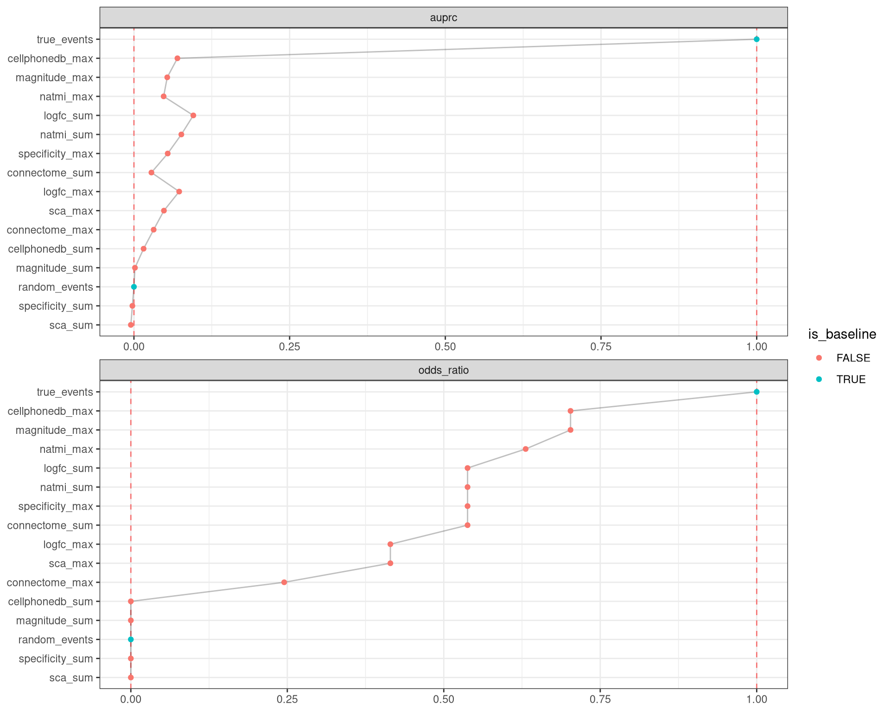

<link href="index_files/libs/datatables-css-0.0.0/datatables-crosstalk.css" rel="stylesheet" />

<link href="index_files/libs/dt-core-1.11.3/css/jquery.dataTables.min.css" rel="stylesheet" />
<link href="index_files/libs/dt-core-1.11.3/css/jquery.dataTables.extra.css" rel="stylesheet" />

<link href="index_files/libs/dt-ext-select-1.11.3/css/select.dataTables.min.css" rel="stylesheet" />

<link href="index_files/libs/dt-ext-searchpanes-1.11.3/css/searchPanes.dataTables.min.css" rel="stylesheet" />

<link href="index_files/libs/dt-ext-buttons-1.11.3/css/buttons.dataTables.min.css" rel="stylesheet" />

<link href="index_files/libs/crosstalk-1.2.0/css/crosstalk.min.css" rel="stylesheet" />

<link href="index_files/libs/lightable-0.0.1/lightable.css" rel="stylesheet" />

## Description

## The task

The growing availability of single-cell data has sparked an increased
interest in the inference of cell-cell communication (CCC),
with an ever-growing number of computational tools developed for this purpose.

Different tools propose distinct preprocessing steps with diverse
scoring functions, that are challenging to compare and evaluate.
Furthermore, each tool typically comes with its own set of prior knowledge.
To harmonize these, [Dimitrov et
al, 2022](https://openproblems.bio/bibliography#dimitrov2022comparison) recently
developed the [LIANA](https://github.com/saezlab/liana) framework, which was used
as a foundation for this task.

The challenges in evaluating the tools are further exacerbated by the
lack of a gold standard to benchmark the performance of CCC methods. In an
attempt to address this, Dimitrov et al use alternative data modalities, including
the spatial proximity of cell types and
downstream cytokine activities, to generate an inferred ground truth. However,
these modalities are only approximations of biological reality and come
with their own assumptions and limitations. In time, the inclusion of more
datasets with known ground truth interactions will become available, from
which the limitations and advantages of the different CCC methods will
be better understood.

**This subtask evaluates methods in their ability to predict interactions between
spatially-adjacent source cell types and target cell types. This subtask focuses
on the prediction of interactions from steady-state, or single-context,
single-cell data.**

## The metrics

Metrics for cell-cell communication aim to characterize how good are
the different scoring methods at prioritizing assumed truth predictions.

-   **Odds ratio**: The odds ratio represents the ratio of true and false
    positives within a set of prioritized interactions (top ranked hits) versus
    the same ratio for the remainder of the interactions. Thus, in this
    scenario odds ratios quantify the strength of association between the
    ability of methods to prioritize interactions and those interactions
    assigned to the positive class.

-   **AUPRC**: a single number *\[0-1\]* that summarizes the area under the curve where
    x is the recall and y is the precision.

## Summary

<figure>

<figcaption aria-hidden="true">Overview of the results per method. This figures shows the mean of the scaled scores (group Overall), the mean scores per dataset (group Dataset) and the mean scores per metric (group Metric).</figcaption>
</figure>

## Metrics

-   **Precision-recall AUC**<a href="/bibliography#davis2006prauc" target="_blank">1</a>: Missing 'metric_description'.

<!-- -->

-   **Odds Ratio**<a href="/bibliography#bland2000odds" target="_blank">2</a>: Missing 'metric_description'.

## Results

## Details

Methods

-   **CellPhoneDB (max)**<a href="/bibliography#efremova2020cellphonedb" target="_blank">3</a>: Missing 'method_description'. Links: [Docs](https://github.com/saezlab/liana).

<!-- -->

-   **CellPhoneDB (sum)**<a href="/bibliography#efremova2020cellphonedb" target="_blank">3</a>: Missing 'method_description'. Links: [Docs](https://github.com/saezlab/liana).

<!-- -->

-   **Connectome (max)**<a href="/bibliography#raredon2022computation" target="_blank">6</a>: Missing 'method_description'. Links: [Docs](https://github.com/saezlab/liana).

<!-- -->

-   **Connectome (sum)**<a href="/bibliography#raredon2022computation" target="_blank">6</a>: Missing 'method_description'. Links: [Docs](https://github.com/saezlab/liana).

<!-- -->

-   **Log2FC (max)**<a href="/bibliography#dimitrov2022comparison" target="_blank">4</a>: Missing 'method_description'. Links: [Docs](https://github.com/saezlab/liana).

<!-- -->

-   **Log2FC (sum)**<a href="/bibliography#dimitrov2022comparison" target="_blank">4</a>: Missing 'method_description'. Links: [Docs](https://github.com/saezlab/liana).

<!-- -->

-   **Magnitude Rank Aggregate (max)**<a href="/bibliography#dimitrov2022comparison" target="_blank">4</a>: Missing 'method_description'. Links: [Docs](https://github.com/saezlab/liana).

<!-- -->

-   **Magnitude Rank Aggregate (sum)**<a href="/bibliography#dimitrov2022comparison" target="_blank">4</a>: Missing 'method_description'. Links: [Docs](https://github.com/saezlab/liana).

<!-- -->

-   **NATMI (max)**<a href="/bibliography#hou2020predicting" target="_blank">5</a>: Missing 'method_description'. Links: [Docs](https://github.com/saezlab/liana).

<!-- -->

-   **NATMI (sum)**<a href="/bibliography#hou2020predicting" target="_blank">5</a>: Missing 'method_description'. Links: [Docs](https://github.com/saezlab/liana).

<!-- -->

-   **Random Events**<a href="/bibliography#openproblems" target="_blank">9</a>: Missing 'method_description'. Links: [Docs](https://github.com/openproblems-bio/openproblems).

<!-- -->

-   **SingleCellSignalR (max)**<a href="/bibliography#cabello2020singlecellsignalr" target="_blank">7</a>: Missing 'method_description'. Links: [Docs](https://github.com/saezlab/liana).

<!-- -->

-   **SingleCellSignalR (sum)**<a href="/bibliography#cabello2020singlecellsignalr" target="_blank">7</a>: Missing 'method_description'. Links: [Docs](https://github.com/saezlab/liana).

<!-- -->

-   **Specificity Rank Aggregate (max)**<a href="/bibliography#dimitrov2022comparison" target="_blank">4</a>: Missing 'method_description'. Links: [Docs](https://github.com/saezlab/liana).

<!-- -->

-   **Specificity Rank Aggregate (sum)**<a href="/bibliography#dimitrov2022comparison" target="_blank">4</a>: Missing 'method_description'. Links: [Docs](https://github.com/saezlab/liana).

<!-- -->

-   **True Events**<a href="/bibliography#openproblems" target="_blank">9</a>: Missing 'method_description'. Links: [Docs](https://github.com/openproblems-bio/openproblems).

Baseline methods

-   **Random Events**: Missing 'method_description'.

<!-- -->

-   **True Events**: Missing 'method_description'.

Datasets

-   **Mouse brain atlas**<a href="/bibliography#tasic2016adult" target="_blank">8</a>: Missing 'dataset_description'.

Download raw data

<a href="data/task_info.json" class="btn btn-secondary">Task info</a>
<a href="data/method_info.json" class="btn btn-secondary">Method info</a>
<a href="data/metric_info.json" class="btn btn-secondary">Metric info</a>
<a href="data/dataset_info.json" class="btn btn-secondary">Dataset info</a>
<a href="data/results.json" class="btn btn-secondary">Results</a>
<a href="data/quality_control.json" class="btn btn-secondary">Quality control</a>

Quality control results

<table class="table lightable-paper" style='margin-left: auto; margin-right: auto; font-family: "Arial Narrow", arial, helvetica, sans-serif; margin-left: auto; margin-right: auto;'>
 <thead>
  <tr>
   <th style="text-align:left;"> Category </th>
   <th style="text-align:left;"> Name </th>
   <th style="text-align:right;"> Value </th>
   <th style="text-align:left;"> Condition </th>
   <th style="text-align:left;"> Severity </th>
  </tr>
 </thead>
<tbody>
  <tr>
   <td style="text-align:left;" data-toggle="tooltip" data-container="body" data-placement="right" title="Dataset metadata field 'dataset_description' should be defined
  Task id: cell_cell_communication_source_target
  Field: dataset_description
"> Dataset info </td>
   <td style="text-align:left;" data-toggle="tooltip" data-container="body" data-placement="right" title="Dataset metadata field 'dataset_description' should be defined
  Task id: cell_cell_communication_source_target
  Field: dataset_description
"> Pct 'dataset_description' missing </td>
   <td style="text-align:right;" data-toggle="tooltip" data-container="body" data-placement="right" title="Dataset metadata field 'dataset_description' should be defined
  Task id: cell_cell_communication_source_target
  Field: dataset_description
"> 1 </td>
   <td style="text-align:left;" data-toggle="tooltip" data-container="body" data-placement="right" title="Dataset metadata field 'dataset_description' should be defined
  Task id: cell_cell_communication_source_target
  Field: dataset_description
"> percent_missing(dataset_info, field) </td>
   <td style="text-align:left;color: red !important;" data-toggle="tooltip" data-container="body" data-placement="right" title="Dataset metadata field 'dataset_description' should be defined
  Task id: cell_cell_communication_source_target
  Field: dataset_description
"> ✗✗ </td>
  </tr>
  <tr>
   <td style="text-align:left;" data-toggle="tooltip" data-container="body" data-placement="right" title="Method metadata field 'method_description' should be defined
  Task id: cell_cell_communication_source_target
  Field: method_description
"> Method info </td>
   <td style="text-align:left;" data-toggle="tooltip" data-container="body" data-placement="right" title="Method metadata field 'method_description' should be defined
  Task id: cell_cell_communication_source_target
  Field: method_description
"> Pct 'method_description' missing </td>
   <td style="text-align:right;" data-toggle="tooltip" data-container="body" data-placement="right" title="Method metadata field 'method_description' should be defined
  Task id: cell_cell_communication_source_target
  Field: method_description
"> 1 </td>
   <td style="text-align:left;" data-toggle="tooltip" data-container="body" data-placement="right" title="Method metadata field 'method_description' should be defined
  Task id: cell_cell_communication_source_target
  Field: method_description
"> percent_missing(method_info, field) </td>
   <td style="text-align:left;color: red !important;" data-toggle="tooltip" data-container="body" data-placement="right" title="Method metadata field 'method_description' should be defined
  Task id: cell_cell_communication_source_target
  Field: method_description
"> ✗✗ </td>
  </tr>
  <tr>
   <td style="text-align:left;" data-toggle="tooltip" data-container="body" data-placement="right" title="Metric metadata field 'metric_description' should be defined
  Task id: cell_cell_communication_source_target
  Field: metric_description
"> Metric info </td>
   <td style="text-align:left;" data-toggle="tooltip" data-container="body" data-placement="right" title="Metric metadata field 'metric_description' should be defined
  Task id: cell_cell_communication_source_target
  Field: metric_description
"> Pct 'metric_description' missing </td>
   <td style="text-align:right;" data-toggle="tooltip" data-container="body" data-placement="right" title="Metric metadata field 'metric_description' should be defined
  Task id: cell_cell_communication_source_target
  Field: metric_description
"> 1 </td>
   <td style="text-align:left;" data-toggle="tooltip" data-container="body" data-placement="right" title="Metric metadata field 'metric_description' should be defined
  Task id: cell_cell_communication_source_target
  Field: metric_description
"> percent_missing(metric_info, field) </td>
   <td style="text-align:left;color: red !important;" data-toggle="tooltip" data-container="body" data-placement="right" title="Metric metadata field 'metric_description' should be defined
  Task id: cell_cell_communication_source_target
  Field: metric_description
"> ✗✗ </td>
  </tr>
</tbody>
</table>

Visualization of raw results

