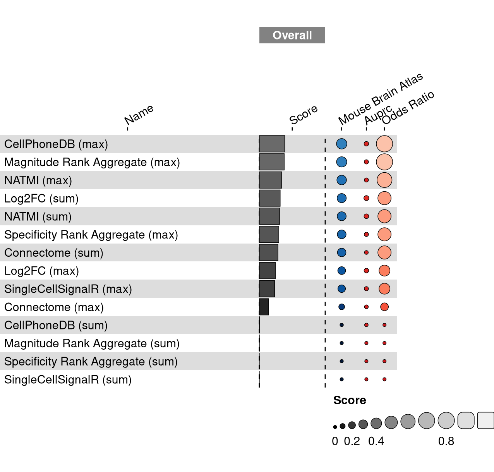

<link href="index_files/libs/lightable-0.0.1/lightable.css" rel="stylesheet" />

<missing description>

## Overview

This visualization shows the means of the scaled scores per method across all results (group Mean), per dataset (group Dataset) and per metric (group Metric).

<figure>

<figcaption aria-hidden="true">The average overall, per dataset and per metric scaled scores per method.</figcaption>
</figure>

Overview per parameter set

<figure>

<figcaption aria-hidden="true">The average overall, per dataset and per metric scaled scores per method and parameter set.</figcaption>
</figure>

## Metrics

-   **Precision-recall AUC**: <missing description>
-   **Odds Ratio**: <missing description>

## Details

Quality control checks

<table class="table lightable-paper" style='margin-left: auto; margin-right: auto; font-family: "Arial Narrow", arial, helvetica, sans-serif; margin-left: auto; margin-right: auto;'>
 <thead>
  <tr>
   <th style="text-align:left;"> Category </th>
   <th style="text-align:left;"> Name </th>
   <th style="text-align:right;"> Value </th>
   <th style="text-align:left;"> Condition </th>
   <th style="text-align:left;"> Severity </th>
  </tr>
 </thead>
<tbody>
  <tr>
   <td style="text-align:left;" data-toggle="tooltip" data-container="body" data-placement="right" title="Percentage of missing results should be less than 10%.
  Task id: cell_cell_communication_source_target
  method id: cellphonedb_sum
  Percentage missing: 50%
"> Raw results </td>
   <td style="text-align:left;" data-toggle="tooltip" data-container="body" data-placement="right" title="Percentage of missing results should be less than 10%.
  Task id: cell_cell_communication_source_target
  method id: cellphonedb_sum
  Percentage missing: 50%
"> Method cellphonedb_sum %missing </td>
   <td style="text-align:right;" data-toggle="tooltip" data-container="body" data-placement="right" title="Percentage of missing results should be less than 10%.
  Task id: cell_cell_communication_source_target
  method id: cellphonedb_sum
  Percentage missing: 50%
"> 0.5000 </td>
   <td style="text-align:left;" data-toggle="tooltip" data-container="body" data-placement="right" title="Percentage of missing results should be less than 10%.
  Task id: cell_cell_communication_source_target
  method id: cellphonedb_sum
  Percentage missing: 50%
"> pct_missing &lt;= .1 </td>
   <td style="text-align:left;color: red !important;" data-toggle="tooltip" data-container="body" data-placement="right" title="Percentage of missing results should be less than 10%.
  Task id: cell_cell_communication_source_target
  method id: cellphonedb_sum
  Percentage missing: 50%
"> ✗✗✗ </td>
  </tr>
  <tr>
   <td style="text-align:left;" data-toggle="tooltip" data-container="body" data-placement="right" title="Percentage of missing results should be less than 10%.
  Task id: cell_cell_communication_source_target
  method id: magnitude_sum
  Percentage missing: 50%
"> Raw results </td>
   <td style="text-align:left;" data-toggle="tooltip" data-container="body" data-placement="right" title="Percentage of missing results should be less than 10%.
  Task id: cell_cell_communication_source_target
  method id: magnitude_sum
  Percentage missing: 50%
"> Method magnitude_sum %missing </td>
   <td style="text-align:right;" data-toggle="tooltip" data-container="body" data-placement="right" title="Percentage of missing results should be less than 10%.
  Task id: cell_cell_communication_source_target
  method id: magnitude_sum
  Percentage missing: 50%
"> 0.5000 </td>
   <td style="text-align:left;" data-toggle="tooltip" data-container="body" data-placement="right" title="Percentage of missing results should be less than 10%.
  Task id: cell_cell_communication_source_target
  method id: magnitude_sum
  Percentage missing: 50%
"> pct_missing &lt;= .1 </td>
   <td style="text-align:left;color: red !important;" data-toggle="tooltip" data-container="body" data-placement="right" title="Percentage of missing results should be less than 10%.
  Task id: cell_cell_communication_source_target
  method id: magnitude_sum
  Percentage missing: 50%
"> ✗✗✗ </td>
  </tr>
  <tr>
   <td style="text-align:left;" data-toggle="tooltip" data-container="body" data-placement="right" title="Percentage of missing results should be less than 10%.
  Task id: cell_cell_communication_source_target
  method id: sca_sum
  Percentage missing: 50%
"> Raw results </td>
   <td style="text-align:left;" data-toggle="tooltip" data-container="body" data-placement="right" title="Percentage of missing results should be less than 10%.
  Task id: cell_cell_communication_source_target
  method id: sca_sum
  Percentage missing: 50%
"> Method sca_sum %missing </td>
   <td style="text-align:right;" data-toggle="tooltip" data-container="body" data-placement="right" title="Percentage of missing results should be less than 10%.
  Task id: cell_cell_communication_source_target
  method id: sca_sum
  Percentage missing: 50%
"> 0.5000 </td>
   <td style="text-align:left;" data-toggle="tooltip" data-container="body" data-placement="right" title="Percentage of missing results should be less than 10%.
  Task id: cell_cell_communication_source_target
  method id: sca_sum
  Percentage missing: 50%
"> pct_missing &lt;= .1 </td>
   <td style="text-align:left;color: red !important;" data-toggle="tooltip" data-container="body" data-placement="right" title="Percentage of missing results should be less than 10%.
  Task id: cell_cell_communication_source_target
  method id: sca_sum
  Percentage missing: 50%
"> ✗✗✗ </td>
  </tr>
  <tr>
   <td style="text-align:left;" data-toggle="tooltip" data-container="body" data-placement="right" title="Percentage of missing results should be less than 10%.
  Task id: cell_cell_communication_source_target
  Metric id: odds_ratio
  Percentage missing: 19%
"> Raw results </td>
   <td style="text-align:left;" data-toggle="tooltip" data-container="body" data-placement="right" title="Percentage of missing results should be less than 10%.
  Task id: cell_cell_communication_source_target
  Metric id: odds_ratio
  Percentage missing: 19%
"> Metric odds_ratio %missing </td>
   <td style="text-align:right;" data-toggle="tooltip" data-container="body" data-placement="right" title="Percentage of missing results should be less than 10%.
  Task id: cell_cell_communication_source_target
  Metric id: odds_ratio
  Percentage missing: 19%
"> 0.1875 </td>
   <td style="text-align:left;" data-toggle="tooltip" data-container="body" data-placement="right" title="Percentage of missing results should be less than 10%.
  Task id: cell_cell_communication_source_target
  Metric id: odds_ratio
  Percentage missing: 19%
"> pct_missing &lt;= .1 </td>
   <td style="text-align:left;color: red !important;" data-toggle="tooltip" data-container="body" data-placement="right" title="Percentage of missing results should be less than 10%.
  Task id: cell_cell_communication_source_target
  Metric id: odds_ratio
  Percentage missing: 19%
"> ✗ </td>
  </tr>
</tbody>
</table>

Visualization of raw results

