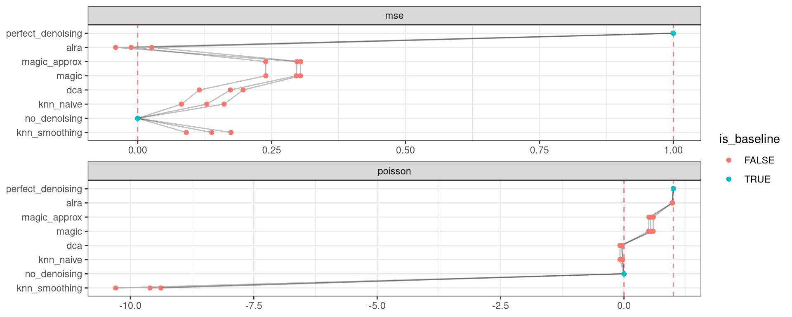

<link href="index_files/libs/lightable-0.0.1/lightable.css" rel="stylesheet" />

missing 'task_description'

<figure>

<figcaption aria-hidden="true">Overview of the results per method. This figures shows the means of the scaled scores per method across all results (group Mean), per dataset (group Dataset) and per metric (group Metric).</figcaption>
</figure>

Overview per parameter set

<figure>

<figcaption aria-hidden="true">Overview of the results per method and parameter set. This figures shows the means of the scaled scores per method parameter set across all results (group Mean), per dataset (group Dataset) and per metric (group Metric).</figcaption>
</figure>

## Methods

-   **ALRA** (Linderman, Zhao, and Kluger 2018): missing 'method_summary'

<!-- -->

-   **DCA** (**https://www.nature.com/articles/s41467-018-07931-2?**): missing 'method_summary'

<!-- -->

-   **KNN smoothing** (Open Problems for Single Cell Analysis Consortium 2022): missing 'method_summary'

<!-- -->

-   **Iterative KNN smoothing** (Wagner, Yan, and Yanai 2018): missing 'method_summary'

<!-- -->

-   **MAGIC** (**https://doi.org/10.1016/j.cell.2018.05.061?**): missing 'method_summary'

<!-- -->

-   **MAGIC (approximate)** (**https://doi.org/10.1016/j.cell.2018.05.061?**): missing 'method_summary'

<!-- -->

-   **No denoising** (Batson, Royer, and Webber 2019): missing 'method_summary'

<!-- -->

-   **Perfect denoising** (Batson, Royer, and Webber 2019): missing 'method_summary'

## Datasets

-   **Pancreas (inDrop)** (Luecken et al. 2021): Human pancreatic islet scRNA-seq data from 6 datasets across technologies (CEL-seq, CEL-seq2, Smart-seq2, inDrop, Fluidigm C1, and SMARTER-seq). Here we just use the inDrop1 batch, which includes1937 cells × 15502 genes.
-   **1k Peripheral blood mononuclear cells** (10x Genomics 2018): 1k Peripheral Blood Mononuclear Cells (PBMCs) from a healthy donor. Sequenced on 10X v3 chemistry in November 2018 by 10X Genomics.
-   **Tabula Muris Senis Lung** (Tabula Muris Consortium 2020): All lung cells from Tabula Muris Senis, a 500k cell-atlas from 18 organs and tissues across the mouse lifespan. Here we use just 10x data from lung. 24540 cells × 16160 genes across 3 time points.

## Metrics

-   **Mean-squared error** (Batson, Royer, and Webber 2019): missing 'metric_summary'
-   **Poisson loss** (Batson, Royer, and Webber 2019): missing 'metric_summary'

## Details

Quality control checks

<table class="table lightable-paper" style='margin-left: auto; margin-right: auto; font-family: "Arial Narrow", arial, helvetica, sans-serif; margin-left: auto; margin-right: auto;'>
 <thead>
  <tr>
   <th style="text-align:left;"> Category </th>
   <th style="text-align:left;"> Name </th>
   <th style="text-align:right;"> Value </th>
   <th style="text-align:left;"> Condition </th>
   <th style="text-align:left;"> Severity </th>
  </tr>
 </thead>
<tbody>
  <tr>
   <td style="text-align:left;" data-toggle="tooltip" data-container="body" data-placement="right" title="Method knn_smoothing performs much worse than baselines.
  Task id: denoising
  Method id: knn_smoothing
  Metric id: poisson
  Worst score: -10.298315065894421%
"> Scaling </td>
   <td style="text-align:left;" data-toggle="tooltip" data-container="body" data-placement="right" title="Method knn_smoothing performs much worse than baselines.
  Task id: denoising
  Method id: knn_smoothing
  Metric id: poisson
  Worst score: -10.298315065894421%
"> Worst score knn_smoothing poisson </td>
   <td style="text-align:right;" data-toggle="tooltip" data-container="body" data-placement="right" title="Method knn_smoothing performs much worse than baselines.
  Task id: denoising
  Method id: knn_smoothing
  Metric id: poisson
  Worst score: -10.298315065894421%
"> -10.29832 </td>
   <td style="text-align:left;" data-toggle="tooltip" data-container="body" data-placement="right" title="Method knn_smoothing performs much worse than baselines.
  Task id: denoising
  Method id: knn_smoothing
  Metric id: poisson
  Worst score: -10.298315065894421%
"> worst_score &gt;= -1 </td>
   <td style="text-align:left;color: red !important;" data-toggle="tooltip" data-container="body" data-placement="right" title="Method knn_smoothing performs much worse than baselines.
  Task id: denoising
  Method id: knn_smoothing
  Metric id: poisson
  Worst score: -10.298315065894421%
"> ✗✗✗ </td>
  </tr>
</tbody>
</table>

Visualization of raw results

## References

10x Genomics. 2018. "1k PBMCs from a Healthy Donor (V3 Chemistry)." <https://www.10xgenomics.com/resources/datasets/1-k-pbm-cs-from-a-healthy-donor-v-3-chemistry-3-standard-3-0-0>.

Batson, Joshua, Loı̈c Royer, and James Webber. 2019. "Molecular Cross-Validation for Single-Cell RNA-Seq." *bioRxiv*. <https://doi.org/10.1101/786269>.

Linderman, George C., Jun Zhao, and Yuval Kluger. 2018. "Zero-Preserving Imputation of scRNA-Seq Data Using Low-Rank Approximation." *bioRxiv*. <https://doi.org/10.1101/397588>.

Luecken, Malte D., M. Büttner, K. Chaichoompu, A. Danese, M. Interlandi, M. F. Mueller, D. C. Strobl, et al. 2021. "Benchmarking Atlas-Level Data Integration in Single-Cell Genomics." *Nature Methods* 19 (1): 41--50. <https://doi.org/10.1038/s41592-021-01336-8>.

Open Problems for Single Cell Analysis Consortium. 2022. "Open Problems." <https://openproblems.bio>.

Tabula Muris Consortium. 2020. "A Single-Cell Transcriptomic Atlas Characterizes Ageing Tissues in the Mouse." *Nature* 583 (7817): 590--95. <https://doi.org/10.1038/s41586-020-2496-1>.

Wagner, Florian, Yun Yan, and Itai Yanai. 2018. "K-Nearest Neighbor Smoothing for High-Throughput Single-Cell RNA-Seq Data." *bioRxiv*. <https://doi.org/10.1101/217737>.
