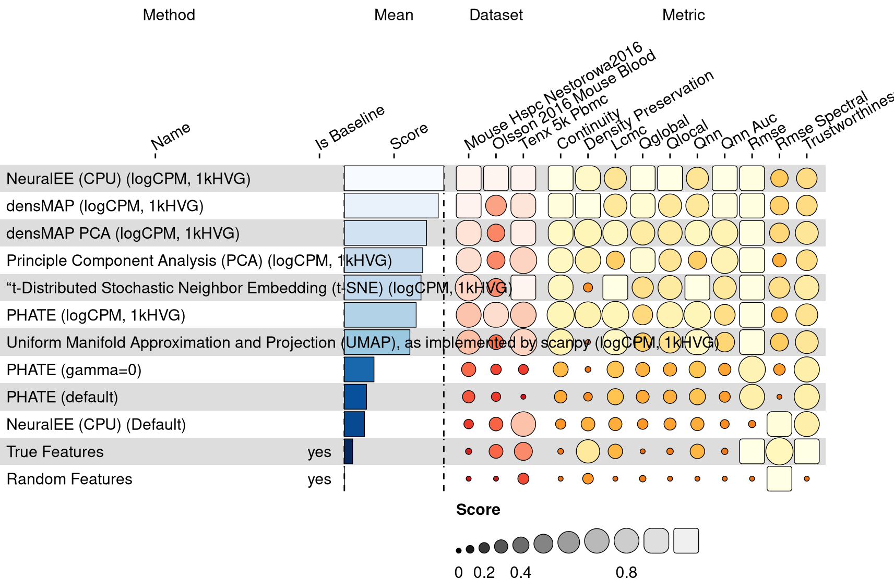
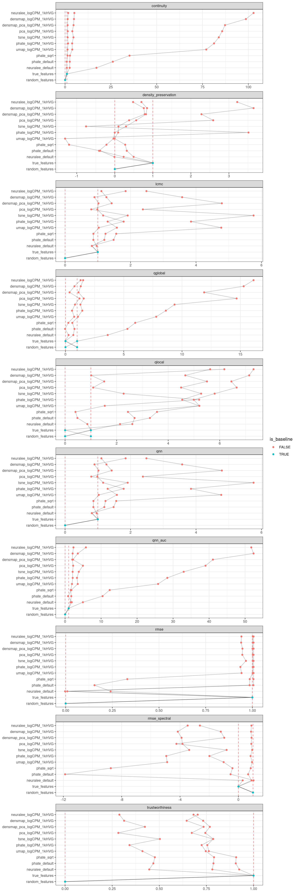

<link href="index_files/libs/lightable-0.0.1/lightable.css" rel="stylesheet" />

Dimensionality reduction is one of the key challenges in single-cell data representation.
Routine single-cell RNA sequencing (scRNA-seq) experiments measure cells in roughly
20,000-30,000 dimensions (i.e., features - mostly gene transcripts but also other functional
elements encoded in mRNA such as lncRNAs). Since its inception,scRNA-seq experiments have
been growing in terms of the number of cells measured. Originally, cutting-edge SmartSeq
experiments would yield a few hundred cells, at best. Now, it is not uncommon to see
experiments that yield over [100,000 cells](https://www.nature.com/articles/s41586-018-0590-4)
or even [\> 1 million cells](https://doi.org/10.1126/science.aba7721).

Each *feature* in a dataset functions as a single dimension. While each of the \~30,000
dimensions measured in each cell contribute to an underlying data structure, the overall
structure of the data is challenging to display in few dimensions due to data sparsity
and the [*"curse of dimensionality"*](https://en.wikipedia.org/wiki/Curse_of_dimensionality)
(distances in high dimensional data don't distinguish data points well). Thus, we need to find
a way to [dimensionally reduce](https://en.wikipedia.org/wiki/Dimensionality_reduction)
the data for visualization and interpretation.

## Overview

This visualization shows the means of the scaled scores per method across all results (group Mean), per dataset (group Dataset) and per metric (group Metric).

<figure>

<figcaption aria-hidden="true">The average overall, per dataset and per metric scaled scores per method.</figcaption>
</figure>

Overview per parameter set

<figure>

<figcaption aria-hidden="true">The average overall, per dataset and per metric scaled scores per method and parameter set.</figcaption>
</figure>

## Metrics

-   **continuity**: <missing description>
-   **density preservation**: <missing description>
-   **local continuity meta criterion**: <missing description>
-   **global property**: <missing description>
-   **local property**: <missing description>
-   **co-KNN size**: <missing description>
-   **co-KNN AUC**: <missing description>
-   **RMSE**: <missing description>
-   **RMSE (spectral)**: <missing description>
-   **trustworthiness**: <missing description>

## Details

Quality control checks

<table class="table lightable-paper" style='margin-left: auto; margin-right: auto; font-family: "Arial Narrow", arial, helvetica, sans-serif; margin-left: auto; margin-right: auto;'>
 <thead>
  <tr>
   <th style="text-align:left;"> Category </th>
   <th style="text-align:left;"> Name </th>
   <th style="text-align:right;"> Value </th>
   <th style="text-align:left;"> Condition </th>
   <th style="text-align:left;"> Severity </th>
  </tr>
 </thead>
<tbody>
  <tr>
   <td style="text-align:left;" data-toggle="tooltip" data-container="body" data-placement="right" title="Method neuralee_logCPM_1kHVG performs a lot better than baselines.
  Task id: dimensionality_reduction
  Method id: neuralee_logCPM_1kHVG
  Metric id: continuity
  Best score: 102.83814481509313%
"> Scaling </td>
   <td style="text-align:left;" data-toggle="tooltip" data-container="body" data-placement="right" title="Method neuralee_logCPM_1kHVG performs a lot better than baselines.
  Task id: dimensionality_reduction
  Method id: neuralee_logCPM_1kHVG
  Metric id: continuity
  Best score: 102.83814481509313%
"> Best score neuralee_logCPM_1kHVG continuity </td>
   <td style="text-align:right;" data-toggle="tooltip" data-container="body" data-placement="right" title="Method neuralee_logCPM_1kHVG performs a lot better than baselines.
  Task id: dimensionality_reduction
  Method id: neuralee_logCPM_1kHVG
  Metric id: continuity
  Best score: 102.83814481509313%
"> 102.838145 </td>
   <td style="text-align:left;" data-toggle="tooltip" data-container="body" data-placement="right" title="Method neuralee_logCPM_1kHVG performs a lot better than baselines.
  Task id: dimensionality_reduction
  Method id: neuralee_logCPM_1kHVG
  Metric id: continuity
  Best score: 102.83814481509313%
"> best_score &lt;= 2 </td>
   <td style="text-align:left;color: red !important;" data-toggle="tooltip" data-container="body" data-placement="right" title="Method neuralee_logCPM_1kHVG performs a lot better than baselines.
  Task id: dimensionality_reduction
  Method id: neuralee_logCPM_1kHVG
  Metric id: continuity
  Best score: 102.83814481509313%
"> ✗✗✗ </td>
  </tr>
  <tr>
   <td style="text-align:left;" data-toggle="tooltip" data-container="body" data-placement="right" title="Method densmap_logCPM_1kHVG performs a lot better than baselines.
  Task id: dimensionality_reduction
  Method id: densmap_logCPM_1kHVG
  Metric id: continuity
  Best score: 98.6632656844972%
"> Scaling </td>
   <td style="text-align:left;" data-toggle="tooltip" data-container="body" data-placement="right" title="Method densmap_logCPM_1kHVG performs a lot better than baselines.
  Task id: dimensionality_reduction
  Method id: densmap_logCPM_1kHVG
  Metric id: continuity
  Best score: 98.6632656844972%
"> Best score densmap_logCPM_1kHVG continuity </td>
   <td style="text-align:right;" data-toggle="tooltip" data-container="body" data-placement="right" title="Method densmap_logCPM_1kHVG performs a lot better than baselines.
  Task id: dimensionality_reduction
  Method id: densmap_logCPM_1kHVG
  Metric id: continuity
  Best score: 98.6632656844972%
"> 98.663266 </td>
   <td style="text-align:left;" data-toggle="tooltip" data-container="body" data-placement="right" title="Method densmap_logCPM_1kHVG performs a lot better than baselines.
  Task id: dimensionality_reduction
  Method id: densmap_logCPM_1kHVG
  Metric id: continuity
  Best score: 98.6632656844972%
"> best_score &lt;= 2 </td>
   <td style="text-align:left;color: red !important;" data-toggle="tooltip" data-container="body" data-placement="right" title="Method densmap_logCPM_1kHVG performs a lot better than baselines.
  Task id: dimensionality_reduction
  Method id: densmap_logCPM_1kHVG
  Metric id: continuity
  Best score: 98.6632656844972%
"> ✗✗✗ </td>
  </tr>
  <tr>
   <td style="text-align:left;" data-toggle="tooltip" data-container="body" data-placement="right" title="Method densmap_pca_logCPM_1kHVG performs a lot better than baselines.
  Task id: dimensionality_reduction
  Method id: densmap_pca_logCPM_1kHVG
  Metric id: continuity
  Best score: 87.28135544874854%
"> Scaling </td>
   <td style="text-align:left;" data-toggle="tooltip" data-container="body" data-placement="right" title="Method densmap_pca_logCPM_1kHVG performs a lot better than baselines.
  Task id: dimensionality_reduction
  Method id: densmap_pca_logCPM_1kHVG
  Metric id: continuity
  Best score: 87.28135544874854%
"> Best score densmap_pca_logCPM_1kHVG continuity </td>
   <td style="text-align:right;" data-toggle="tooltip" data-container="body" data-placement="right" title="Method densmap_pca_logCPM_1kHVG performs a lot better than baselines.
  Task id: dimensionality_reduction
  Method id: densmap_pca_logCPM_1kHVG
  Metric id: continuity
  Best score: 87.28135544874854%
"> 87.281355 </td>
   <td style="text-align:left;" data-toggle="tooltip" data-container="body" data-placement="right" title="Method densmap_pca_logCPM_1kHVG performs a lot better than baselines.
  Task id: dimensionality_reduction
  Method id: densmap_pca_logCPM_1kHVG
  Metric id: continuity
  Best score: 87.28135544874854%
"> best_score &lt;= 2 </td>
   <td style="text-align:left;color: red !important;" data-toggle="tooltip" data-container="body" data-placement="right" title="Method densmap_pca_logCPM_1kHVG performs a lot better than baselines.
  Task id: dimensionality_reduction
  Method id: densmap_pca_logCPM_1kHVG
  Metric id: continuity
  Best score: 87.28135544874854%
"> ✗✗✗ </td>
  </tr>
  <tr>
   <td style="text-align:left;" data-toggle="tooltip" data-container="body" data-placement="right" title="Method pca_logCPM_1kHVG performs a lot better than baselines.
  Task id: dimensionality_reduction
  Method id: pca_logCPM_1kHVG
  Metric id: continuity
  Best score: 85.71740376798641%
"> Scaling </td>
   <td style="text-align:left;" data-toggle="tooltip" data-container="body" data-placement="right" title="Method pca_logCPM_1kHVG performs a lot better than baselines.
  Task id: dimensionality_reduction
  Method id: pca_logCPM_1kHVG
  Metric id: continuity
  Best score: 85.71740376798641%
"> Best score pca_logCPM_1kHVG continuity </td>
   <td style="text-align:right;" data-toggle="tooltip" data-container="body" data-placement="right" title="Method pca_logCPM_1kHVG performs a lot better than baselines.
  Task id: dimensionality_reduction
  Method id: pca_logCPM_1kHVG
  Metric id: continuity
  Best score: 85.71740376798641%
"> 85.717404 </td>
   <td style="text-align:left;" data-toggle="tooltip" data-container="body" data-placement="right" title="Method pca_logCPM_1kHVG performs a lot better than baselines.
  Task id: dimensionality_reduction
  Method id: pca_logCPM_1kHVG
  Metric id: continuity
  Best score: 85.71740376798641%
"> best_score &lt;= 2 </td>
   <td style="text-align:left;color: red !important;" data-toggle="tooltip" data-container="body" data-placement="right" title="Method pca_logCPM_1kHVG performs a lot better than baselines.
  Task id: dimensionality_reduction
  Method id: pca_logCPM_1kHVG
  Metric id: continuity
  Best score: 85.71740376798641%
"> ✗✗✗ </td>
  </tr>
  <tr>
   <td style="text-align:left;" data-toggle="tooltip" data-container="body" data-placement="right" title="Method tsne_logCPM_1kHVG performs a lot better than baselines.
  Task id: dimensionality_reduction
  Method id: tsne_logCPM_1kHVG
  Metric id: continuity
  Best score: 83.87346863100112%
"> Scaling </td>
   <td style="text-align:left;" data-toggle="tooltip" data-container="body" data-placement="right" title="Method tsne_logCPM_1kHVG performs a lot better than baselines.
  Task id: dimensionality_reduction
  Method id: tsne_logCPM_1kHVG
  Metric id: continuity
  Best score: 83.87346863100112%
"> Best score tsne_logCPM_1kHVG continuity </td>
   <td style="text-align:right;" data-toggle="tooltip" data-container="body" data-placement="right" title="Method tsne_logCPM_1kHVG performs a lot better than baselines.
  Task id: dimensionality_reduction
  Method id: tsne_logCPM_1kHVG
  Metric id: continuity
  Best score: 83.87346863100112%
"> 83.873469 </td>
   <td style="text-align:left;" data-toggle="tooltip" data-container="body" data-placement="right" title="Method tsne_logCPM_1kHVG performs a lot better than baselines.
  Task id: dimensionality_reduction
  Method id: tsne_logCPM_1kHVG
  Metric id: continuity
  Best score: 83.87346863100112%
"> best_score &lt;= 2 </td>
   <td style="text-align:left;color: red !important;" data-toggle="tooltip" data-container="body" data-placement="right" title="Method tsne_logCPM_1kHVG performs a lot better than baselines.
  Task id: dimensionality_reduction
  Method id: tsne_logCPM_1kHVG
  Metric id: continuity
  Best score: 83.87346863100112%
"> ✗✗✗ </td>
  </tr>
  <tr>
   <td style="text-align:left;" data-toggle="tooltip" data-container="body" data-placement="right" title="Method phate_logCPM_1kHVG performs a lot better than baselines.
  Task id: dimensionality_reduction
  Method id: phate_logCPM_1kHVG
  Metric id: continuity
  Best score: 81.27619835417812%
"> Scaling </td>
   <td style="text-align:left;" data-toggle="tooltip" data-container="body" data-placement="right" title="Method phate_logCPM_1kHVG performs a lot better than baselines.
  Task id: dimensionality_reduction
  Method id: phate_logCPM_1kHVG
  Metric id: continuity
  Best score: 81.27619835417812%
"> Best score phate_logCPM_1kHVG continuity </td>
   <td style="text-align:right;" data-toggle="tooltip" data-container="body" data-placement="right" title="Method phate_logCPM_1kHVG performs a lot better than baselines.
  Task id: dimensionality_reduction
  Method id: phate_logCPM_1kHVG
  Metric id: continuity
  Best score: 81.27619835417812%
"> 81.276198 </td>
   <td style="text-align:left;" data-toggle="tooltip" data-container="body" data-placement="right" title="Method phate_logCPM_1kHVG performs a lot better than baselines.
  Task id: dimensionality_reduction
  Method id: phate_logCPM_1kHVG
  Metric id: continuity
  Best score: 81.27619835417812%
"> best_score &lt;= 2 </td>
   <td style="text-align:left;color: red !important;" data-toggle="tooltip" data-container="body" data-placement="right" title="Method phate_logCPM_1kHVG performs a lot better than baselines.
  Task id: dimensionality_reduction
  Method id: phate_logCPM_1kHVG
  Metric id: continuity
  Best score: 81.27619835417812%
"> ✗✗✗ </td>
  </tr>
  <tr>
   <td style="text-align:left;" data-toggle="tooltip" data-container="body" data-placement="right" title="Method umap_logCPM_1kHVG performs a lot better than baselines.
  Task id: dimensionality_reduction
  Method id: umap_logCPM_1kHVG
  Metric id: continuity
  Best score: 77.04036966783967%
"> Scaling </td>
   <td style="text-align:left;" data-toggle="tooltip" data-container="body" data-placement="right" title="Method umap_logCPM_1kHVG performs a lot better than baselines.
  Task id: dimensionality_reduction
  Method id: umap_logCPM_1kHVG
  Metric id: continuity
  Best score: 77.04036966783967%
"> Best score umap_logCPM_1kHVG continuity </td>
   <td style="text-align:right;" data-toggle="tooltip" data-container="body" data-placement="right" title="Method umap_logCPM_1kHVG performs a lot better than baselines.
  Task id: dimensionality_reduction
  Method id: umap_logCPM_1kHVG
  Metric id: continuity
  Best score: 77.04036966783967%
"> 77.040370 </td>
   <td style="text-align:left;" data-toggle="tooltip" data-container="body" data-placement="right" title="Method umap_logCPM_1kHVG performs a lot better than baselines.
  Task id: dimensionality_reduction
  Method id: umap_logCPM_1kHVG
  Metric id: continuity
  Best score: 77.04036966783967%
"> best_score &lt;= 2 </td>
   <td style="text-align:left;color: red !important;" data-toggle="tooltip" data-container="body" data-placement="right" title="Method umap_logCPM_1kHVG performs a lot better than baselines.
  Task id: dimensionality_reduction
  Method id: umap_logCPM_1kHVG
  Metric id: continuity
  Best score: 77.04036966783967%
"> ✗✗✗ </td>
  </tr>
  <tr>
   <td style="text-align:left;" data-toggle="tooltip" data-container="body" data-placement="right" title="Method densmap_logCPM_1kHVG performs a lot better than baselines.
  Task id: dimensionality_reduction
  Method id: densmap_logCPM_1kHVG
  Metric id: qnn_auc
  Best score: 52.346142282079846%
"> Scaling </td>
   <td style="text-align:left;" data-toggle="tooltip" data-container="body" data-placement="right" title="Method densmap_logCPM_1kHVG performs a lot better than baselines.
  Task id: dimensionality_reduction
  Method id: densmap_logCPM_1kHVG
  Metric id: qnn_auc
  Best score: 52.346142282079846%
"> Best score densmap_logCPM_1kHVG qnn_auc </td>
   <td style="text-align:right;" data-toggle="tooltip" data-container="body" data-placement="right" title="Method densmap_logCPM_1kHVG performs a lot better than baselines.
  Task id: dimensionality_reduction
  Method id: densmap_logCPM_1kHVG
  Metric id: qnn_auc
  Best score: 52.346142282079846%
"> 52.346142 </td>
   <td style="text-align:left;" data-toggle="tooltip" data-container="body" data-placement="right" title="Method densmap_logCPM_1kHVG performs a lot better than baselines.
  Task id: dimensionality_reduction
  Method id: densmap_logCPM_1kHVG
  Metric id: qnn_auc
  Best score: 52.346142282079846%
"> best_score &lt;= 2 </td>
   <td style="text-align:left;color: red !important;" data-toggle="tooltip" data-container="body" data-placement="right" title="Method densmap_logCPM_1kHVG performs a lot better than baselines.
  Task id: dimensionality_reduction
  Method id: densmap_logCPM_1kHVG
  Metric id: qnn_auc
  Best score: 52.346142282079846%
"> ✗✗✗ </td>
  </tr>
  <tr>
   <td style="text-align:left;" data-toggle="tooltip" data-container="body" data-placement="right" title="Method neuralee_logCPM_1kHVG performs a lot better than baselines.
  Task id: dimensionality_reduction
  Method id: neuralee_logCPM_1kHVG
  Metric id: qnn_auc
  Best score: 51.715852240502336%
"> Scaling </td>
   <td style="text-align:left;" data-toggle="tooltip" data-container="body" data-placement="right" title="Method neuralee_logCPM_1kHVG performs a lot better than baselines.
  Task id: dimensionality_reduction
  Method id: neuralee_logCPM_1kHVG
  Metric id: qnn_auc
  Best score: 51.715852240502336%
"> Best score neuralee_logCPM_1kHVG qnn_auc </td>
   <td style="text-align:right;" data-toggle="tooltip" data-container="body" data-placement="right" title="Method neuralee_logCPM_1kHVG performs a lot better than baselines.
  Task id: dimensionality_reduction
  Method id: neuralee_logCPM_1kHVG
  Metric id: qnn_auc
  Best score: 51.715852240502336%
"> 51.715852 </td>
   <td style="text-align:left;" data-toggle="tooltip" data-container="body" data-placement="right" title="Method neuralee_logCPM_1kHVG performs a lot better than baselines.
  Task id: dimensionality_reduction
  Method id: neuralee_logCPM_1kHVG
  Metric id: qnn_auc
  Best score: 51.715852240502336%
"> best_score &lt;= 2 </td>
   <td style="text-align:left;color: red !important;" data-toggle="tooltip" data-container="body" data-placement="right" title="Method neuralee_logCPM_1kHVG performs a lot better than baselines.
  Task id: dimensionality_reduction
  Method id: neuralee_logCPM_1kHVG
  Metric id: qnn_auc
  Best score: 51.715852240502336%
"> ✗✗✗ </td>
  </tr>
  <tr>
   <td style="text-align:left;" data-toggle="tooltip" data-container="body" data-placement="right" title="Method densmap_pca_logCPM_1kHVG performs a lot better than baselines.
  Task id: dimensionality_reduction
  Method id: densmap_pca_logCPM_1kHVG
  Metric id: qnn_auc
  Best score: 41.067048200521015%
"> Scaling </td>
   <td style="text-align:left;" data-toggle="tooltip" data-container="body" data-placement="right" title="Method densmap_pca_logCPM_1kHVG performs a lot better than baselines.
  Task id: dimensionality_reduction
  Method id: densmap_pca_logCPM_1kHVG
  Metric id: qnn_auc
  Best score: 41.067048200521015%
"> Best score densmap_pca_logCPM_1kHVG qnn_auc </td>
   <td style="text-align:right;" data-toggle="tooltip" data-container="body" data-placement="right" title="Method densmap_pca_logCPM_1kHVG performs a lot better than baselines.
  Task id: dimensionality_reduction
  Method id: densmap_pca_logCPM_1kHVG
  Metric id: qnn_auc
  Best score: 41.067048200521015%
"> 41.067048 </td>
   <td style="text-align:left;" data-toggle="tooltip" data-container="body" data-placement="right" title="Method densmap_pca_logCPM_1kHVG performs a lot better than baselines.
  Task id: dimensionality_reduction
  Method id: densmap_pca_logCPM_1kHVG
  Metric id: qnn_auc
  Best score: 41.067048200521015%
"> best_score &lt;= 2 </td>
   <td style="text-align:left;color: red !important;" data-toggle="tooltip" data-container="body" data-placement="right" title="Method densmap_pca_logCPM_1kHVG performs a lot better than baselines.
  Task id: dimensionality_reduction
  Method id: densmap_pca_logCPM_1kHVG
  Metric id: qnn_auc
  Best score: 41.067048200521015%
"> ✗✗✗ </td>
  </tr>
  <tr>
   <td style="text-align:left;" data-toggle="tooltip" data-container="body" data-placement="right" title="Method pca_logCPM_1kHVG performs a lot better than baselines.
  Task id: dimensionality_reduction
  Method id: pca_logCPM_1kHVG
  Metric id: qnn_auc
  Best score: 39.00986505038051%
"> Scaling </td>
   <td style="text-align:left;" data-toggle="tooltip" data-container="body" data-placement="right" title="Method pca_logCPM_1kHVG performs a lot better than baselines.
  Task id: dimensionality_reduction
  Method id: pca_logCPM_1kHVG
  Metric id: qnn_auc
  Best score: 39.00986505038051%
"> Best score pca_logCPM_1kHVG qnn_auc </td>
   <td style="text-align:right;" data-toggle="tooltip" data-container="body" data-placement="right" title="Method pca_logCPM_1kHVG performs a lot better than baselines.
  Task id: dimensionality_reduction
  Method id: pca_logCPM_1kHVG
  Metric id: qnn_auc
  Best score: 39.00986505038051%
"> 39.009865 </td>
   <td style="text-align:left;" data-toggle="tooltip" data-container="body" data-placement="right" title="Method pca_logCPM_1kHVG performs a lot better than baselines.
  Task id: dimensionality_reduction
  Method id: pca_logCPM_1kHVG
  Metric id: qnn_auc
  Best score: 39.00986505038051%
"> best_score &lt;= 2 </td>
   <td style="text-align:left;color: red !important;" data-toggle="tooltip" data-container="body" data-placement="right" title="Method pca_logCPM_1kHVG performs a lot better than baselines.
  Task id: dimensionality_reduction
  Method id: pca_logCPM_1kHVG
  Metric id: qnn_auc
  Best score: 39.00986505038051%
"> ✗✗✗ </td>
  </tr>
  <tr>
   <td style="text-align:left;" data-toggle="tooltip" data-container="body" data-placement="right" title="Method phate_sqrt performs a lot better than baselines.
  Task id: dimensionality_reduction
  Method id: phate_sqrt
  Metric id: continuity
  Best score: 35.1551121696587%
"> Scaling </td>
   <td style="text-align:left;" data-toggle="tooltip" data-container="body" data-placement="right" title="Method phate_sqrt performs a lot better than baselines.
  Task id: dimensionality_reduction
  Method id: phate_sqrt
  Metric id: continuity
  Best score: 35.1551121696587%
"> Best score phate_sqrt continuity </td>
   <td style="text-align:right;" data-toggle="tooltip" data-container="body" data-placement="right" title="Method phate_sqrt performs a lot better than baselines.
  Task id: dimensionality_reduction
  Method id: phate_sqrt
  Metric id: continuity
  Best score: 35.1551121696587%
"> 35.155112 </td>
   <td style="text-align:left;" data-toggle="tooltip" data-container="body" data-placement="right" title="Method phate_sqrt performs a lot better than baselines.
  Task id: dimensionality_reduction
  Method id: phate_sqrt
  Metric id: continuity
  Best score: 35.1551121696587%
"> best_score &lt;= 2 </td>
   <td style="text-align:left;color: red !important;" data-toggle="tooltip" data-container="body" data-placement="right" title="Method phate_sqrt performs a lot better than baselines.
  Task id: dimensionality_reduction
  Method id: phate_sqrt
  Metric id: continuity
  Best score: 35.1551121696587%
"> ✗✗✗ </td>
  </tr>
  <tr>
   <td style="text-align:left;" data-toggle="tooltip" data-container="body" data-placement="right" title="Method tsne_logCPM_1kHVG performs a lot better than baselines.
  Task id: dimensionality_reduction
  Method id: tsne_logCPM_1kHVG
  Metric id: qnn_auc
  Best score: 32.94131052664672%
"> Scaling </td>
   <td style="text-align:left;" data-toggle="tooltip" data-container="body" data-placement="right" title="Method tsne_logCPM_1kHVG performs a lot better than baselines.
  Task id: dimensionality_reduction
  Method id: tsne_logCPM_1kHVG
  Metric id: qnn_auc
  Best score: 32.94131052664672%
"> Best score tsne_logCPM_1kHVG qnn_auc </td>
   <td style="text-align:right;" data-toggle="tooltip" data-container="body" data-placement="right" title="Method tsne_logCPM_1kHVG performs a lot better than baselines.
  Task id: dimensionality_reduction
  Method id: tsne_logCPM_1kHVG
  Metric id: qnn_auc
  Best score: 32.94131052664672%
"> 32.941311 </td>
   <td style="text-align:left;" data-toggle="tooltip" data-container="body" data-placement="right" title="Method tsne_logCPM_1kHVG performs a lot better than baselines.
  Task id: dimensionality_reduction
  Method id: tsne_logCPM_1kHVG
  Metric id: qnn_auc
  Best score: 32.94131052664672%
"> best_score &lt;= 2 </td>
   <td style="text-align:left;color: red !important;" data-toggle="tooltip" data-container="body" data-placement="right" title="Method tsne_logCPM_1kHVG performs a lot better than baselines.
  Task id: dimensionality_reduction
  Method id: tsne_logCPM_1kHVG
  Metric id: qnn_auc
  Best score: 32.94131052664672%
"> ✗✗✗ </td>
  </tr>
  <tr>
   <td style="text-align:left;" data-toggle="tooltip" data-container="body" data-placement="right" title="Method phate_logCPM_1kHVG performs a lot better than baselines.
  Task id: dimensionality_reduction
  Method id: phate_logCPM_1kHVG
  Metric id: qnn_auc
  Best score: 28.40457957102999%
"> Scaling </td>
   <td style="text-align:left;" data-toggle="tooltip" data-container="body" data-placement="right" title="Method phate_logCPM_1kHVG performs a lot better than baselines.
  Task id: dimensionality_reduction
  Method id: phate_logCPM_1kHVG
  Metric id: qnn_auc
  Best score: 28.40457957102999%
"> Best score phate_logCPM_1kHVG qnn_auc </td>
   <td style="text-align:right;" data-toggle="tooltip" data-container="body" data-placement="right" title="Method phate_logCPM_1kHVG performs a lot better than baselines.
  Task id: dimensionality_reduction
  Method id: phate_logCPM_1kHVG
  Metric id: qnn_auc
  Best score: 28.40457957102999%
"> 28.404580 </td>
   <td style="text-align:left;" data-toggle="tooltip" data-container="body" data-placement="right" title="Method phate_logCPM_1kHVG performs a lot better than baselines.
  Task id: dimensionality_reduction
  Method id: phate_logCPM_1kHVG
  Metric id: qnn_auc
  Best score: 28.40457957102999%
"> best_score &lt;= 2 </td>
   <td style="text-align:left;color: red !important;" data-toggle="tooltip" data-container="body" data-placement="right" title="Method phate_logCPM_1kHVG performs a lot better than baselines.
  Task id: dimensionality_reduction
  Method id: phate_logCPM_1kHVG
  Metric id: qnn_auc
  Best score: 28.40457957102999%
"> ✗✗✗ </td>
  </tr>
  <tr>
   <td style="text-align:left;" data-toggle="tooltip" data-container="body" data-placement="right" title="Method phate_default performs a lot better than baselines.
  Task id: dimensionality_reduction
  Method id: phate_default
  Metric id: continuity
  Best score: 26.045760657186854%
"> Scaling </td>
   <td style="text-align:left;" data-toggle="tooltip" data-container="body" data-placement="right" title="Method phate_default performs a lot better than baselines.
  Task id: dimensionality_reduction
  Method id: phate_default
  Metric id: continuity
  Best score: 26.045760657186854%
"> Best score phate_default continuity </td>
   <td style="text-align:right;" data-toggle="tooltip" data-container="body" data-placement="right" title="Method phate_default performs a lot better than baselines.
  Task id: dimensionality_reduction
  Method id: phate_default
  Metric id: continuity
  Best score: 26.045760657186854%
"> 26.045761 </td>
   <td style="text-align:left;" data-toggle="tooltip" data-container="body" data-placement="right" title="Method phate_default performs a lot better than baselines.
  Task id: dimensionality_reduction
  Method id: phate_default
  Metric id: continuity
  Best score: 26.045760657186854%
"> best_score &lt;= 2 </td>
   <td style="text-align:left;color: red !important;" data-toggle="tooltip" data-container="body" data-placement="right" title="Method phate_default performs a lot better than baselines.
  Task id: dimensionality_reduction
  Method id: phate_default
  Metric id: continuity
  Best score: 26.045760657186854%
"> ✗✗✗ </td>
  </tr>
  <tr>
   <td style="text-align:left;" data-toggle="tooltip" data-container="body" data-placement="right" title="Method umap_logCPM_1kHVG performs a lot better than baselines.
  Task id: dimensionality_reduction
  Method id: umap_logCPM_1kHVG
  Metric id: qnn_auc
  Best score: 25.82993603860544%
"> Scaling </td>
   <td style="text-align:left;" data-toggle="tooltip" data-container="body" data-placement="right" title="Method umap_logCPM_1kHVG performs a lot better than baselines.
  Task id: dimensionality_reduction
  Method id: umap_logCPM_1kHVG
  Metric id: qnn_auc
  Best score: 25.82993603860544%
"> Best score umap_logCPM_1kHVG qnn_auc </td>
   <td style="text-align:right;" data-toggle="tooltip" data-container="body" data-placement="right" title="Method umap_logCPM_1kHVG performs a lot better than baselines.
  Task id: dimensionality_reduction
  Method id: umap_logCPM_1kHVG
  Metric id: qnn_auc
  Best score: 25.82993603860544%
"> 25.829936 </td>
   <td style="text-align:left;" data-toggle="tooltip" data-container="body" data-placement="right" title="Method umap_logCPM_1kHVG performs a lot better than baselines.
  Task id: dimensionality_reduction
  Method id: umap_logCPM_1kHVG
  Metric id: qnn_auc
  Best score: 25.82993603860544%
"> best_score &lt;= 2 </td>
   <td style="text-align:left;color: red !important;" data-toggle="tooltip" data-container="body" data-placement="right" title="Method umap_logCPM_1kHVG performs a lot better than baselines.
  Task id: dimensionality_reduction
  Method id: umap_logCPM_1kHVG
  Metric id: qnn_auc
  Best score: 25.82993603860544%
"> ✗✗✗ </td>
  </tr>
  <tr>
   <td style="text-align:left;" data-toggle="tooltip" data-container="body" data-placement="right" title="Method phate_default performs much worse than baselines.
  Task id: dimensionality_reduction
  Method id: phate_default
  Metric id: rmse_spectral
  Worst score: -11.880482343387474%
"> Scaling </td>
   <td style="text-align:left;" data-toggle="tooltip" data-container="body" data-placement="right" title="Method phate_default performs much worse than baselines.
  Task id: dimensionality_reduction
  Method id: phate_default
  Metric id: rmse_spectral
  Worst score: -11.880482343387474%
"> Worst score phate_default rmse_spectral </td>
   <td style="text-align:right;" data-toggle="tooltip" data-container="body" data-placement="right" title="Method phate_default performs much worse than baselines.
  Task id: dimensionality_reduction
  Method id: phate_default
  Metric id: rmse_spectral
  Worst score: -11.880482343387474%
"> -11.880482 </td>
   <td style="text-align:left;" data-toggle="tooltip" data-container="body" data-placement="right" title="Method phate_default performs much worse than baselines.
  Task id: dimensionality_reduction
  Method id: phate_default
  Metric id: rmse_spectral
  Worst score: -11.880482343387474%
"> worst_score &gt;= -1 </td>
   <td style="text-align:left;color: red !important;" data-toggle="tooltip" data-container="body" data-placement="right" title="Method phate_default performs much worse than baselines.
  Task id: dimensionality_reduction
  Method id: phate_default
  Metric id: rmse_spectral
  Worst score: -11.880482343387474%
"> ✗✗✗ </td>
  </tr>
  <tr>
   <td style="text-align:left;" data-toggle="tooltip" data-container="body" data-placement="right" title="Method phate_sqrt performs much worse than baselines.
  Task id: dimensionality_reduction
  Method id: phate_sqrt
  Metric id: rmse_spectral
  Worst score: -8.744787098984089%
"> Scaling </td>
   <td style="text-align:left;" data-toggle="tooltip" data-container="body" data-placement="right" title="Method phate_sqrt performs much worse than baselines.
  Task id: dimensionality_reduction
  Method id: phate_sqrt
  Metric id: rmse_spectral
  Worst score: -8.744787098984089%
"> Worst score phate_sqrt rmse_spectral </td>
   <td style="text-align:right;" data-toggle="tooltip" data-container="body" data-placement="right" title="Method phate_sqrt performs much worse than baselines.
  Task id: dimensionality_reduction
  Method id: phate_sqrt
  Metric id: rmse_spectral
  Worst score: -8.744787098984089%
"> -8.744787 </td>
   <td style="text-align:left;" data-toggle="tooltip" data-container="body" data-placement="right" title="Method phate_sqrt performs much worse than baselines.
  Task id: dimensionality_reduction
  Method id: phate_sqrt
  Metric id: rmse_spectral
  Worst score: -8.744787098984089%
"> worst_score &gt;= -1 </td>
   <td style="text-align:left;color: red !important;" data-toggle="tooltip" data-container="body" data-placement="right" title="Method phate_sqrt performs much worse than baselines.
  Task id: dimensionality_reduction
  Method id: phate_sqrt
  Metric id: rmse_spectral
  Worst score: -8.744787098984089%
"> ✗✗✗ </td>
  </tr>
  <tr>
   <td style="text-align:left;" data-toggle="tooltip" data-container="body" data-placement="right" title="Method neuralee_default performs a lot better than baselines.
  Task id: dimensionality_reduction
  Method id: neuralee_default
  Metric id: continuity
  Best score: 17.117206954090772%
"> Scaling </td>
   <td style="text-align:left;" data-toggle="tooltip" data-container="body" data-placement="right" title="Method neuralee_default performs a lot better than baselines.
  Task id: dimensionality_reduction
  Method id: neuralee_default
  Metric id: continuity
  Best score: 17.117206954090772%
"> Best score neuralee_default continuity </td>
   <td style="text-align:right;" data-toggle="tooltip" data-container="body" data-placement="right" title="Method neuralee_default performs a lot better than baselines.
  Task id: dimensionality_reduction
  Method id: neuralee_default
  Metric id: continuity
  Best score: 17.117206954090772%
"> 17.117207 </td>
   <td style="text-align:left;" data-toggle="tooltip" data-container="body" data-placement="right" title="Method neuralee_default performs a lot better than baselines.
  Task id: dimensionality_reduction
  Method id: neuralee_default
  Metric id: continuity
  Best score: 17.117206954090772%
"> best_score &lt;= 2 </td>
   <td style="text-align:left;color: red !important;" data-toggle="tooltip" data-container="body" data-placement="right" title="Method neuralee_default performs a lot better than baselines.
  Task id: dimensionality_reduction
  Method id: neuralee_default
  Metric id: continuity
  Best score: 17.117206954090772%
"> ✗✗✗ </td>
  </tr>
  <tr>
   <td style="text-align:left;" data-toggle="tooltip" data-container="body" data-placement="right" title="Method neuralee_logCPM_1kHVG performs a lot better than baselines.
  Task id: dimensionality_reduction
  Method id: neuralee_logCPM_1kHVG
  Metric id: qglobal
  Best score: 16.13294394290441%
"> Scaling </td>
   <td style="text-align:left;" data-toggle="tooltip" data-container="body" data-placement="right" title="Method neuralee_logCPM_1kHVG performs a lot better than baselines.
  Task id: dimensionality_reduction
  Method id: neuralee_logCPM_1kHVG
  Metric id: qglobal
  Best score: 16.13294394290441%
"> Best score neuralee_logCPM_1kHVG qglobal </td>
   <td style="text-align:right;" data-toggle="tooltip" data-container="body" data-placement="right" title="Method neuralee_logCPM_1kHVG performs a lot better than baselines.
  Task id: dimensionality_reduction
  Method id: neuralee_logCPM_1kHVG
  Metric id: qglobal
  Best score: 16.13294394290441%
"> 16.132944 </td>
   <td style="text-align:left;" data-toggle="tooltip" data-container="body" data-placement="right" title="Method neuralee_logCPM_1kHVG performs a lot better than baselines.
  Task id: dimensionality_reduction
  Method id: neuralee_logCPM_1kHVG
  Metric id: qglobal
  Best score: 16.13294394290441%
"> best_score &lt;= 2 </td>
   <td style="text-align:left;color: red !important;" data-toggle="tooltip" data-container="body" data-placement="right" title="Method neuralee_logCPM_1kHVG performs a lot better than baselines.
  Task id: dimensionality_reduction
  Method id: neuralee_logCPM_1kHVG
  Metric id: qglobal
  Best score: 16.13294394290441%
"> ✗✗✗ </td>
  </tr>
  <tr>
   <td style="text-align:left;" data-toggle="tooltip" data-container="body" data-placement="right" title="Method densmap_logCPM_1kHVG performs a lot better than baselines.
  Task id: dimensionality_reduction
  Method id: densmap_logCPM_1kHVG
  Metric id: qglobal
  Best score: 15.284277319217653%
"> Scaling </td>
   <td style="text-align:left;" data-toggle="tooltip" data-container="body" data-placement="right" title="Method densmap_logCPM_1kHVG performs a lot better than baselines.
  Task id: dimensionality_reduction
  Method id: densmap_logCPM_1kHVG
  Metric id: qglobal
  Best score: 15.284277319217653%
"> Best score densmap_logCPM_1kHVG qglobal </td>
   <td style="text-align:right;" data-toggle="tooltip" data-container="body" data-placement="right" title="Method densmap_logCPM_1kHVG performs a lot better than baselines.
  Task id: dimensionality_reduction
  Method id: densmap_logCPM_1kHVG
  Metric id: qglobal
  Best score: 15.284277319217653%
"> 15.284277 </td>
   <td style="text-align:left;" data-toggle="tooltip" data-container="body" data-placement="right" title="Method densmap_logCPM_1kHVG performs a lot better than baselines.
  Task id: dimensionality_reduction
  Method id: densmap_logCPM_1kHVG
  Metric id: qglobal
  Best score: 15.284277319217653%
"> best_score &lt;= 2 </td>
   <td style="text-align:left;color: red !important;" data-toggle="tooltip" data-container="body" data-placement="right" title="Method densmap_logCPM_1kHVG performs a lot better than baselines.
  Task id: dimensionality_reduction
  Method id: densmap_logCPM_1kHVG
  Metric id: qglobal
  Best score: 15.284277319217653%
"> ✗✗✗ </td>
  </tr>
  <tr>
   <td style="text-align:left;" data-toggle="tooltip" data-container="body" data-placement="right" title="Method pca_logCPM_1kHVG performs a lot better than baselines.
  Task id: dimensionality_reduction
  Method id: pca_logCPM_1kHVG
  Metric id: qglobal
  Best score: 14.681745025490805%
"> Scaling </td>
   <td style="text-align:left;" data-toggle="tooltip" data-container="body" data-placement="right" title="Method pca_logCPM_1kHVG performs a lot better than baselines.
  Task id: dimensionality_reduction
  Method id: pca_logCPM_1kHVG
  Metric id: qglobal
  Best score: 14.681745025490805%
"> Best score pca_logCPM_1kHVG qglobal </td>
   <td style="text-align:right;" data-toggle="tooltip" data-container="body" data-placement="right" title="Method pca_logCPM_1kHVG performs a lot better than baselines.
  Task id: dimensionality_reduction
  Method id: pca_logCPM_1kHVG
  Metric id: qglobal
  Best score: 14.681745025490805%
"> 14.681745 </td>
   <td style="text-align:left;" data-toggle="tooltip" data-container="body" data-placement="right" title="Method pca_logCPM_1kHVG performs a lot better than baselines.
  Task id: dimensionality_reduction
  Method id: pca_logCPM_1kHVG
  Metric id: qglobal
  Best score: 14.681745025490805%
"> best_score &lt;= 2 </td>
   <td style="text-align:left;color: red !important;" data-toggle="tooltip" data-container="body" data-placement="right" title="Method pca_logCPM_1kHVG performs a lot better than baselines.
  Task id: dimensionality_reduction
  Method id: pca_logCPM_1kHVG
  Metric id: qglobal
  Best score: 14.681745025490805%
"> ✗✗✗ </td>
  </tr>
  <tr>
   <td style="text-align:left;" data-toggle="tooltip" data-container="body" data-placement="right" title="Method phate_sqrt performs a lot better than baselines.
  Task id: dimensionality_reduction
  Method id: phate_sqrt
  Metric id: qnn_auc
  Best score: 12.384966210770889%
"> Scaling </td>
   <td style="text-align:left;" data-toggle="tooltip" data-container="body" data-placement="right" title="Method phate_sqrt performs a lot better than baselines.
  Task id: dimensionality_reduction
  Method id: phate_sqrt
  Metric id: qnn_auc
  Best score: 12.384966210770889%
"> Best score phate_sqrt qnn_auc </td>
   <td style="text-align:right;" data-toggle="tooltip" data-container="body" data-placement="right" title="Method phate_sqrt performs a lot better than baselines.
  Task id: dimensionality_reduction
  Method id: phate_sqrt
  Metric id: qnn_auc
  Best score: 12.384966210770889%
"> 12.384966 </td>
   <td style="text-align:left;" data-toggle="tooltip" data-container="body" data-placement="right" title="Method phate_sqrt performs a lot better than baselines.
  Task id: dimensionality_reduction
  Method id: phate_sqrt
  Metric id: qnn_auc
  Best score: 12.384966210770889%
"> best_score &lt;= 2 </td>
   <td style="text-align:left;color: red !important;" data-toggle="tooltip" data-container="body" data-placement="right" title="Method phate_sqrt performs a lot better than baselines.
  Task id: dimensionality_reduction
  Method id: phate_sqrt
  Metric id: qnn_auc
  Best score: 12.384966210770889%
"> ✗✗✗ </td>
  </tr>
  <tr>
   <td style="text-align:left;" data-toggle="tooltip" data-container="body" data-placement="right" title="Method densmap_pca_logCPM_1kHVG performs a lot better than baselines.
  Task id: dimensionality_reduction
  Method id: densmap_pca_logCPM_1kHVG
  Metric id: qglobal
  Best score: 11.897509952339183%
"> Scaling </td>
   <td style="text-align:left;" data-toggle="tooltip" data-container="body" data-placement="right" title="Method densmap_pca_logCPM_1kHVG performs a lot better than baselines.
  Task id: dimensionality_reduction
  Method id: densmap_pca_logCPM_1kHVG
  Metric id: qglobal
  Best score: 11.897509952339183%
"> Best score densmap_pca_logCPM_1kHVG qglobal </td>
   <td style="text-align:right;" data-toggle="tooltip" data-container="body" data-placement="right" title="Method densmap_pca_logCPM_1kHVG performs a lot better than baselines.
  Task id: dimensionality_reduction
  Method id: densmap_pca_logCPM_1kHVG
  Metric id: qglobal
  Best score: 11.897509952339183%
"> 11.897510 </td>
   <td style="text-align:left;" data-toggle="tooltip" data-container="body" data-placement="right" title="Method densmap_pca_logCPM_1kHVG performs a lot better than baselines.
  Task id: dimensionality_reduction
  Method id: densmap_pca_logCPM_1kHVG
  Metric id: qglobal
  Best score: 11.897509952339183%
"> best_score &lt;= 2 </td>
   <td style="text-align:left;color: red !important;" data-toggle="tooltip" data-container="body" data-placement="right" title="Method densmap_pca_logCPM_1kHVG performs a lot better than baselines.
  Task id: dimensionality_reduction
  Method id: densmap_pca_logCPM_1kHVG
  Metric id: qglobal
  Best score: 11.897509952339183%
"> ✗✗✗ </td>
  </tr>
  <tr>
   <td style="text-align:left;" data-toggle="tooltip" data-container="body" data-placement="right" title="Method phate_default performs a lot better than baselines.
  Task id: dimensionality_reduction
  Method id: phate_default
  Metric id: qnn_auc
  Best score: 10.410511376236835%
"> Scaling </td>
   <td style="text-align:left;" data-toggle="tooltip" data-container="body" data-placement="right" title="Method phate_default performs a lot better than baselines.
  Task id: dimensionality_reduction
  Method id: phate_default
  Metric id: qnn_auc
  Best score: 10.410511376236835%
"> Best score phate_default qnn_auc </td>
   <td style="text-align:right;" data-toggle="tooltip" data-container="body" data-placement="right" title="Method phate_default performs a lot better than baselines.
  Task id: dimensionality_reduction
  Method id: phate_default
  Metric id: qnn_auc
  Best score: 10.410511376236835%
"> 10.410511 </td>
   <td style="text-align:left;" data-toggle="tooltip" data-container="body" data-placement="right" title="Method phate_default performs a lot better than baselines.
  Task id: dimensionality_reduction
  Method id: phate_default
  Metric id: qnn_auc
  Best score: 10.410511376236835%
"> best_score &lt;= 2 </td>
   <td style="text-align:left;color: red !important;" data-toggle="tooltip" data-container="body" data-placement="right" title="Method phate_default performs a lot better than baselines.
  Task id: dimensionality_reduction
  Method id: phate_default
  Metric id: qnn_auc
  Best score: 10.410511376236835%
"> ✗✗✗ </td>
  </tr>
  <tr>
   <td style="text-align:left;" data-toggle="tooltip" data-container="body" data-placement="right" title="Method phate_logCPM_1kHVG performs much worse than baselines.
  Task id: dimensionality_reduction
  Method id: phate_logCPM_1kHVG
  Metric id: rmse_spectral
  Worst score: -4.9434393781515835%
"> Scaling </td>
   <td style="text-align:left;" data-toggle="tooltip" data-container="body" data-placement="right" title="Method phate_logCPM_1kHVG performs much worse than baselines.
  Task id: dimensionality_reduction
  Method id: phate_logCPM_1kHVG
  Metric id: rmse_spectral
  Worst score: -4.9434393781515835%
"> Worst score phate_logCPM_1kHVG rmse_spectral </td>
   <td style="text-align:right;" data-toggle="tooltip" data-container="body" data-placement="right" title="Method phate_logCPM_1kHVG performs much worse than baselines.
  Task id: dimensionality_reduction
  Method id: phate_logCPM_1kHVG
  Metric id: rmse_spectral
  Worst score: -4.9434393781515835%
"> -4.943439 </td>
   <td style="text-align:left;" data-toggle="tooltip" data-container="body" data-placement="right" title="Method phate_logCPM_1kHVG performs much worse than baselines.
  Task id: dimensionality_reduction
  Method id: phate_logCPM_1kHVG
  Metric id: rmse_spectral
  Worst score: -4.9434393781515835%
"> worst_score &gt;= -1 </td>
   <td style="text-align:left;color: red !important;" data-toggle="tooltip" data-container="body" data-placement="right" title="Method phate_logCPM_1kHVG performs much worse than baselines.
  Task id: dimensionality_reduction
  Method id: phate_logCPM_1kHVG
  Metric id: rmse_spectral
  Worst score: -4.9434393781515835%
"> ✗✗✗ </td>
  </tr>
  <tr>
   <td style="text-align:left;" data-toggle="tooltip" data-container="body" data-placement="right" title="Method umap_logCPM_1kHVG performs much worse than baselines.
  Task id: dimensionality_reduction
  Method id: umap_logCPM_1kHVG
  Metric id: rmse_spectral
  Worst score: -4.882204229017713%
"> Scaling </td>
   <td style="text-align:left;" data-toggle="tooltip" data-container="body" data-placement="right" title="Method umap_logCPM_1kHVG performs much worse than baselines.
  Task id: dimensionality_reduction
  Method id: umap_logCPM_1kHVG
  Metric id: rmse_spectral
  Worst score: -4.882204229017713%
"> Worst score umap_logCPM_1kHVG rmse_spectral </td>
   <td style="text-align:right;" data-toggle="tooltip" data-container="body" data-placement="right" title="Method umap_logCPM_1kHVG performs much worse than baselines.
  Task id: dimensionality_reduction
  Method id: umap_logCPM_1kHVG
  Metric id: rmse_spectral
  Worst score: -4.882204229017713%
"> -4.882204 </td>
   <td style="text-align:left;" data-toggle="tooltip" data-container="body" data-placement="right" title="Method umap_logCPM_1kHVG performs much worse than baselines.
  Task id: dimensionality_reduction
  Method id: umap_logCPM_1kHVG
  Metric id: rmse_spectral
  Worst score: -4.882204229017713%
"> worst_score &gt;= -1 </td>
   <td style="text-align:left;color: red !important;" data-toggle="tooltip" data-container="body" data-placement="right" title="Method umap_logCPM_1kHVG performs much worse than baselines.
  Task id: dimensionality_reduction
  Method id: umap_logCPM_1kHVG
  Metric id: rmse_spectral
  Worst score: -4.882204229017713%
"> ✗✗✗ </td>
  </tr>
  <tr>
   <td style="text-align:left;" data-toggle="tooltip" data-container="body" data-placement="right" title="Method tsne_logCPM_1kHVG performs a lot better than baselines.
  Task id: dimensionality_reduction
  Method id: tsne_logCPM_1kHVG
  Metric id: qglobal
  Best score: 9.358494435549117%
"> Scaling </td>
   <td style="text-align:left;" data-toggle="tooltip" data-container="body" data-placement="right" title="Method tsne_logCPM_1kHVG performs a lot better than baselines.
  Task id: dimensionality_reduction
  Method id: tsne_logCPM_1kHVG
  Metric id: qglobal
  Best score: 9.358494435549117%
"> Best score tsne_logCPM_1kHVG qglobal </td>
   <td style="text-align:right;" data-toggle="tooltip" data-container="body" data-placement="right" title="Method tsne_logCPM_1kHVG performs a lot better than baselines.
  Task id: dimensionality_reduction
  Method id: tsne_logCPM_1kHVG
  Metric id: qglobal
  Best score: 9.358494435549117%
"> 9.358494 </td>
   <td style="text-align:left;" data-toggle="tooltip" data-container="body" data-placement="right" title="Method tsne_logCPM_1kHVG performs a lot better than baselines.
  Task id: dimensionality_reduction
  Method id: tsne_logCPM_1kHVG
  Metric id: qglobal
  Best score: 9.358494435549117%
"> best_score &lt;= 2 </td>
   <td style="text-align:left;color: red !important;" data-toggle="tooltip" data-container="body" data-placement="right" title="Method tsne_logCPM_1kHVG performs a lot better than baselines.
  Task id: dimensionality_reduction
  Method id: tsne_logCPM_1kHVG
  Metric id: qglobal
  Best score: 9.358494435549117%
"> ✗✗✗ </td>
  </tr>
  <tr>
   <td style="text-align:left;" data-toggle="tooltip" data-container="body" data-placement="right" title="Method phate_logCPM_1kHVG performs a lot better than baselines.
  Task id: dimensionality_reduction
  Method id: phate_logCPM_1kHVG
  Metric id: qglobal
  Best score: 8.612992603118963%
"> Scaling </td>
   <td style="text-align:left;" data-toggle="tooltip" data-container="body" data-placement="right" title="Method phate_logCPM_1kHVG performs a lot better than baselines.
  Task id: dimensionality_reduction
  Method id: phate_logCPM_1kHVG
  Metric id: qglobal
  Best score: 8.612992603118963%
"> Best score phate_logCPM_1kHVG qglobal </td>
   <td style="text-align:right;" data-toggle="tooltip" data-container="body" data-placement="right" title="Method phate_logCPM_1kHVG performs a lot better than baselines.
  Task id: dimensionality_reduction
  Method id: phate_logCPM_1kHVG
  Metric id: qglobal
  Best score: 8.612992603118963%
"> 8.612993 </td>
   <td style="text-align:left;" data-toggle="tooltip" data-container="body" data-placement="right" title="Method phate_logCPM_1kHVG performs a lot better than baselines.
  Task id: dimensionality_reduction
  Method id: phate_logCPM_1kHVG
  Metric id: qglobal
  Best score: 8.612992603118963%
"> best_score &lt;= 2 </td>
   <td style="text-align:left;color: red !important;" data-toggle="tooltip" data-container="body" data-placement="right" title="Method phate_logCPM_1kHVG performs a lot better than baselines.
  Task id: dimensionality_reduction
  Method id: phate_logCPM_1kHVG
  Metric id: qglobal
  Best score: 8.612992603118963%
"> ✗✗✗ </td>
  </tr>
  <tr>
   <td style="text-align:left;" data-toggle="tooltip" data-container="body" data-placement="right" title="Method pca_logCPM_1kHVG performs much worse than baselines.
  Task id: dimensionality_reduction
  Method id: pca_logCPM_1kHVG
  Metric id: rmse_spectral
  Worst score: -4.2484677198873175%
"> Scaling </td>
   <td style="text-align:left;" data-toggle="tooltip" data-container="body" data-placement="right" title="Method pca_logCPM_1kHVG performs much worse than baselines.
  Task id: dimensionality_reduction
  Method id: pca_logCPM_1kHVG
  Metric id: rmse_spectral
  Worst score: -4.2484677198873175%
"> Worst score pca_logCPM_1kHVG rmse_spectral </td>
   <td style="text-align:right;" data-toggle="tooltip" data-container="body" data-placement="right" title="Method pca_logCPM_1kHVG performs much worse than baselines.
  Task id: dimensionality_reduction
  Method id: pca_logCPM_1kHVG
  Metric id: rmse_spectral
  Worst score: -4.2484677198873175%
"> -4.248468 </td>
   <td style="text-align:left;" data-toggle="tooltip" data-container="body" data-placement="right" title="Method pca_logCPM_1kHVG performs much worse than baselines.
  Task id: dimensionality_reduction
  Method id: pca_logCPM_1kHVG
  Metric id: rmse_spectral
  Worst score: -4.2484677198873175%
"> worst_score &gt;= -1 </td>
   <td style="text-align:left;color: red !important;" data-toggle="tooltip" data-container="body" data-placement="right" title="Method pca_logCPM_1kHVG performs much worse than baselines.
  Task id: dimensionality_reduction
  Method id: pca_logCPM_1kHVG
  Metric id: rmse_spectral
  Worst score: -4.2484677198873175%
"> ✗✗✗ </td>
  </tr>
  <tr>
   <td style="text-align:left;" data-toggle="tooltip" data-container="body" data-placement="right" title="Method densmap_logCPM_1kHVG performs much worse than baselines.
  Task id: dimensionality_reduction
  Method id: densmap_logCPM_1kHVG
  Metric id: rmse_spectral
  Worst score: -4.154292086061113%
"> Scaling </td>
   <td style="text-align:left;" data-toggle="tooltip" data-container="body" data-placement="right" title="Method densmap_logCPM_1kHVG performs much worse than baselines.
  Task id: dimensionality_reduction
  Method id: densmap_logCPM_1kHVG
  Metric id: rmse_spectral
  Worst score: -4.154292086061113%
"> Worst score densmap_logCPM_1kHVG rmse_spectral </td>
   <td style="text-align:right;" data-toggle="tooltip" data-container="body" data-placement="right" title="Method densmap_logCPM_1kHVG performs much worse than baselines.
  Task id: dimensionality_reduction
  Method id: densmap_logCPM_1kHVG
  Metric id: rmse_spectral
  Worst score: -4.154292086061113%
"> -4.154292 </td>
   <td style="text-align:left;" data-toggle="tooltip" data-container="body" data-placement="right" title="Method densmap_logCPM_1kHVG performs much worse than baselines.
  Task id: dimensionality_reduction
  Method id: densmap_logCPM_1kHVG
  Metric id: rmse_spectral
  Worst score: -4.154292086061113%
"> worst_score &gt;= -1 </td>
   <td style="text-align:left;color: red !important;" data-toggle="tooltip" data-container="body" data-placement="right" title="Method densmap_logCPM_1kHVG performs much worse than baselines.
  Task id: dimensionality_reduction
  Method id: densmap_logCPM_1kHVG
  Metric id: rmse_spectral
  Worst score: -4.154292086061113%
"> ✗✗✗ </td>
  </tr>
  <tr>
   <td style="text-align:left;" data-toggle="tooltip" data-container="body" data-placement="right" title="Method densmap_pca_logCPM_1kHVG performs much worse than baselines.
  Task id: dimensionality_reduction
  Method id: densmap_pca_logCPM_1kHVG
  Metric id: rmse_spectral
  Worst score: -3.895765918017437%
"> Scaling </td>
   <td style="text-align:left;" data-toggle="tooltip" data-container="body" data-placement="right" title="Method densmap_pca_logCPM_1kHVG performs much worse than baselines.
  Task id: dimensionality_reduction
  Method id: densmap_pca_logCPM_1kHVG
  Metric id: rmse_spectral
  Worst score: -3.895765918017437%
"> Worst score densmap_pca_logCPM_1kHVG rmse_spectral </td>
   <td style="text-align:right;" data-toggle="tooltip" data-container="body" data-placement="right" title="Method densmap_pca_logCPM_1kHVG performs much worse than baselines.
  Task id: dimensionality_reduction
  Method id: densmap_pca_logCPM_1kHVG
  Metric id: rmse_spectral
  Worst score: -3.895765918017437%
"> -3.895766 </td>
   <td style="text-align:left;" data-toggle="tooltip" data-container="body" data-placement="right" title="Method densmap_pca_logCPM_1kHVG performs much worse than baselines.
  Task id: dimensionality_reduction
  Method id: densmap_pca_logCPM_1kHVG
  Metric id: rmse_spectral
  Worst score: -3.895765918017437%
"> worst_score &gt;= -1 </td>
   <td style="text-align:left;color: red !important;" data-toggle="tooltip" data-container="body" data-placement="right" title="Method densmap_pca_logCPM_1kHVG performs much worse than baselines.
  Task id: dimensionality_reduction
  Method id: densmap_pca_logCPM_1kHVG
  Metric id: rmse_spectral
  Worst score: -3.895765918017437%
"> ✗✗✗ </td>
  </tr>
  <tr>
   <td style="text-align:left;" data-toggle="tooltip" data-container="body" data-placement="right" title="Method umap_logCPM_1kHVG performs a lot better than baselines.
  Task id: dimensionality_reduction
  Method id: umap_logCPM_1kHVG
  Metric id: qglobal
  Best score: 7.7857784598414765%
"> Scaling </td>
   <td style="text-align:left;" data-toggle="tooltip" data-container="body" data-placement="right" title="Method umap_logCPM_1kHVG performs a lot better than baselines.
  Task id: dimensionality_reduction
  Method id: umap_logCPM_1kHVG
  Metric id: qglobal
  Best score: 7.7857784598414765%
"> Best score umap_logCPM_1kHVG qglobal </td>
   <td style="text-align:right;" data-toggle="tooltip" data-container="body" data-placement="right" title="Method umap_logCPM_1kHVG performs a lot better than baselines.
  Task id: dimensionality_reduction
  Method id: umap_logCPM_1kHVG
  Metric id: qglobal
  Best score: 7.7857784598414765%
"> 7.785779 </td>
   <td style="text-align:left;" data-toggle="tooltip" data-container="body" data-placement="right" title="Method umap_logCPM_1kHVG performs a lot better than baselines.
  Task id: dimensionality_reduction
  Method id: umap_logCPM_1kHVG
  Metric id: qglobal
  Best score: 7.7857784598414765%
"> best_score &lt;= 2 </td>
   <td style="text-align:left;color: red !important;" data-toggle="tooltip" data-container="body" data-placement="right" title="Method umap_logCPM_1kHVG performs a lot better than baselines.
  Task id: dimensionality_reduction
  Method id: umap_logCPM_1kHVG
  Metric id: qglobal
  Best score: 7.7857784598414765%
"> ✗✗✗ </td>
  </tr>
  <tr>
   <td style="text-align:left;" data-toggle="tooltip" data-container="body" data-placement="right" title="Method neuralee_logCPM_1kHVG performs a lot better than baselines.
  Task id: dimensionality_reduction
  Method id: neuralee_logCPM_1kHVG
  Metric id: qlocal
  Best score: 7.311321979503796%
"> Scaling </td>
   <td style="text-align:left;" data-toggle="tooltip" data-container="body" data-placement="right" title="Method neuralee_logCPM_1kHVG performs a lot better than baselines.
  Task id: dimensionality_reduction
  Method id: neuralee_logCPM_1kHVG
  Metric id: qlocal
  Best score: 7.311321979503796%
"> Best score neuralee_logCPM_1kHVG qlocal </td>
   <td style="text-align:right;" data-toggle="tooltip" data-container="body" data-placement="right" title="Method neuralee_logCPM_1kHVG performs a lot better than baselines.
  Task id: dimensionality_reduction
  Method id: neuralee_logCPM_1kHVG
  Metric id: qlocal
  Best score: 7.311321979503796%
"> 7.311322 </td>
   <td style="text-align:left;" data-toggle="tooltip" data-container="body" data-placement="right" title="Method neuralee_logCPM_1kHVG performs a lot better than baselines.
  Task id: dimensionality_reduction
  Method id: neuralee_logCPM_1kHVG
  Metric id: qlocal
  Best score: 7.311321979503796%
"> best_score &lt;= 2 </td>
   <td style="text-align:left;color: red !important;" data-toggle="tooltip" data-container="body" data-placement="right" title="Method neuralee_logCPM_1kHVG performs a lot better than baselines.
  Task id: dimensionality_reduction
  Method id: neuralee_logCPM_1kHVG
  Metric id: qlocal
  Best score: 7.311321979503796%
"> ✗✗✗ </td>
  </tr>
  <tr>
   <td style="text-align:left;" data-toggle="tooltip" data-container="body" data-placement="right" title="Method densmap_logCPM_1kHVG performs a lot better than baselines.
  Task id: dimensionality_reduction
  Method id: densmap_logCPM_1kHVG
  Metric id: qlocal
  Best score: 7.142970523509472%
"> Scaling </td>
   <td style="text-align:left;" data-toggle="tooltip" data-container="body" data-placement="right" title="Method densmap_logCPM_1kHVG performs a lot better than baselines.
  Task id: dimensionality_reduction
  Method id: densmap_logCPM_1kHVG
  Metric id: qlocal
  Best score: 7.142970523509472%
"> Best score densmap_logCPM_1kHVG qlocal </td>
   <td style="text-align:right;" data-toggle="tooltip" data-container="body" data-placement="right" title="Method densmap_logCPM_1kHVG performs a lot better than baselines.
  Task id: dimensionality_reduction
  Method id: densmap_logCPM_1kHVG
  Metric id: qlocal
  Best score: 7.142970523509472%
"> 7.142970 </td>
   <td style="text-align:left;" data-toggle="tooltip" data-container="body" data-placement="right" title="Method densmap_logCPM_1kHVG performs a lot better than baselines.
  Task id: dimensionality_reduction
  Method id: densmap_logCPM_1kHVG
  Metric id: qlocal
  Best score: 7.142970523509472%
"> best_score &lt;= 2 </td>
   <td style="text-align:left;color: red !important;" data-toggle="tooltip" data-container="body" data-placement="right" title="Method densmap_logCPM_1kHVG performs a lot better than baselines.
  Task id: dimensionality_reduction
  Method id: densmap_logCPM_1kHVG
  Metric id: qlocal
  Best score: 7.142970523509472%
"> ✗✗✗ </td>
  </tr>
  <tr>
   <td style="text-align:left;" data-toggle="tooltip" data-container="body" data-placement="right" title="Method neuralee_logCPM_1kHVG performs much worse than baselines.
  Task id: dimensionality_reduction
  Method id: neuralee_logCPM_1kHVG
  Metric id: rmse_spectral
  Worst score: -3.4783740440817237%
"> Scaling </td>
   <td style="text-align:left;" data-toggle="tooltip" data-container="body" data-placement="right" title="Method neuralee_logCPM_1kHVG performs much worse than baselines.
  Task id: dimensionality_reduction
  Method id: neuralee_logCPM_1kHVG
  Metric id: rmse_spectral
  Worst score: -3.4783740440817237%
"> Worst score neuralee_logCPM_1kHVG rmse_spectral </td>
   <td style="text-align:right;" data-toggle="tooltip" data-container="body" data-placement="right" title="Method neuralee_logCPM_1kHVG performs much worse than baselines.
  Task id: dimensionality_reduction
  Method id: neuralee_logCPM_1kHVG
  Metric id: rmse_spectral
  Worst score: -3.4783740440817237%
"> -3.478374 </td>
   <td style="text-align:left;" data-toggle="tooltip" data-container="body" data-placement="right" title="Method neuralee_logCPM_1kHVG performs much worse than baselines.
  Task id: dimensionality_reduction
  Method id: neuralee_logCPM_1kHVG
  Metric id: rmse_spectral
  Worst score: -3.4783740440817237%
"> worst_score &gt;= -1 </td>
   <td style="text-align:left;color: red !important;" data-toggle="tooltip" data-container="body" data-placement="right" title="Method neuralee_logCPM_1kHVG performs much worse than baselines.
  Task id: dimensionality_reduction
  Method id: neuralee_logCPM_1kHVG
  Metric id: rmse_spectral
  Worst score: -3.4783740440817237%
"> ✗✗✗ </td>
  </tr>
  <tr>
   <td style="text-align:left;" data-toggle="tooltip" data-container="body" data-placement="right" title="Method tsne_logCPM_1kHVG performs much worse than baselines.
  Task id: dimensionality_reduction
  Method id: tsne_logCPM_1kHVG
  Metric id: rmse_spectral
  Worst score: -3.3737825355811353%
"> Scaling </td>
   <td style="text-align:left;" data-toggle="tooltip" data-container="body" data-placement="right" title="Method tsne_logCPM_1kHVG performs much worse than baselines.
  Task id: dimensionality_reduction
  Method id: tsne_logCPM_1kHVG
  Metric id: rmse_spectral
  Worst score: -3.3737825355811353%
"> Worst score tsne_logCPM_1kHVG rmse_spectral </td>
   <td style="text-align:right;" data-toggle="tooltip" data-container="body" data-placement="right" title="Method tsne_logCPM_1kHVG performs much worse than baselines.
  Task id: dimensionality_reduction
  Method id: tsne_logCPM_1kHVG
  Metric id: rmse_spectral
  Worst score: -3.3737825355811353%
"> -3.373782 </td>
   <td style="text-align:left;" data-toggle="tooltip" data-container="body" data-placement="right" title="Method tsne_logCPM_1kHVG performs much worse than baselines.
  Task id: dimensionality_reduction
  Method id: tsne_logCPM_1kHVG
  Metric id: rmse_spectral
  Worst score: -3.3737825355811353%
"> worst_score &gt;= -1 </td>
   <td style="text-align:left;color: red !important;" data-toggle="tooltip" data-container="body" data-placement="right" title="Method tsne_logCPM_1kHVG performs much worse than baselines.
  Task id: dimensionality_reduction
  Method id: tsne_logCPM_1kHVG
  Metric id: rmse_spectral
  Worst score: -3.3737825355811353%
"> ✗✗✗ </td>
  </tr>
  <tr>
   <td style="text-align:left;" data-toggle="tooltip" data-container="body" data-placement="right" title="Method pca_logCPM_1kHVG performs a lot better than baselines.
  Task id: dimensionality_reduction
  Method id: pca_logCPM_1kHVG
  Metric id: qlocal
  Best score: 6.65705207245835%
"> Scaling </td>
   <td style="text-align:left;" data-toggle="tooltip" data-container="body" data-placement="right" title="Method pca_logCPM_1kHVG performs a lot better than baselines.
  Task id: dimensionality_reduction
  Method id: pca_logCPM_1kHVG
  Metric id: qlocal
  Best score: 6.65705207245835%
"> Best score pca_logCPM_1kHVG qlocal </td>
   <td style="text-align:right;" data-toggle="tooltip" data-container="body" data-placement="right" title="Method pca_logCPM_1kHVG performs a lot better than baselines.
  Task id: dimensionality_reduction
  Method id: pca_logCPM_1kHVG
  Metric id: qlocal
  Best score: 6.65705207245835%
"> 6.657052 </td>
   <td style="text-align:left;" data-toggle="tooltip" data-container="body" data-placement="right" title="Method pca_logCPM_1kHVG performs a lot better than baselines.
  Task id: dimensionality_reduction
  Method id: pca_logCPM_1kHVG
  Metric id: qlocal
  Best score: 6.65705207245835%
"> best_score &lt;= 2 </td>
   <td style="text-align:left;color: red !important;" data-toggle="tooltip" data-container="body" data-placement="right" title="Method pca_logCPM_1kHVG performs a lot better than baselines.
  Task id: dimensionality_reduction
  Method id: pca_logCPM_1kHVG
  Metric id: qlocal
  Best score: 6.65705207245835%
"> ✗✗✗ </td>
  </tr>
  <tr>
   <td style="text-align:left;" data-toggle="tooltip" data-container="body" data-placement="right" title="Method densmap_pca_logCPM_1kHVG performs a lot better than baselines.
  Task id: dimensionality_reduction
  Method id: densmap_pca_logCPM_1kHVG
  Metric id: qlocal
  Best score: 6.451980918195087%
"> Scaling </td>
   <td style="text-align:left;" data-toggle="tooltip" data-container="body" data-placement="right" title="Method densmap_pca_logCPM_1kHVG performs a lot better than baselines.
  Task id: dimensionality_reduction
  Method id: densmap_pca_logCPM_1kHVG
  Metric id: qlocal
  Best score: 6.451980918195087%
"> Best score densmap_pca_logCPM_1kHVG qlocal </td>
   <td style="text-align:right;" data-toggle="tooltip" data-container="body" data-placement="right" title="Method densmap_pca_logCPM_1kHVG performs a lot better than baselines.
  Task id: dimensionality_reduction
  Method id: densmap_pca_logCPM_1kHVG
  Metric id: qlocal
  Best score: 6.451980918195087%
"> 6.451981 </td>
   <td style="text-align:left;" data-toggle="tooltip" data-container="body" data-placement="right" title="Method densmap_pca_logCPM_1kHVG performs a lot better than baselines.
  Task id: dimensionality_reduction
  Method id: densmap_pca_logCPM_1kHVG
  Metric id: qlocal
  Best score: 6.451980918195087%
"> best_score &lt;= 2 </td>
   <td style="text-align:left;color: red !important;" data-toggle="tooltip" data-container="body" data-placement="right" title="Method densmap_pca_logCPM_1kHVG performs a lot better than baselines.
  Task id: dimensionality_reduction
  Method id: densmap_pca_logCPM_1kHVG
  Metric id: qlocal
  Best score: 6.451980918195087%
"> ✗✗✗ </td>
  </tr>
  <tr>
   <td style="text-align:left;" data-toggle="tooltip" data-container="body" data-placement="right" title="Method phate_sqrt performs a lot better than baselines.
  Task id: dimensionality_reduction
  Method id: phate_sqrt
  Metric id: qglobal
  Best score: 5.983924465342125%
"> Scaling </td>
   <td style="text-align:left;" data-toggle="tooltip" data-container="body" data-placement="right" title="Method phate_sqrt performs a lot better than baselines.
  Task id: dimensionality_reduction
  Method id: phate_sqrt
  Metric id: qglobal
  Best score: 5.983924465342125%
"> Best score phate_sqrt qglobal </td>
   <td style="text-align:right;" data-toggle="tooltip" data-container="body" data-placement="right" title="Method phate_sqrt performs a lot better than baselines.
  Task id: dimensionality_reduction
  Method id: phate_sqrt
  Metric id: qglobal
  Best score: 5.983924465342125%
"> 5.983924 </td>
   <td style="text-align:left;" data-toggle="tooltip" data-container="body" data-placement="right" title="Method phate_sqrt performs a lot better than baselines.
  Task id: dimensionality_reduction
  Method id: phate_sqrt
  Metric id: qglobal
  Best score: 5.983924465342125%
"> best_score &lt;= 2 </td>
   <td style="text-align:left;color: red !important;" data-toggle="tooltip" data-container="body" data-placement="right" title="Method phate_sqrt performs a lot better than baselines.
  Task id: dimensionality_reduction
  Method id: phate_sqrt
  Metric id: qglobal
  Best score: 5.983924465342125%
"> ✗✗ </td>
  </tr>
  <tr>
   <td style="text-align:left;" data-toggle="tooltip" data-container="body" data-placement="right" title="Method tsne_logCPM_1kHVG performs a lot better than baselines.
  Task id: dimensionality_reduction
  Method id: tsne_logCPM_1kHVG
  Metric id: qlocal
  Best score: 5.803059232428761%
"> Scaling </td>
   <td style="text-align:left;" data-toggle="tooltip" data-container="body" data-placement="right" title="Method tsne_logCPM_1kHVG performs a lot better than baselines.
  Task id: dimensionality_reduction
  Method id: tsne_logCPM_1kHVG
  Metric id: qlocal
  Best score: 5.803059232428761%
"> Best score tsne_logCPM_1kHVG qlocal </td>
   <td style="text-align:right;" data-toggle="tooltip" data-container="body" data-placement="right" title="Method tsne_logCPM_1kHVG performs a lot better than baselines.
  Task id: dimensionality_reduction
  Method id: tsne_logCPM_1kHVG
  Metric id: qlocal
  Best score: 5.803059232428761%
"> 5.803059 </td>
   <td style="text-align:left;" data-toggle="tooltip" data-container="body" data-placement="right" title="Method tsne_logCPM_1kHVG performs a lot better than baselines.
  Task id: dimensionality_reduction
  Method id: tsne_logCPM_1kHVG
  Metric id: qlocal
  Best score: 5.803059232428761%
"> best_score &lt;= 2 </td>
   <td style="text-align:left;color: red !important;" data-toggle="tooltip" data-container="body" data-placement="right" title="Method tsne_logCPM_1kHVG performs a lot better than baselines.
  Task id: dimensionality_reduction
  Method id: tsne_logCPM_1kHVG
  Metric id: qlocal
  Best score: 5.803059232428761%
"> ✗✗ </td>
  </tr>
  <tr>
   <td style="text-align:left;" data-toggle="tooltip" data-container="body" data-placement="right" title="Method tsne_logCPM_1kHVG performs a lot better than baselines.
  Task id: dimensionality_reduction
  Method id: tsne_logCPM_1kHVG
  Metric id: lcmc
  Best score: 5.7572254335260125%
"> Scaling </td>
   <td style="text-align:left;" data-toggle="tooltip" data-container="body" data-placement="right" title="Method tsne_logCPM_1kHVG performs a lot better than baselines.
  Task id: dimensionality_reduction
  Method id: tsne_logCPM_1kHVG
  Metric id: lcmc
  Best score: 5.7572254335260125%
"> Best score tsne_logCPM_1kHVG lcmc </td>
   <td style="text-align:right;" data-toggle="tooltip" data-container="body" data-placement="right" title="Method tsne_logCPM_1kHVG performs a lot better than baselines.
  Task id: dimensionality_reduction
  Method id: tsne_logCPM_1kHVG
  Metric id: lcmc
  Best score: 5.7572254335260125%
"> 5.757225 </td>
   <td style="text-align:left;" data-toggle="tooltip" data-container="body" data-placement="right" title="Method tsne_logCPM_1kHVG performs a lot better than baselines.
  Task id: dimensionality_reduction
  Method id: tsne_logCPM_1kHVG
  Metric id: lcmc
  Best score: 5.7572254335260125%
"> best_score &lt;= 2 </td>
   <td style="text-align:left;color: red !important;" data-toggle="tooltip" data-container="body" data-placement="right" title="Method tsne_logCPM_1kHVG performs a lot better than baselines.
  Task id: dimensionality_reduction
  Method id: tsne_logCPM_1kHVG
  Metric id: lcmc
  Best score: 5.7572254335260125%
"> ✗✗ </td>
  </tr>
  <tr>
   <td style="text-align:left;" data-toggle="tooltip" data-container="body" data-placement="right" title="Method tsne_logCPM_1kHVG performs a lot better than baselines.
  Task id: dimensionality_reduction
  Method id: tsne_logCPM_1kHVG
  Metric id: qnn
  Best score: 5.7572254335260125%
"> Scaling </td>
   <td style="text-align:left;" data-toggle="tooltip" data-container="body" data-placement="right" title="Method tsne_logCPM_1kHVG performs a lot better than baselines.
  Task id: dimensionality_reduction
  Method id: tsne_logCPM_1kHVG
  Metric id: qnn
  Best score: 5.7572254335260125%
"> Best score tsne_logCPM_1kHVG qnn </td>
   <td style="text-align:right;" data-toggle="tooltip" data-container="body" data-placement="right" title="Method tsne_logCPM_1kHVG performs a lot better than baselines.
  Task id: dimensionality_reduction
  Method id: tsne_logCPM_1kHVG
  Metric id: qnn
  Best score: 5.7572254335260125%
"> 5.757225 </td>
   <td style="text-align:left;" data-toggle="tooltip" data-container="body" data-placement="right" title="Method tsne_logCPM_1kHVG performs a lot better than baselines.
  Task id: dimensionality_reduction
  Method id: tsne_logCPM_1kHVG
  Metric id: qnn
  Best score: 5.7572254335260125%
"> best_score &lt;= 2 </td>
   <td style="text-align:left;color: red !important;" data-toggle="tooltip" data-container="body" data-placement="right" title="Method tsne_logCPM_1kHVG performs a lot better than baselines.
  Task id: dimensionality_reduction
  Method id: tsne_logCPM_1kHVG
  Metric id: qnn
  Best score: 5.7572254335260125%
"> ✗✗ </td>
  </tr>
  <tr>
   <td style="text-align:left;" data-toggle="tooltip" data-container="body" data-placement="right" title="Method phate_default performs a lot better than baselines.
  Task id: dimensionality_reduction
  Method id: phate_default
  Metric id: qglobal
  Best score: 5.315624865380937%
"> Scaling </td>
   <td style="text-align:left;" data-toggle="tooltip" data-container="body" data-placement="right" title="Method phate_default performs a lot better than baselines.
  Task id: dimensionality_reduction
  Method id: phate_default
  Metric id: qglobal
  Best score: 5.315624865380937%
"> Best score phate_default qglobal </td>
   <td style="text-align:right;" data-toggle="tooltip" data-container="body" data-placement="right" title="Method phate_default performs a lot better than baselines.
  Task id: dimensionality_reduction
  Method id: phate_default
  Metric id: qglobal
  Best score: 5.315624865380937%
"> 5.315625 </td>
   <td style="text-align:left;" data-toggle="tooltip" data-container="body" data-placement="right" title="Method phate_default performs a lot better than baselines.
  Task id: dimensionality_reduction
  Method id: phate_default
  Metric id: qglobal
  Best score: 5.315624865380937%
"> best_score &lt;= 2 </td>
   <td style="text-align:left;color: red !important;" data-toggle="tooltip" data-container="body" data-placement="right" title="Method phate_default performs a lot better than baselines.
  Task id: dimensionality_reduction
  Method id: phate_default
  Metric id: qglobal
  Best score: 5.315624865380937%
"> ✗✗ </td>
  </tr>
  <tr>
   <td style="text-align:left;" data-toggle="tooltip" data-container="body" data-placement="right" title="Method umap_logCPM_1kHVG performs a lot better than baselines.
  Task id: dimensionality_reduction
  Method id: umap_logCPM_1kHVG
  Metric id: qlocal
  Best score: 5.209984053856216%
"> Scaling </td>
   <td style="text-align:left;" data-toggle="tooltip" data-container="body" data-placement="right" title="Method umap_logCPM_1kHVG performs a lot better than baselines.
  Task id: dimensionality_reduction
  Method id: umap_logCPM_1kHVG
  Metric id: qlocal
  Best score: 5.209984053856216%
"> Best score umap_logCPM_1kHVG qlocal </td>
   <td style="text-align:right;" data-toggle="tooltip" data-container="body" data-placement="right" title="Method umap_logCPM_1kHVG performs a lot better than baselines.
  Task id: dimensionality_reduction
  Method id: umap_logCPM_1kHVG
  Metric id: qlocal
  Best score: 5.209984053856216%
"> 5.209984 </td>
   <td style="text-align:left;" data-toggle="tooltip" data-container="body" data-placement="right" title="Method umap_logCPM_1kHVG performs a lot better than baselines.
  Task id: dimensionality_reduction
  Method id: umap_logCPM_1kHVG
  Metric id: qlocal
  Best score: 5.209984053856216%
"> best_score &lt;= 2 </td>
   <td style="text-align:left;color: red !important;" data-toggle="tooltip" data-container="body" data-placement="right" title="Method umap_logCPM_1kHVG performs a lot better than baselines.
  Task id: dimensionality_reduction
  Method id: umap_logCPM_1kHVG
  Metric id: qlocal
  Best score: 5.209984053856216%
"> ✗✗ </td>
  </tr>
  <tr>
   <td style="text-align:left;" data-toggle="tooltip" data-container="body" data-placement="right" title="Method phate_logCPM_1kHVG performs a lot better than baselines.
  Task id: dimensionality_reduction
  Method id: phate_logCPM_1kHVG
  Metric id: qlocal
  Best score: 5.200088407359667%
"> Scaling </td>
   <td style="text-align:left;" data-toggle="tooltip" data-container="body" data-placement="right" title="Method phate_logCPM_1kHVG performs a lot better than baselines.
  Task id: dimensionality_reduction
  Method id: phate_logCPM_1kHVG
  Metric id: qlocal
  Best score: 5.200088407359667%
"> Best score phate_logCPM_1kHVG qlocal </td>
   <td style="text-align:right;" data-toggle="tooltip" data-container="body" data-placement="right" title="Method phate_logCPM_1kHVG performs a lot better than baselines.
  Task id: dimensionality_reduction
  Method id: phate_logCPM_1kHVG
  Metric id: qlocal
  Best score: 5.200088407359667%
"> 5.200088 </td>
   <td style="text-align:left;" data-toggle="tooltip" data-container="body" data-placement="right" title="Method phate_logCPM_1kHVG performs a lot better than baselines.
  Task id: dimensionality_reduction
  Method id: phate_logCPM_1kHVG
  Metric id: qlocal
  Best score: 5.200088407359667%
"> best_score &lt;= 2 </td>
   <td style="text-align:left;color: red !important;" data-toggle="tooltip" data-container="body" data-placement="right" title="Method phate_logCPM_1kHVG performs a lot better than baselines.
  Task id: dimensionality_reduction
  Method id: phate_logCPM_1kHVG
  Metric id: qlocal
  Best score: 5.200088407359667%
"> ✗✗ </td>
  </tr>
  <tr>
   <td style="text-align:left;" data-toggle="tooltip" data-container="body" data-placement="right" title="Method neuralee_default performs a lot better than baselines.
  Task id: dimensionality_reduction
  Method id: neuralee_default
  Metric id: qnn_auc
  Best score: 4.951439188900353%
"> Scaling </td>
   <td style="text-align:left;" data-toggle="tooltip" data-container="body" data-placement="right" title="Method neuralee_default performs a lot better than baselines.
  Task id: dimensionality_reduction
  Method id: neuralee_default
  Metric id: qnn_auc
  Best score: 4.951439188900353%
"> Best score neuralee_default qnn_auc </td>
   <td style="text-align:right;" data-toggle="tooltip" data-container="body" data-placement="right" title="Method neuralee_default performs a lot better than baselines.
  Task id: dimensionality_reduction
  Method id: neuralee_default
  Metric id: qnn_auc
  Best score: 4.951439188900353%
"> 4.951439 </td>
   <td style="text-align:left;" data-toggle="tooltip" data-container="body" data-placement="right" title="Method neuralee_default performs a lot better than baselines.
  Task id: dimensionality_reduction
  Method id: neuralee_default
  Metric id: qnn_auc
  Best score: 4.951439188900353%
"> best_score &lt;= 2 </td>
   <td style="text-align:left;color: red !important;" data-toggle="tooltip" data-container="body" data-placement="right" title="Method neuralee_default performs a lot better than baselines.
  Task id: dimensionality_reduction
  Method id: neuralee_default
  Metric id: qnn_auc
  Best score: 4.951439188900353%
"> ✗✗ </td>
  </tr>
  <tr>
   <td style="text-align:left;" data-toggle="tooltip" data-container="body" data-placement="right" title="Method densmap_pca_logCPM_1kHVG performs a lot better than baselines.
  Task id: dimensionality_reduction
  Method id: densmap_pca_logCPM_1kHVG
  Metric id: lcmc
  Best score: 4.789430222956235%
"> Scaling </td>
   <td style="text-align:left;" data-toggle="tooltip" data-container="body" data-placement="right" title="Method densmap_pca_logCPM_1kHVG performs a lot better than baselines.
  Task id: dimensionality_reduction
  Method id: densmap_pca_logCPM_1kHVG
  Metric id: lcmc
  Best score: 4.789430222956235%
"> Best score densmap_pca_logCPM_1kHVG lcmc </td>
   <td style="text-align:right;" data-toggle="tooltip" data-container="body" data-placement="right" title="Method densmap_pca_logCPM_1kHVG performs a lot better than baselines.
  Task id: dimensionality_reduction
  Method id: densmap_pca_logCPM_1kHVG
  Metric id: lcmc
  Best score: 4.789430222956235%
"> 4.789430 </td>
   <td style="text-align:left;" data-toggle="tooltip" data-container="body" data-placement="right" title="Method densmap_pca_logCPM_1kHVG performs a lot better than baselines.
  Task id: dimensionality_reduction
  Method id: densmap_pca_logCPM_1kHVG
  Metric id: lcmc
  Best score: 4.789430222956235%
"> best_score &lt;= 2 </td>
   <td style="text-align:left;color: red !important;" data-toggle="tooltip" data-container="body" data-placement="right" title="Method densmap_pca_logCPM_1kHVG performs a lot better than baselines.
  Task id: dimensionality_reduction
  Method id: densmap_pca_logCPM_1kHVG
  Metric id: lcmc
  Best score: 4.789430222956235%
"> ✗✗ </td>
  </tr>
  <tr>
   <td style="text-align:left;" data-toggle="tooltip" data-container="body" data-placement="right" title="Method densmap_pca_logCPM_1kHVG performs a lot better than baselines.
  Task id: dimensionality_reduction
  Method id: densmap_pca_logCPM_1kHVG
  Metric id: qnn
  Best score: 4.789430222956235%
"> Scaling </td>
   <td style="text-align:left;" data-toggle="tooltip" data-container="body" data-placement="right" title="Method densmap_pca_logCPM_1kHVG performs a lot better than baselines.
  Task id: dimensionality_reduction
  Method id: densmap_pca_logCPM_1kHVG
  Metric id: qnn
  Best score: 4.789430222956235%
"> Best score densmap_pca_logCPM_1kHVG qnn </td>
   <td style="text-align:right;" data-toggle="tooltip" data-container="body" data-placement="right" title="Method densmap_pca_logCPM_1kHVG performs a lot better than baselines.
  Task id: dimensionality_reduction
  Method id: densmap_pca_logCPM_1kHVG
  Metric id: qnn
  Best score: 4.789430222956235%
"> 4.789430 </td>
   <td style="text-align:left;" data-toggle="tooltip" data-container="body" data-placement="right" title="Method densmap_pca_logCPM_1kHVG performs a lot better than baselines.
  Task id: dimensionality_reduction
  Method id: densmap_pca_logCPM_1kHVG
  Metric id: qnn
  Best score: 4.789430222956235%
"> best_score &lt;= 2 </td>
   <td style="text-align:left;color: red !important;" data-toggle="tooltip" data-container="body" data-placement="right" title="Method densmap_pca_logCPM_1kHVG performs a lot better than baselines.
  Task id: dimensionality_reduction
  Method id: densmap_pca_logCPM_1kHVG
  Metric id: qnn
  Best score: 4.789430222956235%
"> ✗✗ </td>
  </tr>
  <tr>
   <td style="text-align:left;" data-toggle="tooltip" data-container="body" data-placement="right" title="Method umap_logCPM_1kHVG performs a lot better than baselines.
  Task id: dimensionality_reduction
  Method id: umap_logCPM_1kHVG
  Metric id: lcmc
  Best score: 4.770437654830719%
"> Scaling </td>
   <td style="text-align:left;" data-toggle="tooltip" data-container="body" data-placement="right" title="Method umap_logCPM_1kHVG performs a lot better than baselines.
  Task id: dimensionality_reduction
  Method id: umap_logCPM_1kHVG
  Metric id: lcmc
  Best score: 4.770437654830719%
"> Best score umap_logCPM_1kHVG lcmc </td>
   <td style="text-align:right;" data-toggle="tooltip" data-container="body" data-placement="right" title="Method umap_logCPM_1kHVG performs a lot better than baselines.
  Task id: dimensionality_reduction
  Method id: umap_logCPM_1kHVG
  Metric id: lcmc
  Best score: 4.770437654830719%
"> 4.770438 </td>
   <td style="text-align:left;" data-toggle="tooltip" data-container="body" data-placement="right" title="Method umap_logCPM_1kHVG performs a lot better than baselines.
  Task id: dimensionality_reduction
  Method id: umap_logCPM_1kHVG
  Metric id: lcmc
  Best score: 4.770437654830719%
"> best_score &lt;= 2 </td>
   <td style="text-align:left;color: red !important;" data-toggle="tooltip" data-container="body" data-placement="right" title="Method umap_logCPM_1kHVG performs a lot better than baselines.
  Task id: dimensionality_reduction
  Method id: umap_logCPM_1kHVG
  Metric id: lcmc
  Best score: 4.770437654830719%
"> ✗✗ </td>
  </tr>
  <tr>
   <td style="text-align:left;" data-toggle="tooltip" data-container="body" data-placement="right" title="Method umap_logCPM_1kHVG performs a lot better than baselines.
  Task id: dimensionality_reduction
  Method id: umap_logCPM_1kHVG
  Metric id: qnn
  Best score: 4.770437654830719%
"> Scaling </td>
   <td style="text-align:left;" data-toggle="tooltip" data-container="body" data-placement="right" title="Method umap_logCPM_1kHVG performs a lot better than baselines.
  Task id: dimensionality_reduction
  Method id: umap_logCPM_1kHVG
  Metric id: qnn
  Best score: 4.770437654830719%
"> Best score umap_logCPM_1kHVG qnn </td>
   <td style="text-align:right;" data-toggle="tooltip" data-container="body" data-placement="right" title="Method umap_logCPM_1kHVG performs a lot better than baselines.
  Task id: dimensionality_reduction
  Method id: umap_logCPM_1kHVG
  Metric id: qnn
  Best score: 4.770437654830719%
"> 4.770438 </td>
   <td style="text-align:left;" data-toggle="tooltip" data-container="body" data-placement="right" title="Method umap_logCPM_1kHVG performs a lot better than baselines.
  Task id: dimensionality_reduction
  Method id: umap_logCPM_1kHVG
  Metric id: qnn
  Best score: 4.770437654830719%
"> best_score &lt;= 2 </td>
   <td style="text-align:left;color: red !important;" data-toggle="tooltip" data-container="body" data-placement="right" title="Method umap_logCPM_1kHVG performs a lot better than baselines.
  Task id: dimensionality_reduction
  Method id: umap_logCPM_1kHVG
  Metric id: qnn
  Best score: 4.770437654830719%
"> ✗✗ </td>
  </tr>
  <tr>
   <td style="text-align:left;" data-toggle="tooltip" data-container="body" data-placement="right" title="Method phate_logCPM_1kHVG performs a lot better than baselines.
  Task id: dimensionality_reduction
  Method id: phate_logCPM_1kHVG
  Metric id: lcmc
  Best score: 3.8464079273327836%
"> Scaling </td>
   <td style="text-align:left;" data-toggle="tooltip" data-container="body" data-placement="right" title="Method phate_logCPM_1kHVG performs a lot better than baselines.
  Task id: dimensionality_reduction
  Method id: phate_logCPM_1kHVG
  Metric id: lcmc
  Best score: 3.8464079273327836%
"> Best score phate_logCPM_1kHVG lcmc </td>
   <td style="text-align:right;" data-toggle="tooltip" data-container="body" data-placement="right" title="Method phate_logCPM_1kHVG performs a lot better than baselines.
  Task id: dimensionality_reduction
  Method id: phate_logCPM_1kHVG
  Metric id: lcmc
  Best score: 3.8464079273327836%
"> 3.846408 </td>
   <td style="text-align:left;" data-toggle="tooltip" data-container="body" data-placement="right" title="Method phate_logCPM_1kHVG performs a lot better than baselines.
  Task id: dimensionality_reduction
  Method id: phate_logCPM_1kHVG
  Metric id: lcmc
  Best score: 3.8464079273327836%
"> best_score &lt;= 2 </td>
   <td style="text-align:left;color: red !important;" data-toggle="tooltip" data-container="body" data-placement="right" title="Method phate_logCPM_1kHVG performs a lot better than baselines.
  Task id: dimensionality_reduction
  Method id: phate_logCPM_1kHVG
  Metric id: lcmc
  Best score: 3.8464079273327836%
"> ✗ </td>
  </tr>
  <tr>
   <td style="text-align:left;" data-toggle="tooltip" data-container="body" data-placement="right" title="Method phate_logCPM_1kHVG performs a lot better than baselines.
  Task id: dimensionality_reduction
  Method id: phate_logCPM_1kHVG
  Metric id: qnn
  Best score: 3.8464079273327836%
"> Scaling </td>
   <td style="text-align:left;" data-toggle="tooltip" data-container="body" data-placement="right" title="Method phate_logCPM_1kHVG performs a lot better than baselines.
  Task id: dimensionality_reduction
  Method id: phate_logCPM_1kHVG
  Metric id: qnn
  Best score: 3.8464079273327836%
"> Best score phate_logCPM_1kHVG qnn </td>
   <td style="text-align:right;" data-toggle="tooltip" data-container="body" data-placement="right" title="Method phate_logCPM_1kHVG performs a lot better than baselines.
  Task id: dimensionality_reduction
  Method id: phate_logCPM_1kHVG
  Metric id: qnn
  Best score: 3.8464079273327836%
"> 3.846408 </td>
   <td style="text-align:left;" data-toggle="tooltip" data-container="body" data-placement="right" title="Method phate_logCPM_1kHVG performs a lot better than baselines.
  Task id: dimensionality_reduction
  Method id: phate_logCPM_1kHVG
  Metric id: qnn
  Best score: 3.8464079273327836%
"> best_score &lt;= 2 </td>
   <td style="text-align:left;color: red !important;" data-toggle="tooltip" data-container="body" data-placement="right" title="Method phate_logCPM_1kHVG performs a lot better than baselines.
  Task id: dimensionality_reduction
  Method id: phate_logCPM_1kHVG
  Metric id: qnn
  Best score: 3.8464079273327836%
"> ✗ </td>
  </tr>
  <tr>
   <td style="text-align:left;" data-toggle="tooltip" data-container="body" data-placement="right" title="Method densmap_logCPM_1kHVG performs a lot better than baselines.
  Task id: dimensionality_reduction
  Method id: densmap_logCPM_1kHVG
  Metric id: density_preservation
  Best score: 3.6471166917533075%
"> Scaling </td>
   <td style="text-align:left;" data-toggle="tooltip" data-container="body" data-placement="right" title="Method densmap_logCPM_1kHVG performs a lot better than baselines.
  Task id: dimensionality_reduction
  Method id: densmap_logCPM_1kHVG
  Metric id: density_preservation
  Best score: 3.6471166917533075%
"> Best score densmap_logCPM_1kHVG density_preservation </td>
   <td style="text-align:right;" data-toggle="tooltip" data-container="body" data-placement="right" title="Method densmap_logCPM_1kHVG performs a lot better than baselines.
  Task id: dimensionality_reduction
  Method id: densmap_logCPM_1kHVG
  Metric id: density_preservation
  Best score: 3.6471166917533075%
"> 3.647117 </td>
   <td style="text-align:left;" data-toggle="tooltip" data-container="body" data-placement="right" title="Method densmap_logCPM_1kHVG performs a lot better than baselines.
  Task id: dimensionality_reduction
  Method id: densmap_logCPM_1kHVG
  Metric id: density_preservation
  Best score: 3.6471166917533075%
"> best_score &lt;= 2 </td>
   <td style="text-align:left;color: red !important;" data-toggle="tooltip" data-container="body" data-placement="right" title="Method densmap_logCPM_1kHVG performs a lot better than baselines.
  Task id: dimensionality_reduction
  Method id: densmap_logCPM_1kHVG
  Metric id: density_preservation
  Best score: 3.6471166917533075%
"> ✗ </td>
  </tr>
  <tr>
   <td style="text-align:left;" data-toggle="tooltip" data-container="body" data-placement="right" title="Method neuralee_default performs a lot better than baselines.
  Task id: dimensionality_reduction
  Method id: neuralee_default
  Metric id: qglobal
  Best score: 3.6255694895590502%
"> Scaling </td>
   <td style="text-align:left;" data-toggle="tooltip" data-container="body" data-placement="right" title="Method neuralee_default performs a lot better than baselines.
  Task id: dimensionality_reduction
  Method id: neuralee_default
  Metric id: qglobal
  Best score: 3.6255694895590502%
"> Best score neuralee_default qglobal </td>
   <td style="text-align:right;" data-toggle="tooltip" data-container="body" data-placement="right" title="Method neuralee_default performs a lot better than baselines.
  Task id: dimensionality_reduction
  Method id: neuralee_default
  Metric id: qglobal
  Best score: 3.6255694895590502%
"> 3.625570 </td>
   <td style="text-align:left;" data-toggle="tooltip" data-container="body" data-placement="right" title="Method neuralee_default performs a lot better than baselines.
  Task id: dimensionality_reduction
  Method id: neuralee_default
  Metric id: qglobal
  Best score: 3.6255694895590502%
"> best_score &lt;= 2 </td>
   <td style="text-align:left;color: red !important;" data-toggle="tooltip" data-container="body" data-placement="right" title="Method neuralee_default performs a lot better than baselines.
  Task id: dimensionality_reduction
  Method id: neuralee_default
  Metric id: qglobal
  Best score: 3.6255694895590502%
"> ✗ </td>
  </tr>
  <tr>
   <td style="text-align:left;" data-toggle="tooltip" data-container="body" data-placement="right" title="Method densmap_logCPM_1kHVG performs a lot better than baselines.
  Task id: dimensionality_reduction
  Method id: densmap_logCPM_1kHVG
  Metric id: lcmc
  Best score: 3.5763831544178375%
"> Scaling </td>
   <td style="text-align:left;" data-toggle="tooltip" data-container="body" data-placement="right" title="Method densmap_logCPM_1kHVG performs a lot better than baselines.
  Task id: dimensionality_reduction
  Method id: densmap_logCPM_1kHVG
  Metric id: lcmc
  Best score: 3.5763831544178375%
"> Best score densmap_logCPM_1kHVG lcmc </td>
   <td style="text-align:right;" data-toggle="tooltip" data-container="body" data-placement="right" title="Method densmap_logCPM_1kHVG performs a lot better than baselines.
  Task id: dimensionality_reduction
  Method id: densmap_logCPM_1kHVG
  Metric id: lcmc
  Best score: 3.5763831544178375%
"> 3.576383 </td>
   <td style="text-align:left;" data-toggle="tooltip" data-container="body" data-placement="right" title="Method densmap_logCPM_1kHVG performs a lot better than baselines.
  Task id: dimensionality_reduction
  Method id: densmap_logCPM_1kHVG
  Metric id: lcmc
  Best score: 3.5763831544178375%
"> best_score &lt;= 2 </td>
   <td style="text-align:left;color: red !important;" data-toggle="tooltip" data-container="body" data-placement="right" title="Method densmap_logCPM_1kHVG performs a lot better than baselines.
  Task id: dimensionality_reduction
  Method id: densmap_logCPM_1kHVG
  Metric id: lcmc
  Best score: 3.5763831544178375%
"> ✗ </td>
  </tr>
  <tr>
   <td style="text-align:left;" data-toggle="tooltip" data-container="body" data-placement="right" title="Method densmap_logCPM_1kHVG performs a lot better than baselines.
  Task id: dimensionality_reduction
  Method id: densmap_logCPM_1kHVG
  Metric id: qnn
  Best score: 3.5763831544178375%
"> Scaling </td>
   <td style="text-align:left;" data-toggle="tooltip" data-container="body" data-placement="right" title="Method densmap_logCPM_1kHVG performs a lot better than baselines.
  Task id: dimensionality_reduction
  Method id: densmap_logCPM_1kHVG
  Metric id: qnn
  Best score: 3.5763831544178375%
"> Best score densmap_logCPM_1kHVG qnn </td>
   <td style="text-align:right;" data-toggle="tooltip" data-container="body" data-placement="right" title="Method densmap_logCPM_1kHVG performs a lot better than baselines.
  Task id: dimensionality_reduction
  Method id: densmap_logCPM_1kHVG
  Metric id: qnn
  Best score: 3.5763831544178375%
"> 3.576383 </td>
   <td style="text-align:left;" data-toggle="tooltip" data-container="body" data-placement="right" title="Method densmap_logCPM_1kHVG performs a lot better than baselines.
  Task id: dimensionality_reduction
  Method id: densmap_logCPM_1kHVG
  Metric id: qnn
  Best score: 3.5763831544178375%
"> best_score &lt;= 2 </td>
   <td style="text-align:left;color: red !important;" data-toggle="tooltip" data-container="body" data-placement="right" title="Method densmap_logCPM_1kHVG performs a lot better than baselines.
  Task id: dimensionality_reduction
  Method id: densmap_logCPM_1kHVG
  Metric id: qnn
  Best score: 3.5763831544178375%
"> ✗ </td>
  </tr>
  <tr>
   <td style="text-align:left;" data-toggle="tooltip" data-container="body" data-placement="right" title="Method phate_sqrt performs a lot better than baselines.
  Task id: dimensionality_reduction
  Method id: phate_sqrt
  Metric id: qlocal
  Best score: 3.565385048719486%
"> Scaling </td>
   <td style="text-align:left;" data-toggle="tooltip" data-container="body" data-placement="right" title="Method phate_sqrt performs a lot better than baselines.
  Task id: dimensionality_reduction
  Method id: phate_sqrt
  Metric id: qlocal
  Best score: 3.565385048719486%
"> Best score phate_sqrt qlocal </td>
   <td style="text-align:right;" data-toggle="tooltip" data-container="body" data-placement="right" title="Method phate_sqrt performs a lot better than baselines.
  Task id: dimensionality_reduction
  Method id: phate_sqrt
  Metric id: qlocal
  Best score: 3.565385048719486%
"> 3.565385 </td>
   <td style="text-align:left;" data-toggle="tooltip" data-container="body" data-placement="right" title="Method phate_sqrt performs a lot better than baselines.
  Task id: dimensionality_reduction
  Method id: phate_sqrt
  Metric id: qlocal
  Best score: 3.565385048719486%
"> best_score &lt;= 2 </td>
   <td style="text-align:left;color: red !important;" data-toggle="tooltip" data-container="body" data-placement="right" title="Method phate_sqrt performs a lot better than baselines.
  Task id: dimensionality_reduction
  Method id: phate_sqrt
  Metric id: qlocal
  Best score: 3.565385048719486%
"> ✗ </td>
  </tr>
  <tr>
   <td style="text-align:left;" data-toggle="tooltip" data-container="body" data-placement="right" title="Method phate_logCPM_1kHVG performs a lot better than baselines.
  Task id: dimensionality_reduction
  Method id: phate_logCPM_1kHVG
  Metric id: density_preservation
  Best score: 3.514185589968861%
"> Scaling </td>
   <td style="text-align:left;" data-toggle="tooltip" data-container="body" data-placement="right" title="Method phate_logCPM_1kHVG performs a lot better than baselines.
  Task id: dimensionality_reduction
  Method id: phate_logCPM_1kHVG
  Metric id: density_preservation
  Best score: 3.514185589968861%
"> Best score phate_logCPM_1kHVG density_preservation </td>
   <td style="text-align:right;" data-toggle="tooltip" data-container="body" data-placement="right" title="Method phate_logCPM_1kHVG performs a lot better than baselines.
  Task id: dimensionality_reduction
  Method id: phate_logCPM_1kHVG
  Metric id: density_preservation
  Best score: 3.514185589968861%
"> 3.514186 </td>
   <td style="text-align:left;" data-toggle="tooltip" data-container="body" data-placement="right" title="Method phate_logCPM_1kHVG performs a lot better than baselines.
  Task id: dimensionality_reduction
  Method id: phate_logCPM_1kHVG
  Metric id: density_preservation
  Best score: 3.514185589968861%
"> best_score &lt;= 2 </td>
   <td style="text-align:left;color: red !important;" data-toggle="tooltip" data-container="body" data-placement="right" title="Method phate_logCPM_1kHVG performs a lot better than baselines.
  Task id: dimensionality_reduction
  Method id: phate_logCPM_1kHVG
  Metric id: density_preservation
  Best score: 3.514185589968861%
"> ✗ </td>
  </tr>
  <tr>
   <td style="text-align:left;" data-toggle="tooltip" data-container="body" data-placement="right" title="Method phate_default performs a lot better than baselines.
  Task id: dimensionality_reduction
  Method id: phate_default
  Metric id: qlocal
  Best score: 3.29082956597632%
"> Scaling </td>
   <td style="text-align:left;" data-toggle="tooltip" data-container="body" data-placement="right" title="Method phate_default performs a lot better than baselines.
  Task id: dimensionality_reduction
  Method id: phate_default
  Metric id: qlocal
  Best score: 3.29082956597632%
"> Best score phate_default qlocal </td>
   <td style="text-align:right;" data-toggle="tooltip" data-container="body" data-placement="right" title="Method phate_default performs a lot better than baselines.
  Task id: dimensionality_reduction
  Method id: phate_default
  Metric id: qlocal
  Best score: 3.29082956597632%
"> 3.290830 </td>
   <td style="text-align:left;" data-toggle="tooltip" data-container="body" data-placement="right" title="Method phate_default performs a lot better than baselines.
  Task id: dimensionality_reduction
  Method id: phate_default
  Metric id: qlocal
  Best score: 3.29082956597632%
"> best_score &lt;= 2 </td>
   <td style="text-align:left;color: red !important;" data-toggle="tooltip" data-container="body" data-placement="right" title="Method phate_default performs a lot better than baselines.
  Task id: dimensionality_reduction
  Method id: phate_default
  Metric id: qlocal
  Best score: 3.29082956597632%
"> ✗ </td>
  </tr>
  <tr>
   <td style="text-align:left;" data-toggle="tooltip" data-container="body" data-placement="right" title="Method neuralee_logCPM_1kHVG performs a lot better than baselines.
  Task id: dimensionality_reduction
  Method id: neuralee_logCPM_1kHVG
  Metric id: density_preservation
  Best score: 3.21843575077129%
"> Scaling </td>
   <td style="text-align:left;" data-toggle="tooltip" data-container="body" data-placement="right" title="Method neuralee_logCPM_1kHVG performs a lot better than baselines.
  Task id: dimensionality_reduction
  Method id: neuralee_logCPM_1kHVG
  Metric id: density_preservation
  Best score: 3.21843575077129%
"> Best score neuralee_logCPM_1kHVG density_preservation </td>
   <td style="text-align:right;" data-toggle="tooltip" data-container="body" data-placement="right" title="Method neuralee_logCPM_1kHVG performs a lot better than baselines.
  Task id: dimensionality_reduction
  Method id: neuralee_logCPM_1kHVG
  Metric id: density_preservation
  Best score: 3.21843575077129%
"> 3.218436 </td>
   <td style="text-align:left;" data-toggle="tooltip" data-container="body" data-placement="right" title="Method neuralee_logCPM_1kHVG performs a lot better than baselines.
  Task id: dimensionality_reduction
  Method id: neuralee_logCPM_1kHVG
  Metric id: density_preservation
  Best score: 3.21843575077129%
"> best_score &lt;= 2 </td>
   <td style="text-align:left;color: red !important;" data-toggle="tooltip" data-container="body" data-placement="right" title="Method neuralee_logCPM_1kHVG performs a lot better than baselines.
  Task id: dimensionality_reduction
  Method id: neuralee_logCPM_1kHVG
  Metric id: density_preservation
  Best score: 3.21843575077129%
"> ✗ </td>
  </tr>
  <tr>
   <td style="text-align:left;" data-toggle="tooltip" data-container="body" data-placement="right" title="Method umap_logCPM_1kHVG performs much worse than baselines.
  Task id: dimensionality_reduction
  Method id: umap_logCPM_1kHVG
  Metric id: density_preservation
  Worst score: -1.3062806408417627%
"> Scaling </td>
   <td style="text-align:left;" data-toggle="tooltip" data-container="body" data-placement="right" title="Method umap_logCPM_1kHVG performs much worse than baselines.
  Task id: dimensionality_reduction
  Method id: umap_logCPM_1kHVG
  Metric id: density_preservation
  Worst score: -1.3062806408417627%
"> Worst score umap_logCPM_1kHVG density_preservation </td>
   <td style="text-align:right;" data-toggle="tooltip" data-container="body" data-placement="right" title="Method umap_logCPM_1kHVG performs much worse than baselines.
  Task id: dimensionality_reduction
  Method id: umap_logCPM_1kHVG
  Metric id: density_preservation
  Worst score: -1.3062806408417627%
"> -1.306281 </td>
   <td style="text-align:left;" data-toggle="tooltip" data-container="body" data-placement="right" title="Method umap_logCPM_1kHVG performs much worse than baselines.
  Task id: dimensionality_reduction
  Method id: umap_logCPM_1kHVG
  Metric id: density_preservation
  Worst score: -1.3062806408417627%
"> worst_score &gt;= -1 </td>
   <td style="text-align:left;color: red !important;" data-toggle="tooltip" data-container="body" data-placement="right" title="Method umap_logCPM_1kHVG performs much worse than baselines.
  Task id: dimensionality_reduction
  Method id: umap_logCPM_1kHVG
  Metric id: density_preservation
  Worst score: -1.3062806408417627%
"> ✗ </td>
  </tr>
  <tr>
   <td style="text-align:left;" data-toggle="tooltip" data-container="body" data-placement="right" title="Method neuralee_default performs a lot better than baselines.
  Task id: dimensionality_reduction
  Method id: neuralee_default
  Metric id: qlocal
  Best score: 2.6075869447062363%
"> Scaling </td>
   <td style="text-align:left;" data-toggle="tooltip" data-container="body" data-placement="right" title="Method neuralee_default performs a lot better than baselines.
  Task id: dimensionality_reduction
  Method id: neuralee_default
  Metric id: qlocal
  Best score: 2.6075869447062363%
"> Best score neuralee_default qlocal </td>
   <td style="text-align:right;" data-toggle="tooltip" data-container="body" data-placement="right" title="Method neuralee_default performs a lot better than baselines.
  Task id: dimensionality_reduction
  Method id: neuralee_default
  Metric id: qlocal
  Best score: 2.6075869447062363%
"> 2.607587 </td>
   <td style="text-align:left;" data-toggle="tooltip" data-container="body" data-placement="right" title="Method neuralee_default performs a lot better than baselines.
  Task id: dimensionality_reduction
  Method id: neuralee_default
  Metric id: qlocal
  Best score: 2.6075869447062363%
"> best_score &lt;= 2 </td>
   <td style="text-align:left;color: red !important;" data-toggle="tooltip" data-container="body" data-placement="right" title="Method neuralee_default performs a lot better than baselines.
  Task id: dimensionality_reduction
  Method id: neuralee_default
  Metric id: qlocal
  Best score: 2.6075869447062363%
"> ✗ </td>
  </tr>
  <tr>
   <td style="text-align:left;" data-toggle="tooltip" data-container="body" data-placement="right" title="Method pca_logCPM_1kHVG performs a lot better than baselines.
  Task id: dimensionality_reduction
  Method id: pca_logCPM_1kHVG
  Metric id: density_preservation
  Best score: 2.5866639073535724%
"> Scaling </td>
   <td style="text-align:left;" data-toggle="tooltip" data-container="body" data-placement="right" title="Method pca_logCPM_1kHVG performs a lot better than baselines.
  Task id: dimensionality_reduction
  Method id: pca_logCPM_1kHVG
  Metric id: density_preservation
  Best score: 2.5866639073535724%
"> Best score pca_logCPM_1kHVG density_preservation </td>
   <td style="text-align:right;" data-toggle="tooltip" data-container="body" data-placement="right" title="Method pca_logCPM_1kHVG performs a lot better than baselines.
  Task id: dimensionality_reduction
  Method id: pca_logCPM_1kHVG
  Metric id: density_preservation
  Best score: 2.5866639073535724%
"> 2.586664 </td>
   <td style="text-align:left;" data-toggle="tooltip" data-container="body" data-placement="right" title="Method pca_logCPM_1kHVG performs a lot better than baselines.
  Task id: dimensionality_reduction
  Method id: pca_logCPM_1kHVG
  Metric id: density_preservation
  Best score: 2.5866639073535724%
"> best_score &lt;= 2 </td>
   <td style="text-align:left;color: red !important;" data-toggle="tooltip" data-container="body" data-placement="right" title="Method pca_logCPM_1kHVG performs a lot better than baselines.
  Task id: dimensionality_reduction
  Method id: pca_logCPM_1kHVG
  Metric id: density_preservation
  Best score: 2.5866639073535724%
"> ✗ </td>
  </tr>
  <tr>
   <td style="text-align:left;" data-toggle="tooltip" data-container="body" data-placement="right" title="Method neuralee_logCPM_1kHVG performs a lot better than baselines.
  Task id: dimensionality_reduction
  Method id: neuralee_logCPM_1kHVG
  Metric id: lcmc
  Best score: 2.484723369116433%
"> Scaling </td>
   <td style="text-align:left;" data-toggle="tooltip" data-container="body" data-placement="right" title="Method neuralee_logCPM_1kHVG performs a lot better than baselines.
  Task id: dimensionality_reduction
  Method id: neuralee_logCPM_1kHVG
  Metric id: lcmc
  Best score: 2.484723369116433%
"> Best score neuralee_logCPM_1kHVG lcmc </td>
   <td style="text-align:right;" data-toggle="tooltip" data-container="body" data-placement="right" title="Method neuralee_logCPM_1kHVG performs a lot better than baselines.
  Task id: dimensionality_reduction
  Method id: neuralee_logCPM_1kHVG
  Metric id: lcmc
  Best score: 2.484723369116433%
"> 2.484723 </td>
   <td style="text-align:left;" data-toggle="tooltip" data-container="body" data-placement="right" title="Method neuralee_logCPM_1kHVG performs a lot better than baselines.
  Task id: dimensionality_reduction
  Method id: neuralee_logCPM_1kHVG
  Metric id: lcmc
  Best score: 2.484723369116433%
"> best_score &lt;= 2 </td>
   <td style="text-align:left;color: red !important;" data-toggle="tooltip" data-container="body" data-placement="right" title="Method neuralee_logCPM_1kHVG performs a lot better than baselines.
  Task id: dimensionality_reduction
  Method id: neuralee_logCPM_1kHVG
  Metric id: lcmc
  Best score: 2.484723369116433%
"> ✗ </td>
  </tr>
  <tr>
   <td style="text-align:left;" data-toggle="tooltip" data-container="body" data-placement="right" title="Method neuralee_logCPM_1kHVG performs a lot better than baselines.
  Task id: dimensionality_reduction
  Method id: neuralee_logCPM_1kHVG
  Metric id: qnn
  Best score: 2.484723369116433%
"> Scaling </td>
   <td style="text-align:left;" data-toggle="tooltip" data-container="body" data-placement="right" title="Method neuralee_logCPM_1kHVG performs a lot better than baselines.
  Task id: dimensionality_reduction
  Method id: neuralee_logCPM_1kHVG
  Metric id: qnn
  Best score: 2.484723369116433%
"> Best score neuralee_logCPM_1kHVG qnn </td>
   <td style="text-align:right;" data-toggle="tooltip" data-container="body" data-placement="right" title="Method neuralee_logCPM_1kHVG performs a lot better than baselines.
  Task id: dimensionality_reduction
  Method id: neuralee_logCPM_1kHVG
  Metric id: qnn
  Best score: 2.484723369116433%
"> 2.484723 </td>
   <td style="text-align:left;" data-toggle="tooltip" data-container="body" data-placement="right" title="Method neuralee_logCPM_1kHVG performs a lot better than baselines.
  Task id: dimensionality_reduction
  Method id: neuralee_logCPM_1kHVG
  Metric id: qnn
  Best score: 2.484723369116433%
"> best_score &lt;= 2 </td>
   <td style="text-align:left;color: red !important;" data-toggle="tooltip" data-container="body" data-placement="right" title="Method neuralee_logCPM_1kHVG performs a lot better than baselines.
  Task id: dimensionality_reduction
  Method id: neuralee_logCPM_1kHVG
  Metric id: qnn
  Best score: 2.484723369116433%
"> ✗ </td>
  </tr>
  <tr>
   <td style="text-align:left;" data-toggle="tooltip" data-container="body" data-placement="right" title="Method phate_sqrt performs much worse than baselines.
  Task id: dimensionality_reduction
  Method id: phate_sqrt
  Metric id: density_preservation
  Worst score: -1.2017507573859036%
"> Scaling </td>
   <td style="text-align:left;" data-toggle="tooltip" data-container="body" data-placement="right" title="Method phate_sqrt performs much worse than baselines.
  Task id: dimensionality_reduction
  Method id: phate_sqrt
  Metric id: density_preservation
  Worst score: -1.2017507573859036%
"> Worst score phate_sqrt density_preservation </td>
   <td style="text-align:right;" data-toggle="tooltip" data-container="body" data-placement="right" title="Method phate_sqrt performs much worse than baselines.
  Task id: dimensionality_reduction
  Method id: phate_sqrt
  Metric id: density_preservation
  Worst score: -1.2017507573859036%
"> -1.201751 </td>
   <td style="text-align:left;" data-toggle="tooltip" data-container="body" data-placement="right" title="Method phate_sqrt performs much worse than baselines.
  Task id: dimensionality_reduction
  Method id: phate_sqrt
  Metric id: density_preservation
  Worst score: -1.2017507573859036%
"> worst_score &gt;= -1 </td>
   <td style="text-align:left;color: red !important;" data-toggle="tooltip" data-container="body" data-placement="right" title="Method phate_sqrt performs much worse than baselines.
  Task id: dimensionality_reduction
  Method id: phate_sqrt
  Metric id: density_preservation
  Worst score: -1.2017507573859036%
"> ✗ </td>
  </tr>
  <tr>
   <td style="text-align:left;" data-toggle="tooltip" data-container="body" data-placement="right" title="Method pca_logCPM_1kHVG performs a lot better than baselines.
  Task id: dimensionality_reduction
  Method id: pca_logCPM_1kHVG
  Metric id: lcmc
  Best score: 2.37737407101569%
"> Scaling </td>
   <td style="text-align:left;" data-toggle="tooltip" data-container="body" data-placement="right" title="Method pca_logCPM_1kHVG performs a lot better than baselines.
  Task id: dimensionality_reduction
  Method id: pca_logCPM_1kHVG
  Metric id: lcmc
  Best score: 2.37737407101569%
"> Best score pca_logCPM_1kHVG lcmc </td>
   <td style="text-align:right;" data-toggle="tooltip" data-container="body" data-placement="right" title="Method pca_logCPM_1kHVG performs a lot better than baselines.
  Task id: dimensionality_reduction
  Method id: pca_logCPM_1kHVG
  Metric id: lcmc
  Best score: 2.37737407101569%
"> 2.377374 </td>
   <td style="text-align:left;" data-toggle="tooltip" data-container="body" data-placement="right" title="Method pca_logCPM_1kHVG performs a lot better than baselines.
  Task id: dimensionality_reduction
  Method id: pca_logCPM_1kHVG
  Metric id: lcmc
  Best score: 2.37737407101569%
"> best_score &lt;= 2 </td>
   <td style="text-align:left;color: red !important;" data-toggle="tooltip" data-container="body" data-placement="right" title="Method pca_logCPM_1kHVG performs a lot better than baselines.
  Task id: dimensionality_reduction
  Method id: pca_logCPM_1kHVG
  Metric id: lcmc
  Best score: 2.37737407101569%
"> ✗ </td>
  </tr>
  <tr>
   <td style="text-align:left;" data-toggle="tooltip" data-container="body" data-placement="right" title="Method pca_logCPM_1kHVG performs a lot better than baselines.
  Task id: dimensionality_reduction
  Method id: pca_logCPM_1kHVG
  Metric id: qnn
  Best score: 2.37737407101569%
"> Scaling </td>
   <td style="text-align:left;" data-toggle="tooltip" data-container="body" data-placement="right" title="Method pca_logCPM_1kHVG performs a lot better than baselines.
  Task id: dimensionality_reduction
  Method id: pca_logCPM_1kHVG
  Metric id: qnn
  Best score: 2.37737407101569%
"> Best score pca_logCPM_1kHVG qnn </td>
   <td style="text-align:right;" data-toggle="tooltip" data-container="body" data-placement="right" title="Method pca_logCPM_1kHVG performs a lot better than baselines.
  Task id: dimensionality_reduction
  Method id: pca_logCPM_1kHVG
  Metric id: qnn
  Best score: 2.37737407101569%
"> 2.377374 </td>
   <td style="text-align:left;" data-toggle="tooltip" data-container="body" data-placement="right" title="Method pca_logCPM_1kHVG performs a lot better than baselines.
  Task id: dimensionality_reduction
  Method id: pca_logCPM_1kHVG
  Metric id: qnn
  Best score: 2.37737407101569%
"> best_score &lt;= 2 </td>
   <td style="text-align:left;color: red !important;" data-toggle="tooltip" data-container="body" data-placement="right" title="Method pca_logCPM_1kHVG performs a lot better than baselines.
  Task id: dimensionality_reduction
  Method id: pca_logCPM_1kHVG
  Metric id: qnn
  Best score: 2.37737407101569%
"> ✗ </td>
  </tr>
  <tr>
   <td style="text-align:left;" data-toggle="tooltip" data-container="body" data-placement="right" title="Method densmap_pca_logCPM_1kHVG performs a lot better than baselines.
  Task id: dimensionality_reduction
  Method id: densmap_pca_logCPM_1kHVG
  Metric id: density_preservation
  Best score: 2.277740691976449%
"> Scaling </td>
   <td style="text-align:left;" data-toggle="tooltip" data-container="body" data-placement="right" title="Method densmap_pca_logCPM_1kHVG performs a lot better than baselines.
  Task id: dimensionality_reduction
  Method id: densmap_pca_logCPM_1kHVG
  Metric id: density_preservation
  Best score: 2.277740691976449%
"> Best score densmap_pca_logCPM_1kHVG density_preservation </td>
   <td style="text-align:right;" data-toggle="tooltip" data-container="body" data-placement="right" title="Method densmap_pca_logCPM_1kHVG performs a lot better than baselines.
  Task id: dimensionality_reduction
  Method id: densmap_pca_logCPM_1kHVG
  Metric id: density_preservation
  Best score: 2.277740691976449%
"> 2.277741 </td>
   <td style="text-align:left;" data-toggle="tooltip" data-container="body" data-placement="right" title="Method densmap_pca_logCPM_1kHVG performs a lot better than baselines.
  Task id: dimensionality_reduction
  Method id: densmap_pca_logCPM_1kHVG
  Metric id: density_preservation
  Best score: 2.277740691976449%
"> best_score &lt;= 2 </td>
   <td style="text-align:left;color: red !important;" data-toggle="tooltip" data-container="body" data-placement="right" title="Method densmap_pca_logCPM_1kHVG performs a lot better than baselines.
  Task id: dimensionality_reduction
  Method id: densmap_pca_logCPM_1kHVG
  Metric id: density_preservation
  Best score: 2.277740691976449%
"> ✗ </td>
  </tr>
</tbody>
</table>

Visualization of raw results

