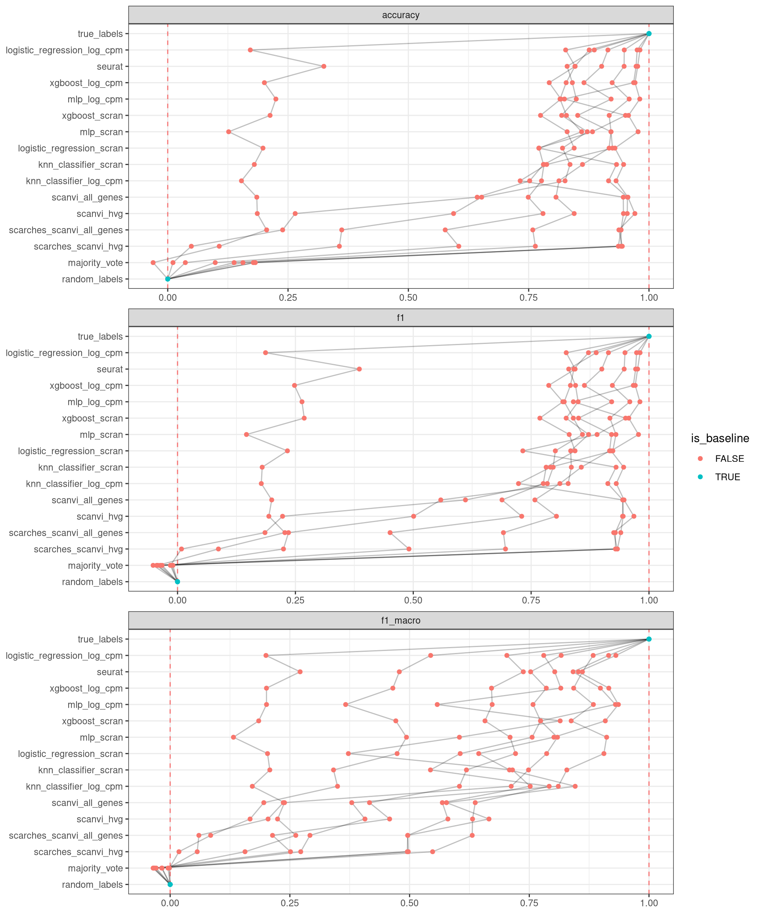

<link href="index_files/libs/lightable-0.0.1/lightable.css" rel="stylesheet" />

<missing description>

## Overview

This visualization shows the means of the scaled scores per method across all results (group Mean), per dataset (group Dataset) and per metric (group Metric).

<figure>

<figcaption aria-hidden="true">The average overall, per dataset and per metric scaled scores per method.</figcaption>
</figure>

Overview per parameter set

<figure>

<figcaption aria-hidden="true">The average overall, per dataset and per metric scaled scores per method and parameter set.</figcaption>
</figure>

## Metrics

-   **Accuracy**: <missing description>
-   **F1 score**: <missing description>
-   **Macro F1 score**: <missing description>

## Details

Quality control checks

<table class="table lightable-paper" style='margin-left: auto; margin-right: auto; font-family: "Arial Narrow", arial, helvetica, sans-serif; margin-left: auto; margin-right: auto;'>
 <thead>
  <tr>
   <th style="text-align:left;"> Category </th>
   <th style="text-align:left;"> Name </th>
   <th style="text-align:right;"> Value </th>
   <th style="text-align:left;"> Condition </th>
   <th style="text-align:left;"> Severity </th>
  </tr>
 </thead>
<tbody>
  <tr>
   <td style="text-align:left;" data-toggle="tooltip" data-container="body" data-placement="right" title="Percentage of missing results should be less than 10%.
  Task id: label_projection
  method id: majority_vote
  Percentage missing: 12%
"> Raw results </td>
   <td style="text-align:left;" data-toggle="tooltip" data-container="body" data-placement="right" title="Percentage of missing results should be less than 10%.
  Task id: label_projection
  method id: majority_vote
  Percentage missing: 12%
"> Method majority_vote %missing </td>
   <td style="text-align:right;" data-toggle="tooltip" data-container="body" data-placement="right" title="Percentage of missing results should be less than 10%.
  Task id: label_projection
  method id: majority_vote
  Percentage missing: 12%
"> 0.125 </td>
   <td style="text-align:left;" data-toggle="tooltip" data-container="body" data-placement="right" title="Percentage of missing results should be less than 10%.
  Task id: label_projection
  method id: majority_vote
  Percentage missing: 12%
"> pct_missing &lt;= .1 </td>
   <td style="text-align:left;color: red !important;" data-toggle="tooltip" data-container="body" data-placement="right" title="Percentage of missing results should be less than 10%.
  Task id: label_projection
  method id: majority_vote
  Percentage missing: 12%
"> ✗ </td>
  </tr>
</tbody>
</table>

Visualization of raw results

