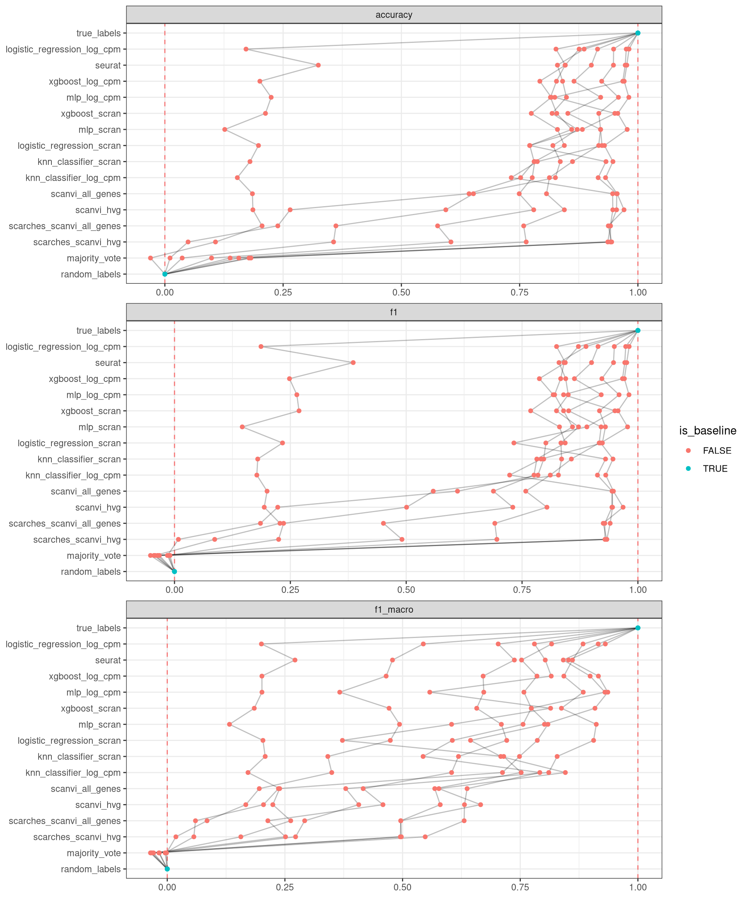

<link href="index_files/libs/lightable-0.0.1/lightable.css" rel="stylesheet" />

missing 'task_description'

<figure>

<figcaption aria-hidden="true">Overview of the results per method. This figures shows the means of the scaled scores per method across all results (group Mean), per dataset (group Dataset) and per metric (group Metric).</figcaption>
</figure>

Overview per parameter set

<figure>

<figcaption aria-hidden="true">Overview of the results per method and parameter set. This figures shows the means of the scaled scores per method parameter set across all results (group Mean), per dataset (group Dataset) and per metric (group Metric).</figcaption>
</figure>

## Methods

-   **K-neighbors classifier (log CPM)** (Cover and Hart 1967): missing 'method_summary'

<!-- -->

-   **K-neighbors classifier (log scran)** (Cover and Hart 1967): missing 'method_summary'

<!-- -->

-   **Logistic regression (log CPM)** (Hosmer Jr, Lemeshow, and Sturdivant 2013): missing 'method_summary'

<!-- -->

-   **Logistic regression (log scran)** (Hosmer Jr, Lemeshow, and Sturdivant 2013): missing 'method_summary'

<!-- -->

-   **Majority Vote** (Open Problems for Single Cell Analysis Consortium 2022): missing 'method_summary'

<!-- -->

-   **Multilayer perceptron (log CPM)** (Hinton 1989): missing 'method_summary'

<!-- -->

-   **Multilayer perceptron (log scran)** (Hinton 1989): missing 'method_summary'

<!-- -->

-   **Random Labels** (Open Problems for Single Cell Analysis Consortium 2022): missing 'method_summary'

<!-- -->

-   **scANVI (All genes)** (Xu et al. 2021): missing 'method_summary'

<!-- -->

-   **scANVI (Seurat v3 2000 HVG)** (Xu et al. 2021): missing 'method_summary'

<!-- -->

-   **scArches+scANVI (All genes)** (Lotfollahi et al. 2020): missing 'method_summary'

<!-- -->

-   **scArches+scANVI (Seurat v3 2000 HVG)** (Lotfollahi et al. 2020): missing 'method_summary'

<!-- -->

-   **Seurat reference mapping (SCTransform)** (Hao et al. 2021): missing 'method_summary'

<!-- -->

-   **True Labels** (Open Problems for Single Cell Analysis Consortium 2022): missing 'method_summary'

<!-- -->

-   **XGBoost (log CPM)** (Chen and Guestrin 2016): missing 'method_summary'

<!-- -->

-   **XGBoost (log scran)** (Chen and Guestrin 2016): missing 'method_summary'

## Datasets

-   **CeNGEN (by batch)** (Hammarlund et al. 2018): 100k FACS-isolated C. elegans neurons from 17 experiments sequenced on 10x Genomics. Split into train/test by experimental batch.
-   **CeNGEN (random split)** (Hammarlund et al. 2018): 100k FACS-isolated C. elegans neurons from 17 experiments sequenced on 10x Genomics. Split into train/test randomly.
-   **Pancreas (by batch)** (Luecken et al. 2021): Human pancreatic islet scRNA-seq data from 6 datasets across technologies (CEL-seq, CEL-seq2, Smart-seq2, inDrop, Fluidigm C1, and SMARTER-seq). Split into train/test by experimental batch.
-   **Pancreas (random split)** (Luecken et al. 2021): Human pancreatic islet scRNA-seq data from 6 datasets across technologies (CEL-seq, CEL-seq2, Smart-seq2, inDrop, Fluidigm C1, and SMARTER-seq). Split into train/test randomly.
-   **Pancreas (random split with label noise)** (Luecken et al. 2021): Human pancreatic islet scRNA-seq data from 6 datasets across technologies (CEL-seq, CEL-seq2, Smart-seq2, inDrop, Fluidigm C1, and SMARTER-seq). Split into train/test randomly with 20% label noise.
-   **Tabula Muris Senis Lung (random split)** (Tabula Muris Consortium 2020): All lung cells from Tabula Muris Senis, a 500k cell-atlas from 18 organs and tissues across the mouse lifespan. Split into train/test randomly.
-   **Zebrafish (by labels)** (Wagner et al. 2018): 90k cells from zebrafish embryos throughout the first day of development, with and without a knockout of chordin, an important developmental gene. Split into train/test by laboratory.
-   **Zebrafish (random split)** (Wagner et al. 2018): 90k cells from zebrafish embryos throughout the first day of development, with and without a knockout of chordin, an important developmental gene. Split into train/test randomly.

## Metrics

-   **Accuracy** (Grandini, Bagli, and Visani 2020): missing 'metric_summary'
-   **F1 score** (Grandini, Bagli, and Visani 2020): missing 'metric_summary'
-   **Macro F1 score** (Grandini, Bagli, and Visani 2020): missing 'metric_summary'

## Details

Quality control checks

<table class="table lightable-paper" style='margin-left: auto; margin-right: auto; font-family: "Arial Narrow", arial, helvetica, sans-serif; margin-left: auto; margin-right: auto;'>
 <thead>
  <tr>
   <th style="text-align:left;"> Category </th>
   <th style="text-align:left;"> Name </th>
   <th style="text-align:right;"> Value </th>
   <th style="text-align:left;"> Condition </th>
   <th style="text-align:left;"> Severity </th>
  </tr>
 </thead>
<tbody>
  <tr>
   <td style="text-align:left;" data-toggle="tooltip" data-container="body" data-placement="right" title="Percentage of missing results should be less than 10%.
  Task id: label_projection
  method id: majority_vote
  Percentage missing: 12%
"> Raw results </td>
   <td style="text-align:left;" data-toggle="tooltip" data-container="body" data-placement="right" title="Percentage of missing results should be less than 10%.
  Task id: label_projection
  method id: majority_vote
  Percentage missing: 12%
"> Method majority_vote %missing </td>
   <td style="text-align:right;" data-toggle="tooltip" data-container="body" data-placement="right" title="Percentage of missing results should be less than 10%.
  Task id: label_projection
  method id: majority_vote
  Percentage missing: 12%
"> 0.125 </td>
   <td style="text-align:left;" data-toggle="tooltip" data-container="body" data-placement="right" title="Percentage of missing results should be less than 10%.
  Task id: label_projection
  method id: majority_vote
  Percentage missing: 12%
"> pct_missing &lt;= .1 </td>
   <td style="text-align:left;color: red !important;" data-toggle="tooltip" data-container="body" data-placement="right" title="Percentage of missing results should be less than 10%.
  Task id: label_projection
  method id: majority_vote
  Percentage missing: 12%
"> ✗ </td>
  </tr>
</tbody>
</table>

Visualization of raw results

## References

Chen, Tianqi, and Carlos Guestrin. 2016. "XGBoost." In *Proceedings of the 22nd ACM SIGKDD International Conference on Knowledge Discovery and Data Mining*. Acm. <https://doi.org/10.1145/2939672.2939785>.

Cover, T., and P. Hart. 1967. "Nearest Neighbor Pattern Classification." *IEEE Transactions on Information Theory* 13 (1): 21--27. <https://doi.org/10.1109/tit.1967.1053964>.

Grandini, Margherita, Enrico Bagli, and Giorgio Visani. 2020. "Metrics for Multi-Class Classification: An Overview." *arXiv*. <https://doi.org/10.48550/arxiv.2008.05756>.

Hammarlund, Marc, Oliver Hobert, David M. Miller, and Nenad Sestan. 2018. "The CeNGEN Project: The Complete Gene Expression Map of an Entire Nervous System." *Neuron* 99 (3): 430--33. <https://doi.org/10.1016/j.neuron.2018.07.042>.

Hao, Yuhan, Stephanie Hao, Erica Andersen-Nissen, William M. Mauck, Shiwei Zheng, Andrew Butler, Maddie J. Lee, et al. 2021. "Integrated Analysis of Multimodal Single-Cell Data." *Cell* 184 (13): 3573--3587.e29. <https://doi.org/10.1016/j.cell.2021.04.048>.

Hinton, Geoffrey E. 1989. "Connectionist Learning Procedures." *Artificial Intelligence* 40 (1-3): 185--234. <https://doi.org/10.1016/0004-3702(89)90049-0>.

Hosmer Jr, D. W., S. Lemeshow, and R. X. Sturdivant. 2013. *Applied Logistic Regression*. Vol. 398. John Wiley & Sons.

Lotfollahi, Mohammad, Mohsen Naghipourfar, Malte D. Luecken, Matin Khajavi, Maren Büttner, Ziga Avsec, Alexander V. Misharin, and Fabian J. Theis. 2020. "Query to Reference Single-Cell Integration with Transfer Learning." *bioRxiv*. <https://doi.org/10.1101/2020.07.16.205997>.

Luecken, Malte D., M. Büttner, K. Chaichoompu, A. Danese, M. Interlandi, M. F. Mueller, D. C. Strobl, et al. 2021. "Benchmarking Atlas-Level Data Integration in Single-Cell Genomics." *Nature Methods* 19 (1): 41--50. <https://doi.org/10.1038/s41592-021-01336-8>.

Open Problems for Single Cell Analysis Consortium. 2022. "Open Problems." <https://openproblems.bio>.

Tabula Muris Consortium. 2020. "A Single-Cell Transcriptomic Atlas Characterizes Ageing Tissues in the Mouse." *Nature* 583 (7817): 590--95. <https://doi.org/10.1038/s41586-020-2496-1>.

Wagner, Daniel E., Caleb Weinreb, Zach M. Collins, James A. Briggs, Sean G. Megason, and Allon M. Klein. 2018. "Single-Cell Mapping of Gene Expression Landscapes and Lineage in the Zebrafish Embryo." *Science* 360 (6392): 981--87. <https://doi.org/10.1126/science.aar4362>.

Xu, Chenling, Romain Lopez, Edouard Mehlman, Jeffrey Regier, Michael I Jordan, and Nir Yosef. 2021. "Probabilistic Harmonization and Annotation of Single-Cell Transcriptomics Data with Deep Generative Models." *Molecular Systems Biology* 17 (1). <https://doi.org/10.15252/msb.20209620>.
