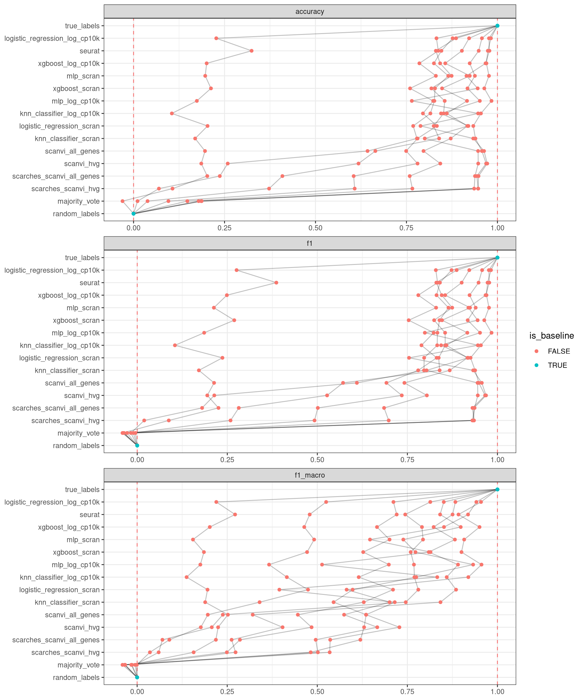

<link href="index_files/libs/datatables-css-0.0.0/datatables-crosstalk.css" rel="stylesheet" />

<link href="index_files/libs/dt-core-1.11.3/css/jquery.dataTables.min.css" rel="stylesheet" />
<link href="index_files/libs/dt-core-1.11.3/css/jquery.dataTables.extra.css" rel="stylesheet" />

<link href="index_files/libs/dt-ext-select-1.11.3/css/select.dataTables.min.css" rel="stylesheet" />

<link href="index_files/libs/dt-ext-searchpanes-1.11.3/css/searchPanes.dataTables.min.css" rel="stylesheet" />

<link href="index_files/libs/dt-ext-buttons-1.11.3/css/buttons.dataTables.min.css" rel="stylesheet" />

<link href="index_files/libs/crosstalk-1.2.0/css/crosstalk.min.css" rel="stylesheet" />

<link href="index_files/libs/lightable-0.0.1/lightable.css" rel="stylesheet" />

## Description

A major challenge for integrating single cell datasets is creating matching
cell type annotations for each cell. One of the most common strategies for
annotating cell types is referred to as
["cluster-then-annotate"](https://www.nature.com/articles/s41576-018-0088-9)
whereby cells are aggregated into clusters based on feature similarity and
then manually characterized based on differential gene expression or previously
identified marker genes. Recently, methods have emerged to build on this
strategy and annotate cells using
[known marker genes](https://www.nature.com/articles/s41592-019-0535-3).
However, these strategies pose a difficulty for integrating atlas-scale
datasets as the particular annotations may not match.
To ensure that the cell type labels in newly generated datasets match
existing reference datasets, some methods align cells to a previously
annotated [reference dataset](https://academic.oup.com/bioinformatics/article/35/22/4688/54802990)
and then *project* labels from the reference to the new dataset.
Here, we compare methods for annotation based on a reference dataset.
The datasets consist of two or more samples of single cell profiles that
have been manually annotated with matching labels. These datasets are then
split into training and test batches, and the task of each method is to
train a cell type classifer on the training set and project those labels
onto the test set.

## Summary

<figure>

<figcaption aria-hidden="true"><strong>Overview of the results per method</strong>. This figures shows the mean of the scaled scores (group Overall), the mean scores per dataset (group Dataset) and the mean scores per metric (group Metric).</figcaption>
</figure>

## Scaled scores

<!--### CeNGEN (by batch)-->

## Downloads

<a href="data/task_info.json" class="btn btn-secondary">Task info</a>
<a href="data/method_info.json" class="btn btn-secondary">Method info</a>
<a href="data/metric_info.json" class="btn btn-secondary">Metric info</a>
<a href="data/dataset_info.json" class="btn btn-secondary">Dataset info</a>
<a href="data/results.json" class="btn btn-secondary">Results</a>
<a href="data/quality_control.json" class="btn btn-secondary">Quality control</a>

## Details

Method descriptions

-   **[K-neighbors classifier (log CPM)](https://scikit-learn.org/stable/modules/generated/sklearn.neighbors.KNeighborsClassifier.html)**: Missing 'method_description'. [\[cover1967nearest\]](/bibliography#cover1967nearest)

<!-- -->

-   **[K-neighbors classifier (log scran)](https://scikit-learn.org/stable/modules/generated/sklearn.neighbors.KNeighborsClassifier.html)**: Missing 'method_description'. [\[cover1967nearest\]](/bibliography#cover1967nearest)

<!-- -->

-   **[Logistic regression (log CPM)](https://scikit-learn.org/stable/modules/generated/sklearn.linear_model.LogisticRegression.html)**: Missing 'method_description'. [\[hosmer2013applied\]](/bibliography#hosmer2013applied)

<!-- -->

-   **[Logistic regression (log scran)](https://scikit-learn.org/stable/modules/generated/sklearn.linear_model.LogisticRegression.html)**: Missing 'method_description'. [\[hosmer2013applied\]](/bibliography#hosmer2013applied)

<!-- -->

-   **[Majority Vote](https://github.com/openproblems-bio/openproblems)**: Baseline method using majority voting. [\[openproblems\]](/bibliography#openproblems)

<!-- -->

-   **[Multilayer perceptron (log CPM)](https://scikit-learn.org/stable/modules/generated/sklearn.neural_network.MLPClassifier.html)**: Missing 'method_description'. [\[hinton1989connectionist\]](/bibliography#hinton1989connectionist)

<!-- -->

-   **[Multilayer perceptron (log scran)](https://scikit-learn.org/stable/modules/generated/sklearn.neural_network.MLPClassifier.html)**: Missing 'method_description'. [\[hinton1989connectionist\]](/bibliography#hinton1989connectionist)

<!-- -->

-   **[Random Labels](https://github.com/openproblems-bio/openproblems)**: Baseline method which generates random labels. [\[openproblems\]](/bibliography#openproblems)

<!-- -->

-   **[scANVI (All genes)](https://github.com/YosefLab/scvi-tools)**: Probabilistic harmonization and annotation of single-cell transcriptomics data with deep generative models. [\[xu2021probabilistic\]](/bibliography#xu2021probabilistic)

<!-- -->

-   **[scANVI (Seurat v3 2000 HVG)](https://github.com/YosefLab/scvi-tools)**: Probabilistic harmonization and annotation of single-cell transcriptomics data with deep generative models. [\[xu2021probabilistic\]](/bibliography#xu2021probabilistic)

<!-- -->

-   **[scArches+scANVI (All genes)](https://github.com/YosefLab/scvi-tools)**: Probabilistic harmonization and annotation of single-cell transcriptomics data with deep generative models. [\[lotfollahi2020query\]](/bibliography#lotfollahi2020query)

<!-- -->

-   **[scArches+scANVI (Seurat v3 2000 HVG)](https://github.com/YosefLab/scvi-tools)**: Probabilistic harmonization and annotation of single-cell transcriptomics data with deep generative models. [\[lotfollahi2020query\]](/bibliography#lotfollahi2020query)

<!-- -->

-   **[Seurat reference mapping (SCTransform)](https://github.com/satijalab/seurat)**: The Seurat v3 anchoring procedure is designed to integrate diverse single-cell datasets across technologies and modalities. [\[hao2021integrated\]](/bibliography#hao2021integrated)

<!-- -->

-   **[True Labels](https://github.com/openproblems-bio/openproblems)**: Positive control method by returning the true labels. [\[openproblems\]](/bibliography#openproblems)

<!-- -->

-   **[XGBoost (log CPM)](https://xgboost.readthedocs.io/en/stable/index.html)**: Missing 'method_description'. [\[chen2016xgboost\]](/bibliography#chen2016xgboost)

<!-- -->

-   **[XGBoost (log scran)](https://xgboost.readthedocs.io/en/stable/index.html)**: Missing 'method_description'. [\[chen2016xgboost\]](/bibliography#chen2016xgboost)

Metric descriptions

-   **Accuracy**: The percentage of correctly predicted labels. [\[grandini2020metrics\]](/bibliography#grandini2020metrics)

<!-- -->

-   **F1 score**: Calculates the F1 score for each label, and find their average weighted by support (the number of true instances for each label). This alters 'macro' to account for label imbalance; it can result in an F-score that is not between precision and recall. [\[grandini2020metrics\]](/bibliography#grandini2020metrics)

<!-- -->

-   **Macro F1 score**: Calculates the F1 score for each label, and find their unweighted mean. This does not take label imbalance into account. [\[grandini2020metrics\]](/bibliography#grandini2020metrics)

Dataset descriptions

-   **CeNGEN (by batch)**: 100k FACS-isolated C. elegans neurons from 17 experiments sequenced on 10x Genomics. Split into train/test by experimental batch. [\[hammarlund2018cengen\]](/bibliography#hammarlund2018cengen)

<!-- -->

-   **CeNGEN (random split)**: 100k FACS-isolated C. elegans neurons from 17 experiments sequenced on 10x Genomics. Split into train/test randomly. [\[hammarlund2018cengen\]](/bibliography#hammarlund2018cengen)

<!-- -->

-   **Pancreas (by batch)**: Human pancreatic islet scRNA-seq data from 6 datasets across technologies (CEL-seq, CEL-seq2, Smart-seq2, inDrop, Fluidigm C1, and SMARTER-seq). Split into train/test by experimental batch. [\[luecken2022benchmarking\]](/bibliography#luecken2022benchmarking)

<!-- -->

-   **Pancreas (random split)**: Human pancreatic islet scRNA-seq data from 6 datasets across technologies (CEL-seq, CEL-seq2, Smart-seq2, inDrop, Fluidigm C1, and SMARTER-seq). Split into train/test randomly. [\[luecken2022benchmarking\]](/bibliography#luecken2022benchmarking)

<!-- -->

-   **Pancreas (random split with label noise)**: Human pancreatic islet scRNA-seq data from 6 datasets across technologies (CEL-seq, CEL-seq2, Smart-seq2, inDrop, Fluidigm C1, and SMARTER-seq). Split into train/test randomly with 20% label noise. [\[luecken2022benchmarking\]](/bibliography#luecken2022benchmarking)

<!-- -->

-   **Tabula Muris Senis Lung (random split)**: All lung cells from Tabula Muris Senis, a 500k cell-atlas from 18 organs and tissues across the mouse lifespan. Split into train/test randomly. [\[tabula2020single\]](/bibliography#tabula2020single)

<!-- -->

-   **Zebrafish (by labels)**: 90k cells from zebrafish embryos throughout the first day of development, with and without a knockout of chordin, an important developmental gene. Split into train/test by laboratory. [\[wagner2018single\]](/bibliography#wagner2018single)

<!-- -->

-   **Zebrafish (random split)**: 90k cells from zebrafish embryos throughout the first day of development, with and without a knockout of chordin, an important developmental gene. Split into train/test randomly. [\[wagner2018single\]](/bibliography#wagner2018single)

Baseline descriptions

-   **Majority Vote**: Baseline method using majority voting.

<!-- -->

-   **Random Labels**: Baseline method which generates random labels.

<!-- -->

-   **True Labels**: Positive control method by returning the true labels.

Quality control

<table class="table lightable-paper" style='margin-left: auto; margin-right: auto; font-family: "Arial Narrow", arial, helvetica, sans-serif; margin-left: auto; margin-right: auto;'>
 <thead>
  <tr>
   <th style="text-align:left;"> Category </th>
   <th style="text-align:left;"> Name </th>
   <th style="text-align:right;"> Value </th>
   <th style="text-align:left;"> Condition </th>
   <th style="text-align:left;"> Severity </th>
  </tr>
 </thead>
<tbody>
  <tr>
   <td style="text-align:left;" data-toggle="tooltip" data-container="body" data-placement="right" title="Percentage of missing results should be less than 10%.
  Task id: label_projection
  dataset id: zebrafish_labs
  Percentage missing: 100%
"> Raw results </td>
   <td style="text-align:left;" data-toggle="tooltip" data-container="body" data-placement="right" title="Percentage of missing results should be less than 10%.
  Task id: label_projection
  dataset id: zebrafish_labs
  Percentage missing: 100%
"> Dataset 'zebrafish_labs' %missing </td>
   <td style="text-align:right;" data-toggle="tooltip" data-container="body" data-placement="right" title="Percentage of missing results should be less than 10%.
  Task id: label_projection
  dataset id: zebrafish_labs
  Percentage missing: 100%
"> 1 </td>
   <td style="text-align:left;" data-toggle="tooltip" data-container="body" data-placement="right" title="Percentage of missing results should be less than 10%.
  Task id: label_projection
  dataset id: zebrafish_labs
  Percentage missing: 100%
"> pct_missing &lt;= .1 </td>
   <td style="text-align:left;color: red !important;" data-toggle="tooltip" data-container="body" data-placement="right" title="Percentage of missing results should be less than 10%.
  Task id: label_projection
  dataset id: zebrafish_labs
  Percentage missing: 100%
"> ✗✗✗ </td>
  </tr>
  <tr>
   <td style="text-align:left;" data-toggle="tooltip" data-container="body" data-placement="right" title="Dataset metadata field 'dataset_description' should be defined
  Task id: label_projection
  Field: dataset_description
"> Dataset info </td>
   <td style="text-align:left;" data-toggle="tooltip" data-container="body" data-placement="right" title="Dataset metadata field 'dataset_description' should be defined
  Task id: label_projection
  Field: dataset_description
"> Pct 'dataset_description' missing </td>
   <td style="text-align:right;" data-toggle="tooltip" data-container="body" data-placement="right" title="Dataset metadata field 'dataset_description' should be defined
  Task id: label_projection
  Field: dataset_description
"> 1 </td>
   <td style="text-align:left;" data-toggle="tooltip" data-container="body" data-placement="right" title="Dataset metadata field 'dataset_description' should be defined
  Task id: label_projection
  Field: dataset_description
"> percent_missing(dataset_info, field) </td>
   <td style="text-align:left;color: red !important;" data-toggle="tooltip" data-container="body" data-placement="right" title="Dataset metadata field 'dataset_description' should be defined
  Task id: label_projection
  Field: dataset_description
"> ✗✗ </td>
  </tr>
  <tr>
   <td style="text-align:left;" data-toggle="tooltip" data-container="body" data-placement="right" title="Method metadata field 'method_description' should be defined
  Task id: label_projection
  Field: method_description
"> Method info </td>
   <td style="text-align:left;" data-toggle="tooltip" data-container="body" data-placement="right" title="Method metadata field 'method_description' should be defined
  Task id: label_projection
  Field: method_description
"> Pct 'method_description' missing </td>
   <td style="text-align:right;" data-toggle="tooltip" data-container="body" data-placement="right" title="Method metadata field 'method_description' should be defined
  Task id: label_projection
  Field: method_description
"> 1 </td>
   <td style="text-align:left;" data-toggle="tooltip" data-container="body" data-placement="right" title="Method metadata field 'method_description' should be defined
  Task id: label_projection
  Field: method_description
"> percent_missing(method_info, field) </td>
   <td style="text-align:left;color: red !important;" data-toggle="tooltip" data-container="body" data-placement="right" title="Method metadata field 'method_description' should be defined
  Task id: label_projection
  Field: method_description
"> ✗✗ </td>
  </tr>
  <tr>
   <td style="text-align:left;" data-toggle="tooltip" data-container="body" data-placement="right" title="Metric metadata field 'metric_description' should be defined
  Task id: label_projection
  Field: metric_description
"> Metric info </td>
   <td style="text-align:left;" data-toggle="tooltip" data-container="body" data-placement="right" title="Metric metadata field 'metric_description' should be defined
  Task id: label_projection
  Field: metric_description
"> Pct 'metric_description' missing </td>
   <td style="text-align:right;" data-toggle="tooltip" data-container="body" data-placement="right" title="Metric metadata field 'metric_description' should be defined
  Task id: label_projection
  Field: metric_description
"> 1 </td>
   <td style="text-align:left;" data-toggle="tooltip" data-container="body" data-placement="right" title="Metric metadata field 'metric_description' should be defined
  Task id: label_projection
  Field: metric_description
"> percent_missing(metric_info, field) </td>
   <td style="text-align:left;color: red !important;" data-toggle="tooltip" data-container="body" data-placement="right" title="Metric metadata field 'metric_description' should be defined
  Task id: label_projection
  Field: metric_description
"> ✗✗ </td>
  </tr>
  <tr>
   <td style="text-align:left;" data-toggle="tooltip" data-container="body" data-placement="right" title="Task metadata field 'task_description' should be defined
  Task id: label_projection
  Field: task_description
"> Task info </td>
   <td style="text-align:left;" data-toggle="tooltip" data-container="body" data-placement="right" title="Task metadata field 'task_description' should be defined
  Task id: label_projection
  Field: task_description
"> Pct 'task_description' missing </td>
   <td style="text-align:right;" data-toggle="tooltip" data-container="body" data-placement="right" title="Task metadata field 'task_description' should be defined
  Task id: label_projection
  Field: task_description
"> 1 </td>
   <td style="text-align:left;" data-toggle="tooltip" data-container="body" data-placement="right" title="Task metadata field 'task_description' should be defined
  Task id: label_projection
  Field: task_description
"> percent_missing([task_info], field) </td>
   <td style="text-align:left;color: red !important;" data-toggle="tooltip" data-container="body" data-placement="right" title="Task metadata field 'task_description' should be defined
  Task id: label_projection
  Field: task_description
"> ✗✗ </td>
  </tr>
</tbody>
</table>

Visualization of raw results

