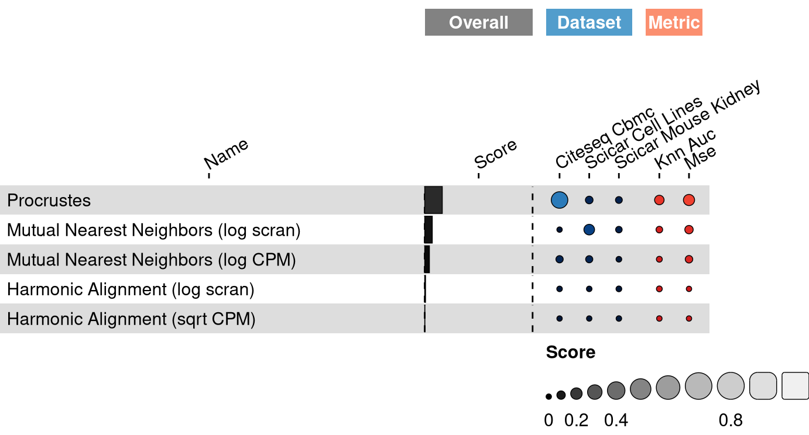
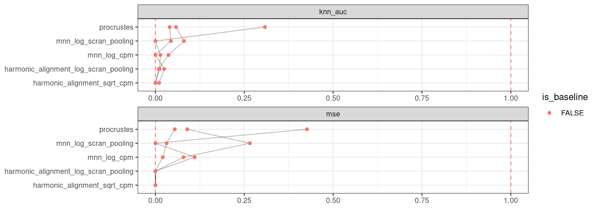

<link href="index_files/libs/datatables-css-0.0.0/datatables-crosstalk.css" rel="stylesheet" />

<link href="index_files/libs/dt-core-1.11.3/css/jquery.dataTables.min.css" rel="stylesheet" />
<link href="index_files/libs/dt-core-1.11.3/css/jquery.dataTables.extra.css" rel="stylesheet" />

<link href="index_files/libs/dt-ext-select-1.11.3/css/select.dataTables.min.css" rel="stylesheet" />

<link href="index_files/libs/dt-ext-searchpanes-1.11.3/css/searchPanes.dataTables.min.css" rel="stylesheet" />

<link href="index_files/libs/dt-ext-buttons-1.11.3/css/buttons.dataTables.min.css" rel="stylesheet" />

<link href="index_files/libs/dt-ext-responsive-1.11.3/css/responsive.dataTables.min.css" rel="stylesheet" />

<link href="index_files/libs/crosstalk-1.2.0/css/crosstalk.min.css" rel="stylesheet" />

<link href="index_files/libs/lightable-0.0.1/lightable.css" rel="stylesheet" />

## Description

Missing 'task_description'

## Summary

<figure>

<figcaption aria-hidden="true"><strong>Overview of the results per method</strong>. This figures shows the mean of the scaled scores (group Overall), the mean scores per dataset (group Dataset) and the mean scores per metric (group Metric).</figcaption>
</figure>

## Scaled scores

## Downloads

<a href="data/task_info.json" class="btn btn-secondary">Task info</a>
<a href="data/method_info.json" class="btn btn-secondary">Method info</a>
<a href="data/metric_info.json" class="btn btn-secondary">Metric info</a>
<a href="data/dataset_info.json" class="btn btn-secondary">Dataset info</a>
<a href="data/results.json" class="btn btn-secondary">Results</a>
<a href="data/quality_control.json" class="btn btn-secondary">Quality control</a>

## Details

Method descriptions

-   **[Harmonic Alignment (log scran)](https://github.com/KrishnaswamyLab/harmonic-alignment)**: Missing 'method_description'. [\[stanley2020harmonic\]](/bibliography#stanley2020harmonic)

<!-- -->

-   **[Harmonic Alignment (sqrt CPM)](https://github.com/KrishnaswamyLab/harmonic-alignment)**: Missing 'method_description'. [\[stanley2020harmonic\]](/bibliography#stanley2020harmonic)

<!-- -->

-   **[Mutual Nearest Neighbors (log CPM)](https://github.com/LTLA/batchelor)**: Missing 'method_description'. [\[haghverdi2018batch\]](/bibliography#haghverdi2018batch)

<!-- -->

-   **[Mutual Nearest Neighbors (log scran)](https://github.com/LTLA/batchelor)**: Missing 'method_description'. [\[haghverdi2018batch\]](/bibliography#haghverdi2018batch)

<!-- -->

-   **[Procrustes](https://docs.scipy.org/doc/scipy/reference/generated/scipy.spatial.procrustes.html)**: Missing 'method_description'. [\[gower1975generalized\]](/bibliography#gower1975generalized)

<!-- -->

-   **[Random Features](https://github.com/openproblems-bio/openproblems)**: Missing 'method_description'. [\[openproblems\]](/bibliography#openproblems)

<!-- -->

-   **[True Features](https://github.com/openproblems-bio/openproblems)**: Missing 'method_description'. [\[openproblems\]](/bibliography#openproblems)

Metric descriptions

-   **kNN Area Under the Curve**: Missing 'metric_description'. [\[stanley2020harmonic\]](/bibliography#stanley2020harmonic)

<!-- -->

-   **Mean squared error**: Missing 'metric_description'. [\[lance2022multimodal\]](/bibliography#lance2022multimodal)

Dataset descriptions

-   **CITE-seq Cord Blood Mononuclear Cells**: Missing 'dataset_description'. [\[stoeckius2017simultaneous\]](/bibliography#stoeckius2017simultaneous)

<!-- -->

-   **sciCAR Cell Lines**: Missing 'dataset_description'. [\[cao2018joint\]](/bibliography#cao2018joint)

<!-- -->

-   **sciCAR Mouse Kidney**: Missing 'dataset_description'. [\[cao2018joint\]](/bibliography#cao2018joint)

Baseline descriptions

-   **Random Features**: Missing 'method_description'.

<!-- -->

-   **True Features**: Missing 'method_description'.

Quality control

<table class="table lightable-paper" style='margin-left: auto; margin-right: auto; font-family: "Arial Narrow", arial, helvetica, sans-serif; margin-left: auto; margin-right: auto;'>
 <thead>
  <tr>
   <th style="text-align:left;"> Category </th>
   <th style="text-align:left;"> Name </th>
   <th style="text-align:right;"> Value </th>
   <th style="text-align:left;"> Condition </th>
   <th style="text-align:left;"> Severity </th>
  </tr>
 </thead>
<tbody>
  <tr>
   <td style="text-align:left;" data-toggle="tooltip" data-container="body" data-placement="right" title="Dataset metadata field 'dataset_description' should be defined
  Task id: multimodal_data_integration
  Field: dataset_description
"> Dataset info </td>
   <td style="text-align:left;" data-toggle="tooltip" data-container="body" data-placement="right" title="Dataset metadata field 'dataset_description' should be defined
  Task id: multimodal_data_integration
  Field: dataset_description
"> Pct 'dataset_description' missing </td>
   <td style="text-align:right;" data-toggle="tooltip" data-container="body" data-placement="right" title="Dataset metadata field 'dataset_description' should be defined
  Task id: multimodal_data_integration
  Field: dataset_description
"> 1 </td>
   <td style="text-align:left;" data-toggle="tooltip" data-container="body" data-placement="right" title="Dataset metadata field 'dataset_description' should be defined
  Task id: multimodal_data_integration
  Field: dataset_description
"> percent_missing(dataset_info, field) </td>
   <td style="text-align:left;color: red !important;" data-toggle="tooltip" data-container="body" data-placement="right" title="Dataset metadata field 'dataset_description' should be defined
  Task id: multimodal_data_integration
  Field: dataset_description
"> ✗✗ </td>
  </tr>
  <tr>
   <td style="text-align:left;" data-toggle="tooltip" data-container="body" data-placement="right" title="Method metadata field 'method_description' should be defined
  Task id: multimodal_data_integration
  Field: method_description
"> Method info </td>
   <td style="text-align:left;" data-toggle="tooltip" data-container="body" data-placement="right" title="Method metadata field 'method_description' should be defined
  Task id: multimodal_data_integration
  Field: method_description
"> Pct 'method_description' missing </td>
   <td style="text-align:right;" data-toggle="tooltip" data-container="body" data-placement="right" title="Method metadata field 'method_description' should be defined
  Task id: multimodal_data_integration
  Field: method_description
"> 1 </td>
   <td style="text-align:left;" data-toggle="tooltip" data-container="body" data-placement="right" title="Method metadata field 'method_description' should be defined
  Task id: multimodal_data_integration
  Field: method_description
"> percent_missing(method_info, field) </td>
   <td style="text-align:left;color: red !important;" data-toggle="tooltip" data-container="body" data-placement="right" title="Method metadata field 'method_description' should be defined
  Task id: multimodal_data_integration
  Field: method_description
"> ✗✗ </td>
  </tr>
  <tr>
   <td style="text-align:left;" data-toggle="tooltip" data-container="body" data-placement="right" title="Metric metadata field 'metric_description' should be defined
  Task id: multimodal_data_integration
  Field: metric_description
"> Metric info </td>
   <td style="text-align:left;" data-toggle="tooltip" data-container="body" data-placement="right" title="Metric metadata field 'metric_description' should be defined
  Task id: multimodal_data_integration
  Field: metric_description
"> Pct 'metric_description' missing </td>
   <td style="text-align:right;" data-toggle="tooltip" data-container="body" data-placement="right" title="Metric metadata field 'metric_description' should be defined
  Task id: multimodal_data_integration
  Field: metric_description
"> 1 </td>
   <td style="text-align:left;" data-toggle="tooltip" data-container="body" data-placement="right" title="Metric metadata field 'metric_description' should be defined
  Task id: multimodal_data_integration
  Field: metric_description
"> percent_missing(metric_info, field) </td>
   <td style="text-align:left;color: red !important;" data-toggle="tooltip" data-container="body" data-placement="right" title="Metric metadata field 'metric_description' should be defined
  Task id: multimodal_data_integration
  Field: metric_description
"> ✗✗ </td>
  </tr>
  <tr>
   <td style="text-align:left;" data-toggle="tooltip" data-container="body" data-placement="right" title="Task metadata field 'task_description' should be defined
  Task id: multimodal_data_integration
  Field: task_description
"> Task info </td>
   <td style="text-align:left;" data-toggle="tooltip" data-container="body" data-placement="right" title="Task metadata field 'task_description' should be defined
  Task id: multimodal_data_integration
  Field: task_description
"> Pct 'task_description' missing </td>
   <td style="text-align:right;" data-toggle="tooltip" data-container="body" data-placement="right" title="Task metadata field 'task_description' should be defined
  Task id: multimodal_data_integration
  Field: task_description
"> 1 </td>
   <td style="text-align:left;" data-toggle="tooltip" data-container="body" data-placement="right" title="Task metadata field 'task_description' should be defined
  Task id: multimodal_data_integration
  Field: task_description
"> percent_missing([task_info], field) </td>
   <td style="text-align:left;color: red !important;" data-toggle="tooltip" data-container="body" data-placement="right" title="Task metadata field 'task_description' should be defined
  Task id: multimodal_data_integration
  Field: task_description
"> ✗✗ </td>
  </tr>
</tbody>
</table>

Visualization of raw results

