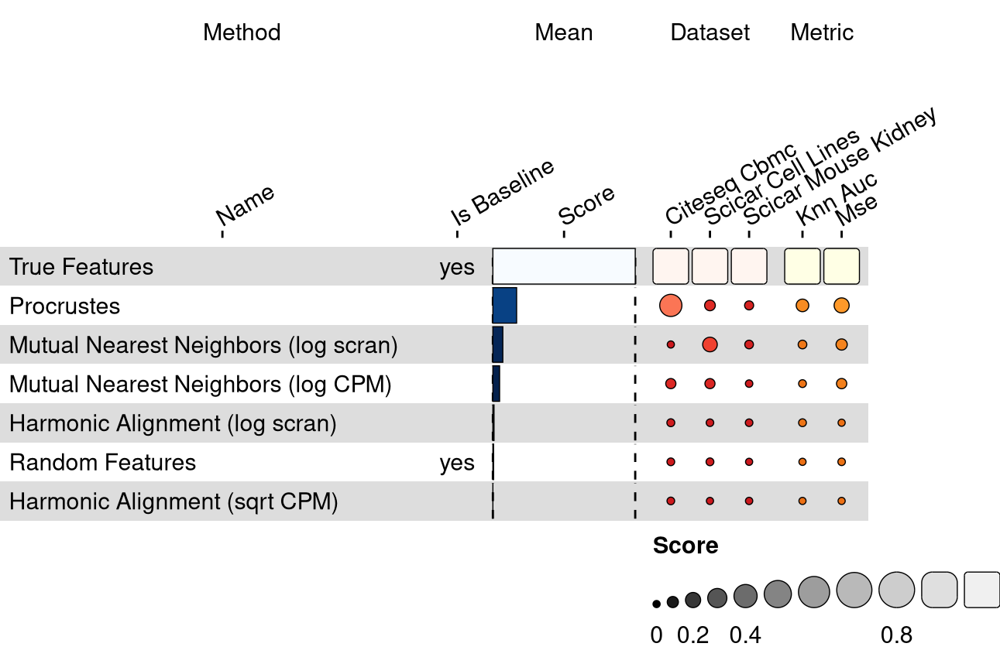
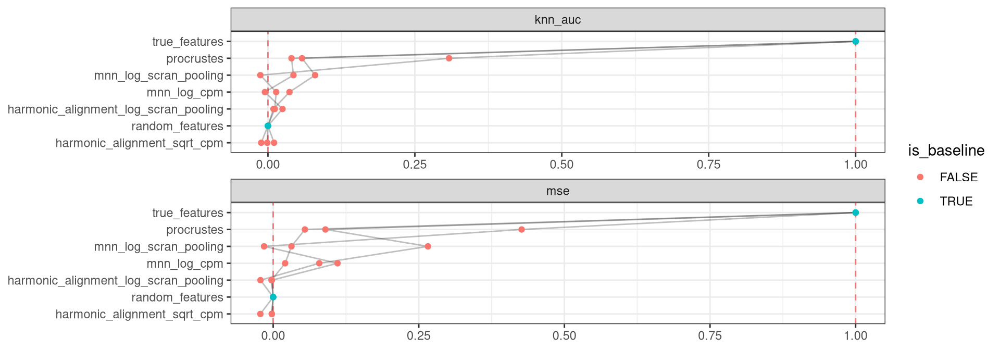

<link href="index_files/libs/lightable-0.0.1/lightable.css" rel="stylesheet" />

missing 'task_description'

<figure>

<figcaption aria-hidden="true">Overview of the results per method. This figures shows the means of the scaled scores per method across all results (group Mean), per dataset (group Dataset) and per metric (group Metric).</figcaption>
</figure>

Overview per parameter set

<figure>

<figcaption aria-hidden="true">Overview of the results per method and parameter set. This figures shows the means of the scaled scores per method parameter set across all results (group Mean), per dataset (group Dataset) and per metric (group Metric).</figcaption>
</figure>

## Methods

-   **Harmonic Alignment (log scran)** (Stanley et al. 2020): missing 'method_summary'

<!-- -->

-   **Harmonic Alignment (sqrt CPM)** (Stanley et al. 2020): missing 'method_summary'

<!-- -->

-   **Mutual Nearest Neighbors (log CPM)** (Haghverdi et al. 2018): missing 'method_summary'

<!-- -->

-   **Mutual Nearest Neighbors (log scran)** (Haghverdi et al. 2018): missing 'method_summary'

<!-- -->

-   **Procrustes** (Gower 1975): missing 'method_summary'

<!-- -->

-   **Random Features** (Open Problems for Single Cell Analysis Consortium 2022): missing 'method_summary'

<!-- -->

-   **True Features** (Open Problems for Single Cell Analysis Consortium 2022): missing 'method_summary'

## Datasets

-   **CITE-seq Cord Blood Mononuclear Cells** (Stoeckius et al. 2017): 8k cord blood mononuclear cells sequenced by CITEseq, a multimodal addition to the 10x scRNA-seq platform that allows simultaneous measurement of RNA and protein.
-   **sciCAR Cell Lines** (Cao et al. 2018): 5k cells from a time-series of dexamethasone treatment sequenced by sci-CAR, a combinatorial indexing-based co-assay that jointly profiles chromatin accessibility and mRNA.
-   **sciCAR Mouse Kidney** (Cao et al. 2018): 11k cells from adult mouse kidney sequenced by sci-CAR, a combinatorial indexing-based co-assay that jointly profiles chromatin accessibility and mRNA.

## Metrics

-   **kNN Area Under the Curve** (Stanley et al. 2020): missing 'metric_summary'
-   **Mean squared error** (Lance et al. 2022): missing 'metric_summary'

## Details

Quality control checks

<table class="table lightable-paper" style='margin-left: auto; margin-right: auto; font-family: "Arial Narrow", arial, helvetica, sans-serif; margin-left: auto; margin-right: auto;'>
 <thead>
  <tr>
   <th style="text-align:left;"> Category </th>
   <th style="text-align:left;"> Name </th>
   <th style="text-align:right;"> Value </th>
   <th style="text-align:left;"> Condition </th>
   <th style="text-align:left;"> Severity </th>
  </tr>
 </thead>
<tbody>
  <tr>
   <td style="text-align:left;" data-toggle="tooltip" data-container="body" data-placement="right" title="Percentage of missing results should be less than 10%.
  Task id: multimodal_data_integration
  method id: true_features
  Percentage missing: 50%
"> Raw results </td>
   <td style="text-align:left;" data-toggle="tooltip" data-container="body" data-placement="right" title="Percentage of missing results should be less than 10%.
  Task id: multimodal_data_integration
  method id: true_features
  Percentage missing: 50%
"> Method true_features %missing </td>
   <td style="text-align:right;" data-toggle="tooltip" data-container="body" data-placement="right" title="Percentage of missing results should be less than 10%.
  Task id: multimodal_data_integration
  method id: true_features
  Percentage missing: 50%
"> 0.5000000 </td>
   <td style="text-align:left;" data-toggle="tooltip" data-container="body" data-placement="right" title="Percentage of missing results should be less than 10%.
  Task id: multimodal_data_integration
  method id: true_features
  Percentage missing: 50%
"> pct_missing &lt;= .1 </td>
   <td style="text-align:left;color: red !important;" data-toggle="tooltip" data-container="body" data-placement="right" title="Percentage of missing results should be less than 10%.
  Task id: multimodal_data_integration
  method id: true_features
  Percentage missing: 50%
"> ✗✗✗ </td>
  </tr>
  <tr>
   <td style="text-align:left;" data-toggle="tooltip" data-container="body" data-placement="right" title="Percentage of missing results should be less than 10%.
  Task id: multimodal_data_integration
  Metric id: mse
  Percentage missing: 14%
"> Raw results </td>
   <td style="text-align:left;" data-toggle="tooltip" data-container="body" data-placement="right" title="Percentage of missing results should be less than 10%.
  Task id: multimodal_data_integration
  Metric id: mse
  Percentage missing: 14%
"> Metric mse %missing </td>
   <td style="text-align:right;" data-toggle="tooltip" data-container="body" data-placement="right" title="Percentage of missing results should be less than 10%.
  Task id: multimodal_data_integration
  Metric id: mse
  Percentage missing: 14%
"> 0.1428571 </td>
   <td style="text-align:left;" data-toggle="tooltip" data-container="body" data-placement="right" title="Percentage of missing results should be less than 10%.
  Task id: multimodal_data_integration
  Metric id: mse
  Percentage missing: 14%
"> pct_missing &lt;= .1 </td>
   <td style="text-align:left;color: red !important;" data-toggle="tooltip" data-container="body" data-placement="right" title="Percentage of missing results should be less than 10%.
  Task id: multimodal_data_integration
  Metric id: mse
  Percentage missing: 14%
"> ✗ </td>
  </tr>
</tbody>
</table>

Visualization of raw results

## References

Cao, Junyue, Darren A. Cusanovich, Vijay Ramani, Delasa Aghamirzaie, Hannah A. Pliner, Andrew J. Hill, Riza M. Daza, et al. 2018. "Joint Profiling of Chromatin Accessibility and Gene Expression in Thousands of Single Cells." *Science* 361 (6409): 1380--85. <https://doi.org/10.1126/science.aau0730>.

Gower, J. C. 1975. "Generalized Procrustes Analysis." *Psychometrika* 40 (1): 33--51. <https://doi.org/10.1007/bf02291478>.

Haghverdi, Laleh, Aaron T L Lun, Michael D Morgan, and John C Marioni. 2018. "Batch Effects in Single-Cell RNA-Sequencing Data Are Corrected by Matching Mutual Nearest Neighbors." *Nature Biotechnology* 36 (5): 421--27. <https://doi.org/10.1038/nbt.4091>.

Lance, Christopher, Malte D. Luecken, Daniel B. Burkhardt, Robrecht Cannoodt, Pia Rautenstrauch, Anna Laddach, Aidyn Ubingazhibov, et al. 2022. "Multimodal Single Cell Data Integration Challenge: Results and Lessons Learned." *bioRxiv*. <https://doi.org/10.1101/2022.04.11.487796>.

Open Problems for Single Cell Analysis Consortium. 2022. "Open Problems." <https://openproblems.bio>.

Stanley, Jay S., Scott Gigante, Guy Wolf, and Smita Krishnaswamy. 2020. "Harmonic Alignment." In *Proceedings of the 2020 SIAM International Conference on Data Mining*, 316--24. Society for Industrial; Applied Mathematics. <https://doi.org/10.1137/1.9781611976236.36>.

Stoeckius, Marlon, Christoph Hafemeister, William Stephenson, Brian Houck-Loomis, Pratip K Chattopadhyay, Harold Swerdlow, Rahul Satija, and Peter Smibert. 2017. "Simultaneous Epitope and Transcriptome Measurement in Single Cells." *Nature Methods* 14 (9): 865--68. <https://doi.org/10.1038/nmeth.4380>.
