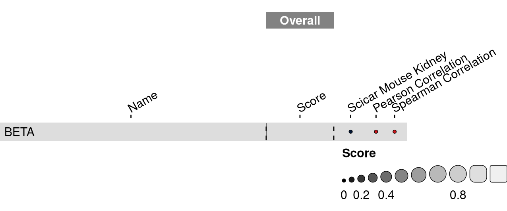

<link href="index_files/libs/lightable-0.0.1/lightable.css" rel="stylesheet" />

missing 'task_description'

<figure>

<figcaption aria-hidden="true">Overview of the results per method. This figures shows the means of the scaled scores per method across all results (group Mean), per dataset (group Dataset) and per metric (group Metric).</figcaption>
</figure>

Overview per parameter set

<figure>

<figcaption aria-hidden="true">Overview of the results per method and parameter set. This figures shows the means of the scaled scores per method parameter set across all results (group Mean), per dataset (group Dataset) and per metric (group Metric).</figcaption>
</figure>

## Methods

-   **BETA** (Wang et al. 2013): missing 'method_summary'

<!-- -->

-   **Random Scores** (Open Problems for Single Cell Analysis Consortium 2022): missing 'method_summary'

<!-- -->

-   **True Scores** (Open Problems for Single Cell Analysis Consortium 2022): missing 'method_summary'

## Datasets

-   **sciCAR Mouse Kidney with cell clusters** (Cao et al. 2018): 11k cells from adult mouse kidney sequenced by sci-CAR, a combinatorial indexing-based co-assay that jointly profiles chromatin accessibility and mRNA.

## Metrics

-   **Median Pearson correlation** (Schober, Boer, and Schwarte 2018): missing 'metric_summary'
-   **Median Spearman correlation** (Schober, Boer, and Schwarte 2018): missing 'metric_summary'

## Details

Quality control checks

<table class="table lightable-paper" style='margin-left: auto; margin-right: auto; font-family: "Arial Narrow", arial, helvetica, sans-serif; margin-left: auto; margin-right: auto;'>
 <thead>
  <tr>
   <th style="text-align:left;"> Category </th>
   <th style="text-align:left;"> Name </th>
   <th style="text-align:right;"> Value </th>
   <th style="text-align:left;"> Condition </th>
   <th style="text-align:left;"> Severity </th>
  </tr>
 </thead>
<tbody>
  <tr>
   <td style="text-align:left;" data-toggle="tooltip" data-container="body" data-placement="right" title="Method beta performs much worse than baselines.
  Task id: regulatory_effect_prediction
  Method id: beta
  Metric id: pearson_correlation
  Worst score: -3.363416765378533%
"> Scaling </td>
   <td style="text-align:left;" data-toggle="tooltip" data-container="body" data-placement="right" title="Method beta performs much worse than baselines.
  Task id: regulatory_effect_prediction
  Method id: beta
  Metric id: pearson_correlation
  Worst score: -3.363416765378533%
"> Worst score beta pearson_correlation </td>
   <td style="text-align:right;" data-toggle="tooltip" data-container="body" data-placement="right" title="Method beta performs much worse than baselines.
  Task id: regulatory_effect_prediction
  Method id: beta
  Metric id: pearson_correlation
  Worst score: -3.363416765378533%
"> -3.363417 </td>
   <td style="text-align:left;" data-toggle="tooltip" data-container="body" data-placement="right" title="Method beta performs much worse than baselines.
  Task id: regulatory_effect_prediction
  Method id: beta
  Metric id: pearson_correlation
  Worst score: -3.363416765378533%
"> worst_score &gt;= -1 </td>
   <td style="text-align:left;color: red !important;" data-toggle="tooltip" data-container="body" data-placement="right" title="Method beta performs much worse than baselines.
  Task id: regulatory_effect_prediction
  Method id: beta
  Metric id: pearson_correlation
  Worst score: -3.363416765378533%
"> ✗✗✗ </td>
  </tr>
</tbody>
</table>

Visualization of raw results

## References

Cao, Junyue, Darren A. Cusanovich, Vijay Ramani, Delasa Aghamirzaie, Hannah A. Pliner, Andrew J. Hill, Riza M. Daza, et al. 2018. "Joint Profiling of Chromatin Accessibility and Gene Expression in Thousands of Single Cells." *Science* 361 (6409): 1380--85. <https://doi.org/10.1126/science.aau0730>.

Open Problems for Single Cell Analysis Consortium. 2022. "Open Problems." <https://openproblems.bio>.

Schober, Patrick, Christa Boer, and Lothar A. Schwarte. 2018. "Correlation Coefficients." *Anesthesia &Amp$\mathsemicolon$ Analgesia* 126 (5): 1763--68. <https://doi.org/10.1213/ane.0000000000002864>.

Wang, Su, Hanfei Sun, Jian Ma, Chongzhi Zang, Chenfei Wang, Juan Wang, Qianzi Tang, Clifford A Meyer, Yong Zhang, and X Shirley Liu. 2013. "Target Analysis by Integration of Transcriptome and ChIP-Seq Data with BETA." *Nature Protocols* 8 (12): 2502--15. <https://doi.org/10.1038/nprot.2013.150>.
