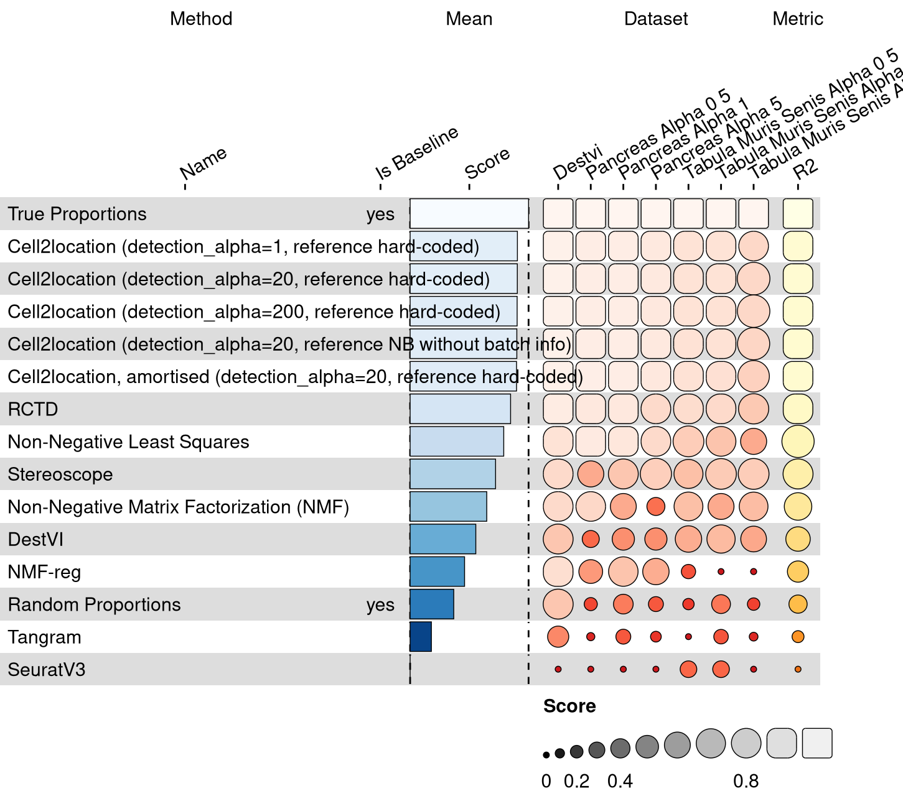
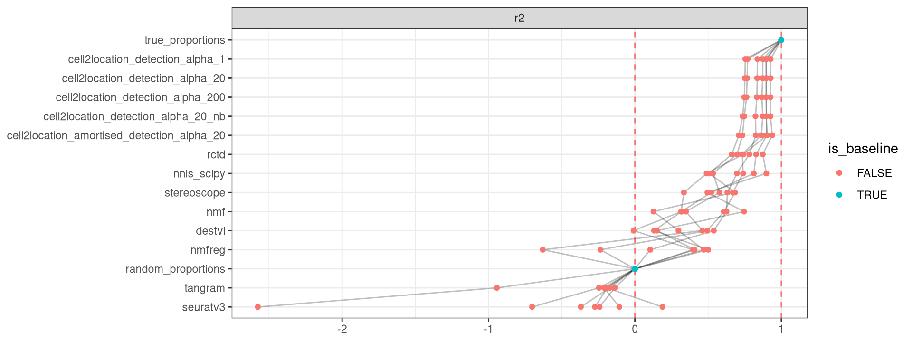

<link href="index_files/libs/lightable-0.0.1/lightable.css" rel="stylesheet" />

Missing 'task_description'

## Results

<figure>

<figcaption aria-hidden="true">Overview of the results per method. This figures shows the means of the scaled scores per method across all results (group Mean), per dataset (group Dataset) and per metric (group Metric).</figcaption>
</figure>

## Methods

-   **[Cell2location, amortised](https://github.com/BayraktarLab/cell2location)** (Kleshchevnikov et al. 2022): Missing 'method_description'.

<!-- -->

-   **[Cell2location](https://github.com/BayraktarLab/cell2location)** (Kleshchevnikov et al. 2022): Missing 'method_description'.

<!-- -->

-   **[DestVI](https://github.com/YosefLab/scvi-tools)** (Lopez et al. 2022): Missing 'method_description'.

<!-- -->

-   **[Non-Negative Matrix Factorization](https://scikit-learn.org/stable/modules/generated/sklearn.decomposition.NMF.html)** (Cichocki and Phan 2009): Missing 'method_description'.

<!-- -->

-   **[NMF-reg](https://github.com/tudaga/NMFreg_tutorial)** (Rodriques et al. 2019): Missing 'method_description'.

<!-- -->

-   **[Non-Negative Least Squares](https://docs.scipy.org/doc/scipy/reference/generated/scipy.optimize.nnls.html)** (Lawson and Hanson 1995): Missing 'method_description'.

<!-- -->

-   **[RCTD](https://github.com/dmcable/spacexr)** (Cable et al. 2021): Missing 'method_description'.

<!-- -->

-   **[SeuratV3](https://satijalab.org/seurat/archive/v3.2/spatial_vignette.html)** (Stuart et al. 2019): Missing 'method_description'.

<!-- -->

-   **[Stereoscope](https://github.com/scverse/scvi-tools)** (Andersson et al. 2020): Missing 'method_description'.

<!-- -->

-   **[Tangram](https://github.com/broadinstitute/Tangram)** (Biancalani et al. 2021): Missing 'method_description'.

## Metrics

-   **r2** (Miles 2005): Missing 'metric_description'.

## Datasets

-   **DestVI** (Lopez et al. 2022): Missing 'dataset_description'.

<!-- -->

-   **Pancreas (alpha=0.5)** (Luecken et al. 2021): Missing 'dataset_description'.

<!-- -->

-   **Pancreas (alpha=1)** (Luecken et al. 2021): Missing 'dataset_description'.

<!-- -->

-   **Pancreas (alpha=5)** (Luecken et al. 2021): Missing 'dataset_description'.

<!-- -->

-   **Tabula muris senis (alpha=0.5)** (Tabula Muris Consortium 2020): Missing 'dataset_description'.

<!-- -->

-   **Tabula muris senis (alpha=1)** (Tabula Muris Consortium 2020): Missing 'dataset_description'.

<!-- -->

-   **Tabula muris senis (alpha=5)** (Tabula Muris Consortium 2020): Missing 'dataset_description'.

## Baselines

-   **Random Proportions**: Missing 'method_description'.

<!-- -->

-   **True Proportions**: Missing 'method_description'.

## Downloads

<a href="data/task_info.json" class="btn btn-secondary">Task info</a>
<a href="data/method_info.json" class="btn btn-secondary">Method info</a>
<a href="data/metric_info.json" class="btn btn-secondary">Metric info</a>
<a href="data/dataset_info.json" class="btn btn-secondary">Dataset info</a>
<a href="data/results.json" class="btn btn-secondary">Results</a>
<a href="data/quality_control.json" class="btn btn-secondary">Quality control</a>

## Details

Overview per parameter set

<figure>

<figcaption aria-hidden="true">Overview of the results per method and parameter set. This figures shows the means of the scaled scores per method parameter set across all results (group Mean), per dataset (group Dataset) and per metric (group Metric).</figcaption>
</figure>

Quality control

<table class="table lightable-paper" style='margin-left: auto; margin-right: auto; font-family: "Arial Narrow", arial, helvetica, sans-serif; margin-left: auto; margin-right: auto;'>
 <thead>
  <tr>
   <th style="text-align:left;"> Category </th>
   <th style="text-align:left;"> Name </th>
   <th style="text-align:right;"> Value </th>
   <th style="text-align:left;"> Condition </th>
   <th style="text-align:left;"> Severity </th>
  </tr>
 </thead>
<tbody>
  <tr>
   <td style="text-align:left;" data-toggle="tooltip" data-container="body" data-placement="right" title="Dataset metadata field 'dataset_description' should be defined
  Task id: spatial_decomposition
  Field: dataset_description
"> Dataset info </td>
   <td style="text-align:left;" data-toggle="tooltip" data-container="body" data-placement="right" title="Dataset metadata field 'dataset_description' should be defined
  Task id: spatial_decomposition
  Field: dataset_description
"> Pct 'dataset_description' missing </td>
   <td style="text-align:right;" data-toggle="tooltip" data-container="body" data-placement="right" title="Dataset metadata field 'dataset_description' should be defined
  Task id: spatial_decomposition
  Field: dataset_description
"> 1.000000 </td>
   <td style="text-align:left;" data-toggle="tooltip" data-container="body" data-placement="right" title="Dataset metadata field 'dataset_description' should be defined
  Task id: spatial_decomposition
  Field: dataset_description
"> percent_missing(dataset_info, field) </td>
   <td style="text-align:left;color: red !important;" data-toggle="tooltip" data-container="body" data-placement="right" title="Dataset metadata field 'dataset_description' should be defined
  Task id: spatial_decomposition
  Field: dataset_description
"> ✗✗ </td>
  </tr>
  <tr>
   <td style="text-align:left;" data-toggle="tooltip" data-container="body" data-placement="right" title="Method metadata field 'method_description' should be defined
  Task id: spatial_decomposition
  Field: method_description
"> Method info </td>
   <td style="text-align:left;" data-toggle="tooltip" data-container="body" data-placement="right" title="Method metadata field 'method_description' should be defined
  Task id: spatial_decomposition
  Field: method_description
"> Pct 'method_description' missing </td>
   <td style="text-align:right;" data-toggle="tooltip" data-container="body" data-placement="right" title="Method metadata field 'method_description' should be defined
  Task id: spatial_decomposition
  Field: method_description
"> 1.000000 </td>
   <td style="text-align:left;" data-toggle="tooltip" data-container="body" data-placement="right" title="Method metadata field 'method_description' should be defined
  Task id: spatial_decomposition
  Field: method_description
"> percent_missing(method_info, field) </td>
   <td style="text-align:left;color: red !important;" data-toggle="tooltip" data-container="body" data-placement="right" title="Method metadata field 'method_description' should be defined
  Task id: spatial_decomposition
  Field: method_description
"> ✗✗ </td>
  </tr>
  <tr>
   <td style="text-align:left;" data-toggle="tooltip" data-container="body" data-placement="right" title="Metric metadata field 'metric_description' should be defined
  Task id: spatial_decomposition
  Field: metric_description
"> Metric info </td>
   <td style="text-align:left;" data-toggle="tooltip" data-container="body" data-placement="right" title="Metric metadata field 'metric_description' should be defined
  Task id: spatial_decomposition
  Field: metric_description
"> Pct 'metric_description' missing </td>
   <td style="text-align:right;" data-toggle="tooltip" data-container="body" data-placement="right" title="Metric metadata field 'metric_description' should be defined
  Task id: spatial_decomposition
  Field: metric_description
"> 1.000000 </td>
   <td style="text-align:left;" data-toggle="tooltip" data-container="body" data-placement="right" title="Metric metadata field 'metric_description' should be defined
  Task id: spatial_decomposition
  Field: metric_description
"> percent_missing(metric_info, field) </td>
   <td style="text-align:left;color: red !important;" data-toggle="tooltip" data-container="body" data-placement="right" title="Metric metadata field 'metric_description' should be defined
  Task id: spatial_decomposition
  Field: metric_description
"> ✗✗ </td>
  </tr>
  <tr>
   <td style="text-align:left;" data-toggle="tooltip" data-container="body" data-placement="right" title="Task metadata field 'task_description' should be defined
  Task id: spatial_decomposition
  Field: task_description
"> Task info </td>
   <td style="text-align:left;" data-toggle="tooltip" data-container="body" data-placement="right" title="Task metadata field 'task_description' should be defined
  Task id: spatial_decomposition
  Field: task_description
"> Pct 'task_description' missing </td>
   <td style="text-align:right;" data-toggle="tooltip" data-container="body" data-placement="right" title="Task metadata field 'task_description' should be defined
  Task id: spatial_decomposition
  Field: task_description
"> 1.000000 </td>
   <td style="text-align:left;" data-toggle="tooltip" data-container="body" data-placement="right" title="Task metadata field 'task_description' should be defined
  Task id: spatial_decomposition
  Field: task_description
"> percent_missing([task_info], field) </td>
   <td style="text-align:left;color: red !important;" data-toggle="tooltip" data-container="body" data-placement="right" title="Task metadata field 'task_description' should be defined
  Task id: spatial_decomposition
  Field: task_description
"> ✗✗ </td>
  </tr>
  <tr>
   <td style="text-align:left;" data-toggle="tooltip" data-container="body" data-placement="right" title="Method seuratv3 performs much worse than baselines.
  Task id: spatial_decomposition
  Method id: seuratv3
  Metric id: r2
  Worst score: -2.5753568569760525%
"> Scaling </td>
   <td style="text-align:left;" data-toggle="tooltip" data-container="body" data-placement="right" title="Method seuratv3 performs much worse than baselines.
  Task id: spatial_decomposition
  Method id: seuratv3
  Metric id: r2
  Worst score: -2.5753568569760525%
"> Worst score seuratv3 r2 </td>
   <td style="text-align:right;" data-toggle="tooltip" data-container="body" data-placement="right" title="Method seuratv3 performs much worse than baselines.
  Task id: spatial_decomposition
  Method id: seuratv3
  Metric id: r2
  Worst score: -2.5753568569760525%
"> -2.575357 </td>
   <td style="text-align:left;" data-toggle="tooltip" data-container="body" data-placement="right" title="Method seuratv3 performs much worse than baselines.
  Task id: spatial_decomposition
  Method id: seuratv3
  Metric id: r2
  Worst score: -2.5753568569760525%
"> worst_score &gt;= -1 </td>
   <td style="text-align:left;color: red !important;" data-toggle="tooltip" data-container="body" data-placement="right" title="Method seuratv3 performs much worse than baselines.
  Task id: spatial_decomposition
  Method id: seuratv3
  Metric id: r2
  Worst score: -2.5753568569760525%
"> ✗✗ </td>
  </tr>
</tbody>
</table>

Visualization of raw results

## References

Andersson, Alma, Joseph Bergenstråhle, Michaela Asp, Ludvig Bergenstråhle, Aleksandra Jurek, José Fernández Navarro, and Joakim Lundeberg. 2020. "Single-Cell and Spatial Transcriptomics Enables Probabilistic Inference of Cell Type Topography." *Communications Biology* 3 (1). <https://doi.org/10.1038/s42003-020-01247-y>.

Biancalani, Tommaso, Gabriele Scalia, Lorenzo Buffoni, Raghav Avasthi, Ziqing Lu, Aman Sanger, Neriman Tokcan, et al. 2021. "Deep Learning and Alignment of Spatially Resolved Single-Cell Transcriptomes with Tangram." *Nature Methods* 18 (11): 1352--62. <https://doi.org/10.1038/s41592-021-01264-7>.

Cable, Dylan M., Evan Murray, Luli S. Zou, Aleksandrina Goeva, Evan Z. Macosko, Fei Chen, and Rafael A. Irizarry. 2021. "Robust Decomposition of Cell Type Mixtures in Spatial Transcriptomics." *Nature Biotechnology* 40 (4): 517--26. <https://doi.org/10.1038/s41587-021-00830-w>.

Cichocki, Andrzej, and Anh-Huy Phan. 2009. "Fast Local Algorithms for Large Scale Nonnegative Matrix and Tensor Factorizations." *IEICE Transactions on Fundamentals of Electronics, Communications and Computer Sciences* E92-a (3): 708--21. <https://doi.org/10.1587/transfun.e92.a.708>.

Kleshchevnikov, Vitalii, Artem Shmatko, Emma Dann, Alexander Aivazidis, Hamish W. King, Tong Li, Rasa Elmentaite, et al. 2022. "Cell2location Maps Fine-Grained Cell Types in Spatial Transcriptomics." *Nature Biotechnology* 40 (5): 661--71. <https://doi.org/10.1038/s41587-021-01139-4>.

Lawson, Charles L., and Richard J. Hanson. 1995. *Solving Least Squares Problems*. Society for Industrial; Applied Mathematics. <https://doi.org/10.1137/1.9781611971217>.

Lopez, Romain, Baoguo Li, Hadas Keren-Shaul, Pierre Boyeau, Merav Kedmi, David Pilzer, Adam Jelinski, et al. 2022. "DestVI Identifies Continuums of Cell Types in Spatial Transcriptomics Data." *Nature Biotechnology* 40 (9): 1360--69. <https://doi.org/10.1038/s41587-022-01272-8>.

Luecken, Malte D., M. Büttner, K. Chaichoompu, A. Danese, M. Interlandi, M. F. Mueller, D. C. Strobl, et al. 2021. "Benchmarking Atlas-Level Data Integration in Single-Cell Genomics." *Nature Methods* 19 (1): 41--50. <https://doi.org/10.1038/s41592-021-01336-8>.

Miles, Jeremy. 2005. "Encyclopedia of Statistics in Behavioral Science." In. John Wiley & Sons, Ltd. <https://doi.org/10.1002/0470013192.bsa526>.

Rodriques, Samuel G., Robert R. Stickels, Aleksandrina Goeva, Carly A. Martin, Evan Murray, Charles R. Vanderburg, Joshua Welch, Linlin M. Chen, Fei Chen, and Evan Z. Macosko. 2019. "Slide-Seq: A Scalable Technology for Measuring Genome-Wide Expression at High Spatial Resolution." *Science* 363 (6434): 1463--67. <https://doi.org/10.1126/science.aaw1219>.

Stuart, T., A. Butler, P. Hoffman, C. Hafemeister, E. Papalexi, W. M. Mauck, Y. Hao, M. Stoeckius, P. Smibert, and R. Satija. 2019. "Comprehensive Integration of Single-Cell Data." *Cell* 177 (7): 1888--1902.e21. <https://doi.org/10.1016/j.cell.2019.05.031>.

Tabula Muris Consortium. 2020. "A Single-Cell Transcriptomic Atlas Characterizes Ageing Tissues in the Mouse." *Nature* 583 (7817): 590--95. <https://doi.org/10.1038/s41586-020-2496-1>.
