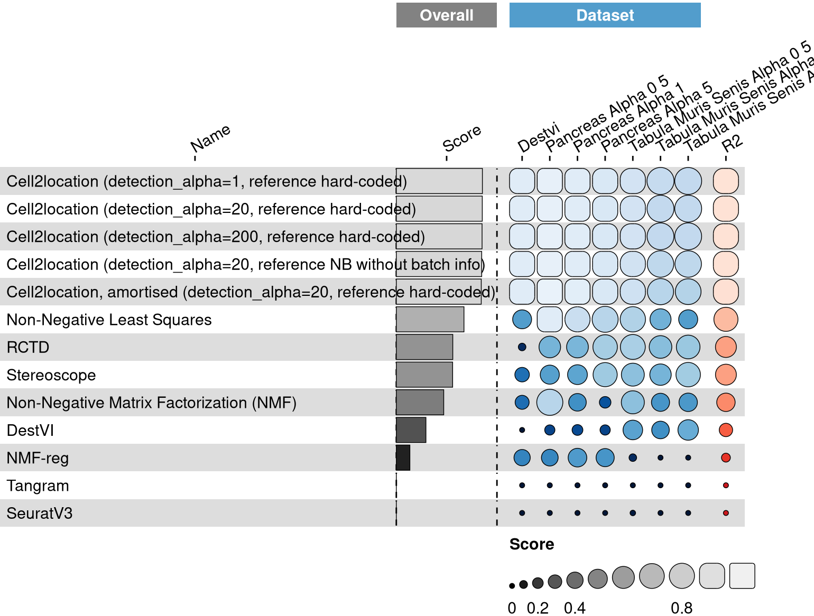

<link href="index_files/libs/lightable-0.0.1/lightable.css" rel="stylesheet" />

## Description

Missing 'task_description'

## Summary

<figure>

<figcaption aria-hidden="true"><strong>Overview of the results per method</strong>. This figures shows the mean of the scaled scores (group Overall), the mean scores per dataset (group Dataset) and the mean scores per metric (group Metric).</figcaption>
</figure>

## Downloads

<a href="data/task_info.json" class="btn btn-secondary">Task info</a>
<a href="data/method_info.json" class="btn btn-secondary">Method info</a>
<a href="data/metric_info.json" class="btn btn-secondary">Metric info</a>
<a href="data/dataset_info.json" class="btn btn-secondary">Dataset info</a>
<a href="data/results.json" class="btn btn-secondary">Results</a>
<a href="data/quality_control.json" class="btn btn-secondary">Quality control</a>

## Details

Method descriptions

-   **[Cell2location, amortised (detection_alpha=20, reference hard-coded)](https://github.com/BayraktarLab/cell2location)**: Missing 'method_description'. [\[kleshchevnikov2022cell2location\]](/bibliography#kleshchevnikov2022cell2location)

<!-- -->

-   **[Cell2location (detection_alpha=1, reference hard-coded)](https://github.com/BayraktarLab/cell2location)**: Missing 'method_description'. [\[kleshchevnikov2022cell2location\]](/bibliography#kleshchevnikov2022cell2location)

<!-- -->

-   **[Cell2location (detection_alpha=20, reference hard-coded)](https://github.com/BayraktarLab/cell2location)**: Missing 'method_description'. [\[kleshchevnikov2022cell2location\]](/bibliography#kleshchevnikov2022cell2location)

<!-- -->

-   **[Cell2location (detection_alpha=200, reference hard-coded)](https://github.com/BayraktarLab/cell2location)**: Missing 'method_description'. [\[kleshchevnikov2022cell2location\]](/bibliography#kleshchevnikov2022cell2location)

<!-- -->

-   **[Cell2location (detection_alpha=20, reference NB without batch info)](https://github.com/BayraktarLab/cell2location)**: Missing 'method_description'. [\[kleshchevnikov2022cell2location\]](/bibliography#kleshchevnikov2022cell2location)

<!-- -->

-   **[DestVI](https://github.com/YosefLab/scvi-tools)**: Missing 'method_description'. [\[lopez2022destvi\]](/bibliography#lopez2022destvi)

<!-- -->

-   **[Non-Negative Matrix Factorization (NMF)](https://scikit-learn.org/stable/modules/generated/sklearn.decomposition.NMF.html)**: Missing 'method_description'. [\[cichocki2009fast\]](/bibliography#cichocki2009fast)

<!-- -->

-   **[NMF-reg](https://github.com/tudaga/NMFreg_tutorial)**: Missing 'method_description'. [\[rodriques2019slide\]](/bibliography#rodriques2019slide)

<!-- -->

-   **[Non-Negative Least Squares](https://docs.scipy.org/doc/scipy/reference/generated/scipy.optimize.nnls.html)**: Missing 'method_description'. [\[lawson1995solving\]](/bibliography#lawson1995solving)

<!-- -->

-   **[Random Proportions](https://github.com/openproblems-bio/openproblems)**: Missing 'method_description'. [\[openproblems\]](/bibliography#openproblems)

<!-- -->

-   **[RCTD](https://github.com/dmcable/spacexr)**: Missing 'method_description'. [\[cable2021robust\]](/bibliography#cable2021robust)

<!-- -->

-   **[SeuratV3](https://satijalab.org/seurat/archive/v3.2/spatial_vignette.html)**: Missing 'method_description'. [\[stuart2019comprehensive\]](/bibliography#stuart2019comprehensive)

<!-- -->

-   **[Stereoscope](https://github.com/scverse/scvi-tools)**: Missing 'method_description'. [\[andersson2020single\]](/bibliography#andersson2020single)

<!-- -->

-   **[Tangram](https://github.com/broadinstitute/Tangram)**: Missing 'method_description'. [\[biancalani2021deep\]](/bibliography#biancalani2021deep)

<!-- -->

-   **[True Proportions](https://github.com/openproblems-bio/openproblems)**: Missing 'method_description'. [\[openproblems\]](/bibliography#openproblems)

Metric descriptions

-   **r2**: Missing 'metric_description'. [\[miles2005rsquared\]](/bibliography#miles2005rsquared)

Dataset descriptions

-   **DestVI**: Missing 'dataset_description'. [\[lopez2022destvi\]](/bibliography#lopez2022destvi)

<!-- -->

-   **Pancreas (alpha=0.5)**: Missing 'dataset_description'. [\[luecken2022benchmarking\]](/bibliography#luecken2022benchmarking)

<!-- -->

-   **Pancreas (alpha=1)**: Missing 'dataset_description'. [\[luecken2022benchmarking\]](/bibliography#luecken2022benchmarking)

<!-- -->

-   **Pancreas (alpha=5)**: Missing 'dataset_description'. [\[luecken2022benchmarking\]](/bibliography#luecken2022benchmarking)

<!-- -->

-   **Tabula muris senis (alpha=0.5)**: Missing 'dataset_description'. [\[tabula2020single\]](/bibliography#tabula2020single)

<!-- -->

-   **Tabula muris senis (alpha=1)**: Missing 'dataset_description'. [\[tabula2020single\]](/bibliography#tabula2020single)

<!-- -->

-   **Tabula muris senis (alpha=5)**: Missing 'dataset_description'. [\[tabula2020single\]](/bibliography#tabula2020single)

Baseline descriptions

-   **Random Proportions**: Missing 'method_description'.

<!-- -->

-   **True Proportions**: Missing 'method_description'.

Quality control

<table class="table lightable-paper" style='margin-left: auto; margin-right: auto; font-family: "Arial Narrow", arial, helvetica, sans-serif; margin-left: auto; margin-right: auto;'>
 <thead>
  <tr>
   <th style="text-align:left;"> Category </th>
   <th style="text-align:left;"> Name </th>
   <th style="text-align:right;"> Value </th>
   <th style="text-align:left;"> Condition </th>
   <th style="text-align:left;"> Severity </th>
  </tr>
 </thead>
<tbody>
  <tr>
   <td style="text-align:left;" data-toggle="tooltip" data-container="body" data-placement="right" title="Dataset metadata field 'dataset_description' should be defined
  Task id: spatial_decomposition
  Field: dataset_description
"> Dataset info </td>
   <td style="text-align:left;" data-toggle="tooltip" data-container="body" data-placement="right" title="Dataset metadata field 'dataset_description' should be defined
  Task id: spatial_decomposition
  Field: dataset_description
"> Pct 'dataset_description' missing </td>
   <td style="text-align:right;" data-toggle="tooltip" data-container="body" data-placement="right" title="Dataset metadata field 'dataset_description' should be defined
  Task id: spatial_decomposition
  Field: dataset_description
"> 1.000000 </td>
   <td style="text-align:left;" data-toggle="tooltip" data-container="body" data-placement="right" title="Dataset metadata field 'dataset_description' should be defined
  Task id: spatial_decomposition
  Field: dataset_description
"> percent_missing(dataset_info, field) </td>
   <td style="text-align:left;color: red !important;" data-toggle="tooltip" data-container="body" data-placement="right" title="Dataset metadata field 'dataset_description' should be defined
  Task id: spatial_decomposition
  Field: dataset_description
"> ✗✗ </td>
  </tr>
  <tr>
   <td style="text-align:left;" data-toggle="tooltip" data-container="body" data-placement="right" title="Method metadata field 'method_description' should be defined
  Task id: spatial_decomposition
  Field: method_description
"> Method info </td>
   <td style="text-align:left;" data-toggle="tooltip" data-container="body" data-placement="right" title="Method metadata field 'method_description' should be defined
  Task id: spatial_decomposition
  Field: method_description
"> Pct 'method_description' missing </td>
   <td style="text-align:right;" data-toggle="tooltip" data-container="body" data-placement="right" title="Method metadata field 'method_description' should be defined
  Task id: spatial_decomposition
  Field: method_description
"> 1.000000 </td>
   <td style="text-align:left;" data-toggle="tooltip" data-container="body" data-placement="right" title="Method metadata field 'method_description' should be defined
  Task id: spatial_decomposition
  Field: method_description
"> percent_missing(method_info, field) </td>
   <td style="text-align:left;color: red !important;" data-toggle="tooltip" data-container="body" data-placement="right" title="Method metadata field 'method_description' should be defined
  Task id: spatial_decomposition
  Field: method_description
"> ✗✗ </td>
  </tr>
  <tr>
   <td style="text-align:left;" data-toggle="tooltip" data-container="body" data-placement="right" title="Metric metadata field 'metric_description' should be defined
  Task id: spatial_decomposition
  Field: metric_description
"> Metric info </td>
   <td style="text-align:left;" data-toggle="tooltip" data-container="body" data-placement="right" title="Metric metadata field 'metric_description' should be defined
  Task id: spatial_decomposition
  Field: metric_description
"> Pct 'metric_description' missing </td>
   <td style="text-align:right;" data-toggle="tooltip" data-container="body" data-placement="right" title="Metric metadata field 'metric_description' should be defined
  Task id: spatial_decomposition
  Field: metric_description
"> 1.000000 </td>
   <td style="text-align:left;" data-toggle="tooltip" data-container="body" data-placement="right" title="Metric metadata field 'metric_description' should be defined
  Task id: spatial_decomposition
  Field: metric_description
"> percent_missing(metric_info, field) </td>
   <td style="text-align:left;color: red !important;" data-toggle="tooltip" data-container="body" data-placement="right" title="Metric metadata field 'metric_description' should be defined
  Task id: spatial_decomposition
  Field: metric_description
"> ✗✗ </td>
  </tr>
  <tr>
   <td style="text-align:left;" data-toggle="tooltip" data-container="body" data-placement="right" title="Task metadata field 'task_description' should be defined
  Task id: spatial_decomposition
  Field: task_description
"> Task info </td>
   <td style="text-align:left;" data-toggle="tooltip" data-container="body" data-placement="right" title="Task metadata field 'task_description' should be defined
  Task id: spatial_decomposition
  Field: task_description
"> Pct 'task_description' missing </td>
   <td style="text-align:right;" data-toggle="tooltip" data-container="body" data-placement="right" title="Task metadata field 'task_description' should be defined
  Task id: spatial_decomposition
  Field: task_description
"> 1.000000 </td>
   <td style="text-align:left;" data-toggle="tooltip" data-container="body" data-placement="right" title="Task metadata field 'task_description' should be defined
  Task id: spatial_decomposition
  Field: task_description
"> percent_missing([task_info], field) </td>
   <td style="text-align:left;color: red !important;" data-toggle="tooltip" data-container="body" data-placement="right" title="Task metadata field 'task_description' should be defined
  Task id: spatial_decomposition
  Field: task_description
"> ✗✗ </td>
  </tr>
  <tr>
   <td style="text-align:left;" data-toggle="tooltip" data-container="body" data-placement="right" title="Method seuratv3 performs much worse than baselines.
  Task id: spatial_decomposition
  Method id: seuratv3
  Metric id: r2
  Worst score: -2.5753568569760525%
"> Scaling </td>
   <td style="text-align:left;" data-toggle="tooltip" data-container="body" data-placement="right" title="Method seuratv3 performs much worse than baselines.
  Task id: spatial_decomposition
  Method id: seuratv3
  Metric id: r2
  Worst score: -2.5753568569760525%
"> Worst score seuratv3 r2 </td>
   <td style="text-align:right;" data-toggle="tooltip" data-container="body" data-placement="right" title="Method seuratv3 performs much worse than baselines.
  Task id: spatial_decomposition
  Method id: seuratv3
  Metric id: r2
  Worst score: -2.5753568569760525%
"> -2.575357 </td>
   <td style="text-align:left;" data-toggle="tooltip" data-container="body" data-placement="right" title="Method seuratv3 performs much worse than baselines.
  Task id: spatial_decomposition
  Method id: seuratv3
  Metric id: r2
  Worst score: -2.5753568569760525%
"> worst_score &gt;= -1 </td>
   <td style="text-align:left;color: red !important;" data-toggle="tooltip" data-container="body" data-placement="right" title="Method seuratv3 performs much worse than baselines.
  Task id: spatial_decomposition
  Method id: seuratv3
  Metric id: r2
  Worst score: -2.5753568569760525%
"> ✗✗ </td>
  </tr>
</tbody>
</table>

Visualization of raw results

